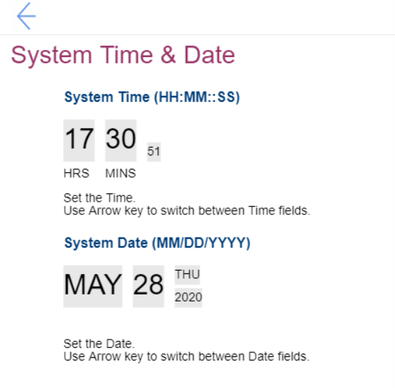

# System Time and Date #

System Time

Fields to set Time. Use Arrow keys to switch between Time fields. 
Possible values:

1.	**Currently set date** 
2.	HH : MM : SS 
    a. HH - Hour:  00 ~ 23 
    b. MM - Minute:  00 ~ 59 
    c. SS - Second:  00 ~ 59 

System Date

Fields to set Date. Use Arrow keys to switch between Date fields. 
Possible values:

1.	**Currently set date**
2.	MM/DD/YYYY: 
    a. MM – Months: January to December  
    b. DD – Date: 1 ~ 31  
    c. YYYY – Year: 1980 ~ 2099  

