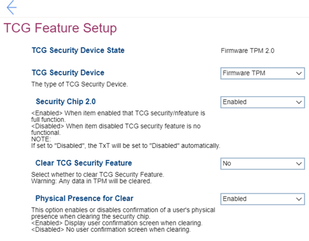

# TCG Feature Setup Settings #

TCG Security Device State

Shows TCG (Trusted Computing Group) Security Device State. View only.  
Possible values: 

1. Discrete TPM 1.2 
2. Discrete TPM 2.0
3. Firmware TPM 2.0

| WMI Setting name | Values | SVP Req'd | AMD/Intel |
|:---|:---|:---|:---|
|  |  |  | Both |

TCG Security Device

One of 2 options to select the type of TCG Security Device:

1. Firmware TPM 
2. **Discrete TPM** – Default.

**Note**. Selecting a different option will require additional confirmation. Before change the TCG Security Device, all TPM related applications must be disabled, otherwise you may not be able to access your data.

| WMI Setting name | Values | SVP Req'd | AMD/Intel |
|:---|:---|:---|:---|
|  |  |  | Both |

<!-- TBF if add Security Chip 1.2 -->

Security Chip 2.0

One of 2 states:

1. **Enabled** – TCG security feature is full function. Default. 
2. Disabled – TCG security feature is no functional.  
    **Note**. When set to "Disabled", then TxT will be set to "Disabled" automatically and "Clear TCG Security Feature" becomes unavailable. 

| WMI Setting name | Values | SVP Req'd | AMD/Intel |
|:---|:---|:---|:---|
|  |  |  | Both |

Clear TCG Security Feature

Available only when "Security Chip 2.0" has "Enabled" state. 
One of two options:

1. Yes – clear TCG Security Feature.  
    **Warning**. Any data in TPM will be cleared.
2. **No** – TCG Security Feature will not be cleaned. Default.

| WMI Setting name | Values | SVP Req'd | AMD/Intel |
|:---|:---|:---|:---|
|  |  |  | Both |

<!-- TBF if add Physical Presence for Provisioning (Only show up for TPM1.2) -->

Physical Presence for Clear

One of 2 states to select where a confirmation of a user’s physical presence is needed when clearing the security chip:

1. **Enabled** – system will display user confirmation screen when clearing. Default. 
2. Disabled – no user confirmation screen when clearing.

| WMI Setting name | Values | SVP Req'd | AMD/Intel |
|:---|:---|:---|:---|
|  |  |  | Both |

