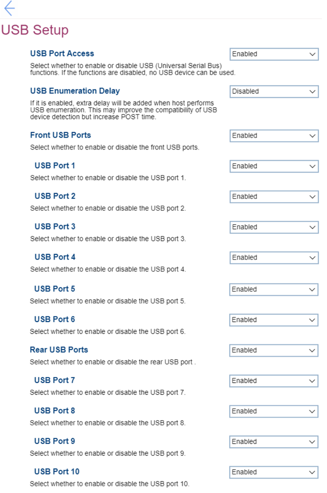

# USB Setup #

USB Port Access

One of 2 possible states for USB (Universal Serial Bus) functions:

1. **Enabled** – USB functions enabled. Default.
2. Disabled – if selected, then no USB device can be used and all other fields for USB settings are unavailable.

| WMI Setting name | Values | SVP Req'd | AMD/Intel |
|:---|:---|:---|:---|
|  |  |  | Both |

USB Enumeration Delay

One of 2 possible states to define whether extra delay is added when host performs USB enumeration:

1. Enabled – if selected, then this may improve the compatibility of USB device detection but increase POST Time.
2. **Disabled** – extra delay will not be added. Default.

| WMI Setting name | Values | SVP Req'd | AMD/Intel |
|:---|:---|:---|:---|
|  |  |  | Both |

Front USB Ports

One of 2 possible states for all Front USB Ports:

1. **Enabled** – if selected, then all Front USB ports are enabled and relevant settings fields are available. Default.
2. Disabled – if selected, then all Front USB ports are disabled and relevant settings fields are not available. 

| WMI Setting name | Values | SVP Req'd | AMD/Intel |
|:---|:---|:---|:---|
|  |  |  | Both |

USB Port [N]

[N] is the order number of the front USB port. 
One of 2 possible states to select per each Front USB Port:

1. **Enabled** – the corresponding Front USB Port is enabled. Default, if ‘Enabled’ is selected in ‘Front USB Ports’. 
2. Disabled – the corresponding Front USB Port is disabled. 

| WMI Setting name | Values | SVP Req'd | AMD/Intel |
|:---|:---|:---|:---|
|  |  |  | Both |

Rear USB Ports

One of 2 possible states for all Rear USB Ports:

1. **Enabled** – if selected, then all rear USB ports are enabled and relevant settings fields are available. Default.
2. Disabled – if selected, then all Rear USB ports are disabled and relevant settings fields are not available.

| WMI Setting name | Values | SVP Req'd | AMD/Intel |
|:---|:---|:---|:---|
|  |  |  | Both |

USB Port [M]

[M] is the order number of the rear USB port. 
One of 2 possible states to select per each Rear USB Port:

1. **Enabled** – the corresponding Rear USB Port is enabled. Default, if ‘Enabled’ is selected in ‘Rear USB Ports’. 
2. Disabled – the corresponding Rear USB Port is disabled.

| WMI Setting name | Values | SVP Req'd | AMD/Intel |
|:---|:---|:---|:---|
|  |  |  | Both |

