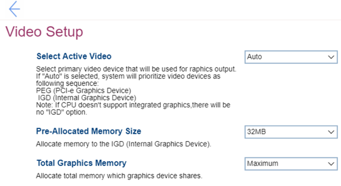

# Video Setup Settings #

Select Active Video

Select the primary video device for graphics output.

Options:

1. **Auto** – Default. Prioritizes video devices as follows: 
    a.	PEG 
    b.	IGD 
2. IGD – Internal Graphics Device will be used.
3. PEG – PCI-e Graphics Device will be used.

?> If CPU does not support integrated graphics, there will be no `IGD` option.

| WMI Setting name | Values | SVP / SMP Req'd | AMD/Intel |
|:---|:---|:---|:---|
| SelectActiveVideo | IGD,PEG,Auto | yes | Both |

Pre-Allocated Memory Size

Allocate memory in the IGD (Internal Graphics Device).

Options:

1. **32 MB** – Default.
2. 64 MB
3. 128 MB

| WMI Setting name | Values | SVP / SMP Req'd | AMD/Intel |
|:---|:---|:---|:---|
| Pre-AllocatedMemorySize |  | yes | Both |

Total Graphics Memory

Allocate total memory which graphics device shares.

Optional:

1. 128 MB
2. 256 MB
3. **Maximum** – Default.

| WMI Setting name | Values | SVP / SMP Req'd | AMD/Intel |
|:---|:---|:---|:---|
| TotalGraphicsMemory |  | yes | Both |

