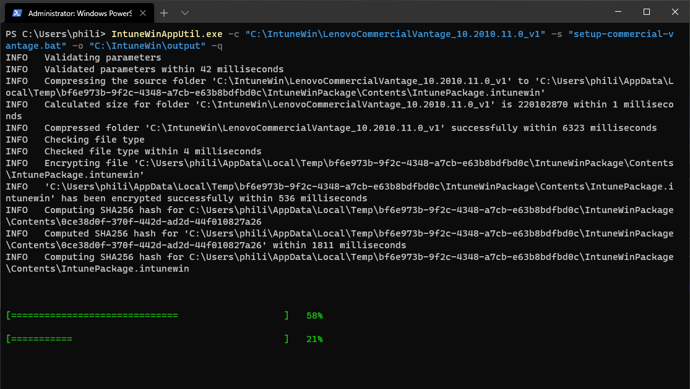
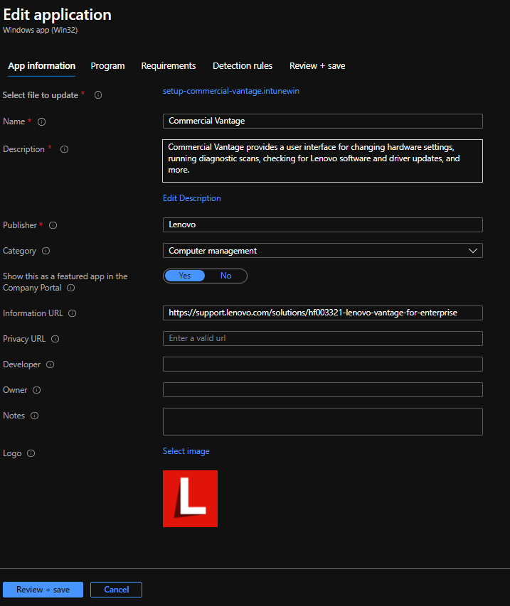
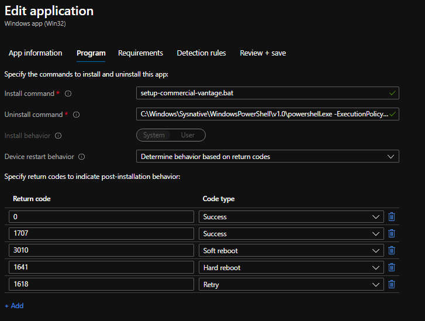
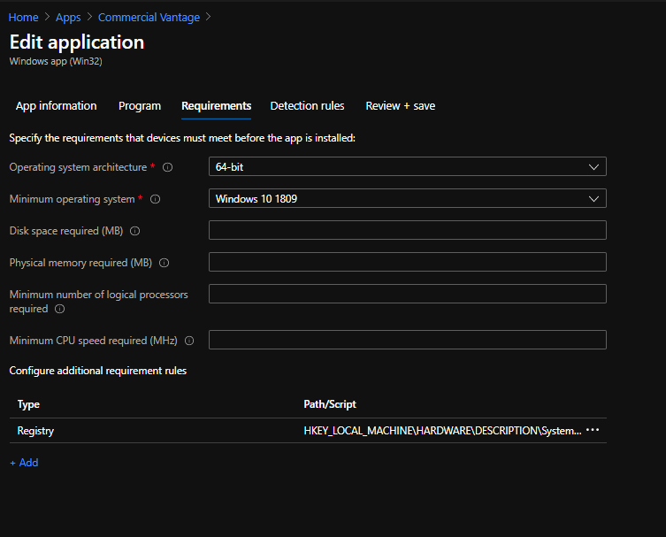
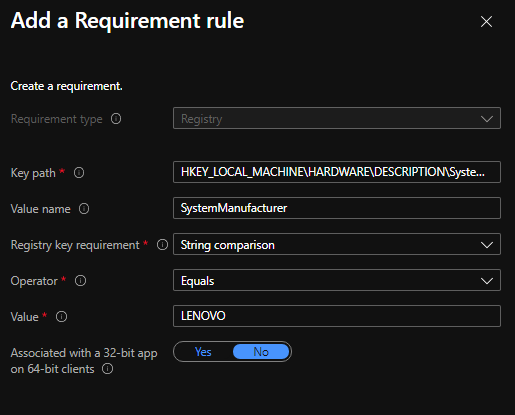
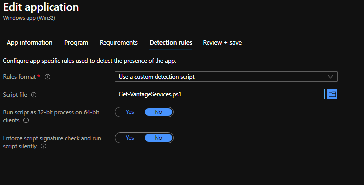
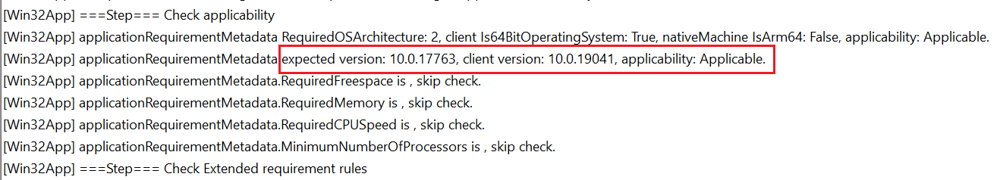
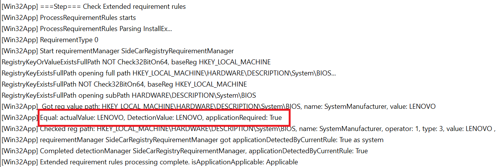
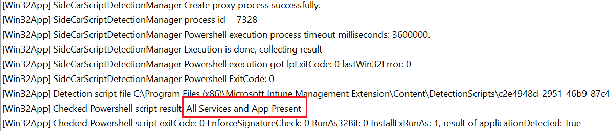

### Deploying Commercial Vantage <br> with Intune   <!-- {docsify-ignore} -->
*Author: Philip Jorgensen*

Download the latest version of Commercial Vantage with Deployment Guide [here](https://support.lenovo.com/solutions/hf003321)

**Preparing the Win32 App**

Once the zip has been downloaded and extracted, use the Content Prep [Tool](https://github.com/Microsoft/Microsoft-Win32-Content-Prep-Tool) to convert to an .intunewin format.  There's already a provided batch file that handles the installation of all dependencies, certs, and .msix bundle so this will be used as the setup file.  A sample command would be:

```cmd
IntuneWinAppUtil.exe -c "C:\IntuneWin\LenovoCommercialVantage_10.2010.11.0_v1" -s "setup-commercial-vantage.bat" -o "C:\IntuneWin\output" -q
```



**Creating the Win32 App**

Login to the [MEM admin center](https://endpoint.microsoft.com/#blade/Microsoft_Intune_DeviceSettings/AppsWindowsMenu/windowsApps) and add a new Windows app (Win32).  Select the new App package file created above, which should be named **setup-commercial-vantage.intunewin** and click OK.

Fill out the necessary fields in the App information section and click Review + save



In the Edit application section, this is where the install/uninstall commands will be specified.

Install command
```cmd
setup-commercial-vantage.bat
```

Uninstall command
```cmd
C:\Windows\Sysnative\WindowsPowerShell\v1.0\powershell.exe -ExecutionPolicy Bypass -File .\uninstall_vantage_v8\uninstall_all.ps1
```

Set Device restart behavior to **Determine behavior based on return codes**.



In the Requirements section, set the Operating system architecture to **64-bit** and Minimum operating system to **1809**

Add an additional Registry type requirement rule that will only apply to Lenovo branded systems. 



Key path
```
HKEY_LOCAL_MACHINE\HARDWARE\DESCRIPTION\System\BIOS
```

Value name
```
SystemManufacturer
```

Registry key requirement: **String comparison**

Operator: **Equals**

Value
```
LENOVO
```



For the detection rule, a custom script detection will be used.  Commercial Vantage depends on these 2 services to run
- **ImControllerService**
- **LenovoVantageService**

This sample PowerShell script can be used for detection 

?> If the Store is not blocked in your environment, remove the version from the string match.  Vantage will automatically update itself as new versions are released. )

```powershell
If (Get-Service -Name ImControllerService -ErrorAction SilentlyContinue) {
    If (Get-Service -Name LenovoVantageService -ErrorAction SilentlyContinue) {
        If (Get-AppxPackage -AllUsers | Where-Object { $_.PackageFullName -match "LenovoSettingsforEnterprise_10.2010.11.0" }) {
            Write-Host "All Services and App Present"
        }
    }
}
```



Click Review and then Save to complete the app creation and content upload to Intune.  Once the upload has finished, assign to a group.

**Results**

Track the installation through the **IntuneManagementExtension.log**

Here we can see the minimum OS version requirement has been met



The additional requirement to check if the system is in fact a Lenovo system is true



The PowerShell detection script finds both services and app are now present

