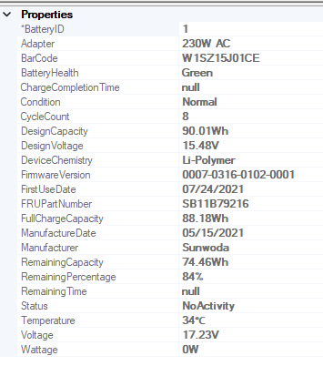

### Audio ###

**Microphone Settings**
When this policy is enabled, the Microphone Settings features of Commercial Vantage will be turned off.

OMA-URI:
```
./Device/Vendor/MSFT/Policy/Config/CommercialVantage~Policy~03E445D7B5956335BEDEF9340AC7E092~7D8BB8A33C8A8577FC2188C5539DFDBB~8BFC79DE8BB6F9B73316906802BA1CF8~0DCC7F7AF7643439978A86FD8954E056/3DE55572B38BBE99A42335869E037DF3
```

Values:

`<enabled/>`
`<disabled/>`

---

**Audio Smart Settings**
When this policy is enabled, the Audio Smart Settings feature of Commercial Vantage will be turned off.

OMA-URI:
```
./Device/Vendor/MSFT/Policy/Config/CommercialVantage~Policy~03E445D7B5956335BEDEF9340AC7E092~7D8BB8A33C8A8577FC2188C5539DFDBB~8BFC79DE8BB6F9B73316906802BA1CF8~0DCC7F7AF7643439978A86FD8954E056/4E23CB25D710E406CF34EE9C2D5E8F77
```

Values:

`<enabled/>`
`<disabled/>`

---

### Display and Camera ###

**Camera**
When this policy is enabled, the Camera features of Commercial Vantage will be turned off.

OMA-URI:
```
./Device/Vendor/MSFT/Policy/Config/CommercialVantage~Policy~03E445D7B5956335BEDEF9340AC7E092~7D8BB8A33C8A8577FC2188C5539DFDBB~8BFC79DE8BB6F9B73316906802BA1CF8~2F1A3379F15869B17CDC4166675CF9F4/70DA5C43A08ABFF6465613AD5E3426D8
```

Values:

`<enabled/>`
`<disabled/>`

---

**Display**
When this policy is enabled, the Display features of Commercial Vantage will be turned off.

OMA-URI:
```
./Device/Vendor/MSFT/Policy/Config/CommercialVantage~Policy~03E445D7B5956335BEDEF9340AC7E092~7D8BB8A33C8A8577FC2188C5539DFDBB~8BFC79DE8BB6F9B73316906802BA1CF8~2F1A3379F15869B17CDC4166675CF9F4/BCC3FA02172D8F220765BCC0DAF5897A
```

Values:

`<enabled/>`
`<disabled/>`

---

### Input and Accessories ###

**Intelligent Keyboard**

When this policy is enabled, the Intelligent Keyboard feature of Commercial Vantage will be turned off.

OMA-URI:
```
./Device/Vendor/MSFT/Policy/Config/CommercialVantage~Policy~03E445D7B5956335BEDEF9340AC7E092~7D8BB8A33C8A8577FC2188C5539DFDBB~8BFC79DE8BB6F9B73316906802BA1CF8~DC6ABC1D9A065D6934DBBF4A781C1743/B472A13920E69AD5EA4E8C8AE4F32DBA
```

Values:

`<enabled/>`
`<disabled/>`

---
### Power ###

**Power Settings**
When this policy is enabled, the Power Settings of Commercial Vantage will be turned off.

OMA-URI:
```
./Device/Vendor/MSFT/Policy/Config/CommercialVantage~Policy~03E445D7B5956335BEDEF9340AC7E092~7D8BB8A33C8A8577FC2188C5539DFDBB~8BFC79DE8BB6F9B73316906802BA1CF8~E4F5170489B8C677D42DEB4590E140A7/5C2B0833E82D16B3417540950063B3B1
```

Values:

`<enabled/>`
`<disabled/>`

---

**Write Battery Information to WMI**

?>Note: Added in version 10.2109

This policy setting allows Commercial Vantage to write the computer battery information into the Lenovo Namespace WMI table. If you enable it, the battery information will be written to WMI.  The information written will appear as follows:



This policy setting allows the Administrator to configure the schedule type, schedule day, and schedule time for writing the computer battery information to WMI.
The Schedule type value should be a number (0-2), where 0 means daily, 1 means weekly, 2 means monthly.

If the Schedule type value is set to 0, the Schedule day value should be set to 0 (and this value will be ignored). If the Schedule type is set to 1, the Schedule day value should be a number (0-6), where 0 means Sunday, 1 means Monday, 2 means Tuesday... 

If the Schedule type is set to 2, the Schedule day value should be a number (-1 or 1-31), where -1 means the last day of the month, 1 means the first day of the month, 2 means the second day of the month...

The Schedule time value format should be HH: mm:ss. For example, 18: 30:00 represents 6:30PM.

If you disable or do not configure this policy setting, the battery information will not be written to WMI.

OMA-URI:
```
./Device/Vendor/MSFT/Policy/Config/CommercialVantage~Policy~03E445D7B5956335BEDEF9340AC7E092~7D8BB8A33C8A8577FC2188C5539DFDBB~8BFC79DE8BB6F9B73316906802BA1CF8~E4F5170489B8C677D42DEB4590E140A7/64F93BB9BFC0EB1C9ADD81981905E061
```

?>  `ADE41242A9F8CE596481FE945E5FE5D8 = Schedule Type`
    `F04F922293A120999D4EB95012CA0C64 = Schedule Day`
    `AC72B4BC066D807C760A11748C39F451 = Schedule Time`

Values:

`<enabled/>`  
`<data id="ADE41242A9F8CE596481FE945E5FE5D8" value="1"/>`
`<data id="F04F922293A120999D4EB95012CA0C64" value="1"/>`
`<data id="AC72B4BC066D807C760A11748C39F451" value="10:00:00"/>`

`<disabled/>`

---

**DPM Power Settings**

?>Note: Added in version 10.2104

When this policy is enabled, the Desktop Power Manager Power Settings of Commercial Vantage will be turned off.

OMA-URI:
```
./Device/Vendor/MSFT/Policy/Config/CommercialVantage~Policy~03E445D7B5956335BEDEF9340AC7E092~7D8BB8A33C8A8577FC2188C5539DFDBB~8BFC79DE8BB6F9B73316906802BA1CF8~E4F5170489B8C677D42DEB4590E140A7/664C30E3A0368439C2BF8EEA05E32EE9
```

Values:

`<enabled/>`
`<disabled/>`

---

**Battery Settings**

?>Added in version 10.2104

!> If this policy is enabled, the Battery Settings section in the GUI will disappear.

When this policy is enabled, the Battery Settings features of Commercial Vantage will be turned off.

Battery percentage for starting and stopping charge threshold can only be set in increments of 5. Any value input will be rolled to next increment of 5.

If an IT Admin sets a "Start Charging" greater than "Stop Charging", Vantage will ignore "Start Charging" set by Admin and will "Start Charging" at 5% less than "Stop Charging".
Ex: IT Admin sets "Start Charging" = 60 and "Stop Charging" = 50. Then, Vantage will "Start Charging" at 45 since "Stop Charging" = 50

If checkbox to "Automatically set the start charging" is checked by IT Admin, Vantage will ignore "Start Charging" set by Admin and will "Start Charging" at "Stop Charging" minus 5.
Ex: If checkbox selected and "Stop Charging" is set to 90, then "Start Charging" is set to 85.

When the toggle to "Automatically Set Threshold" is on, then Battery Threshold "Start" cannot be set.

OMA-URI:
```
./Device/Vendor/MSFT/Policy/Config/CommercialVantage~Policy~03E445D7B5956335BEDEF9340AC7E092~7D8BB8A33C8A8577FC2188C5539DFDBB~8BFC79DE8BB6F9B73316906802BA1CF8~E4F5170489B8C677D42DEB4590E140A7/6A6C1333A96BD99C316FC0AC169C6B8D
```

?>  `30B3EB897294AF0A770737E004CCE7B0 = Enable custom battery threshold settings`
    `4B9DE8D61B215393ED7255D0719FA5FA = Threshold Start`
    `2FE339B04615BBA5C913F45FB6A1B34D = Threshold Stop`
    `51A1765894644A2F58B9AF5EE7F65922 = Auto Start Charging`

Values:

`<enabled/>`  
`<data id="30B3EB897294AF0A770737E004CCE7B0" value="true"/>`
`<data id="4B9DE8D61B215393ED7255D0719FA5FA" value="60"/>`
`<data id="2FE339B04615BBA5C913F45FB6A1B34D" value="80"/>`
`<data id="51A1765894644A2F58B9AF5EE7F65922" value="false"/>`

`<disabled/>`

---

**Power Smart Settings**

?> Added in version 10.2104

When this policy is enabled, the Power Smart Settings of Commercial Vantage will be turned off.

OMA-URI:
```
./Device/Vendor/MSFT/Policy/Config/CommercialVantage~Policy~03E445D7B5956335BEDEF9340AC7E092~7D8BB8A33C8A8577FC2188C5539DFDBB~8BFC79DE8BB6F9B73316906802BA1CF8~E4F5170489B8C677D42DEB4590E140A7/ADB803E7378E121123D5E08D9A2D0AE3
```

Values:

`<enabled/>`
`<disabled/>`

---

**Standby Settings**

?> Added in version 10.2104

When this policy is enabled, the Standby Settings feature of Commercial Vantage will be turned off.

OMA-URI:
```
./Device/Vendor/MSFT/Policy/Config/CommercialVantage~Policy~03E445D7B5956335BEDEF9340AC7E092~7D8BB8A33C8A8577FC2188C5539DFDBB~8BFC79DE8BB6F9B73316906802BA1CF8~E4F5170489B8C677D42DEB4590E140A7/B0FE740B6951DD55D924F47EE0577466
```

Values:

`<enabled/>`
`<disabled/>`

---

**Energy Star**

?> Added in version 10.2104

When this policy is enabled, the Energy Star features of Commercial Vantage will be turned off

OMA-URI:
```
./Device/Vendor/MSFT/Policy/Config/CommercialVantage~Policy~03E445D7B5956335BEDEF9340AC7E092~7D8BB8A33C8A8577FC2188C5539DFDBB~8BFC79DE8BB6F9B73316906802BA1CF8~E4F5170489B8C677D42DEB4590E140A7/D2EF91148F6CAD7276895C6CB7051E06
```

Values:

`<enabled/>`
`<disabled/>`

---

### Smart Assist ###
**Active Protection System Settings**

?> Added in version 10.2104

When this policy is enabled, the Active Protection System Settings features of Commercial Vantage will be turned off.

OMA-URI:
```
./Device/Vendor/MSFT/Policy/Config/CommercialVantage~Policy~03E445D7B5956335BEDEF9340AC7E092~7D8BB8A33C8A8577FC2188C5539DFDBB~8BFC79DE8BB6F9B73316906802BA1CF8~45D8B8B2CBDB4610CAB05A18CF2C9868/3E5A8FB355FCCB817AD1D3DEFAC78170
```

Values:

`<enabled/>`
`<disabled/>`

---

**Intelligent Screen**
When this policy is enabled, the Intelligent Screen features of Commercial Vantage will be turned off.

OMA-URI:
```
./Device/Vendor/MSFT/Policy/Config/CommercialVantage~Policy~03E445D7B5956335BEDEF9340AC7E092~7D8BB8A33C8A8577FC2188C5539DFDBB~8BFC79DE8BB6F9B73316906802BA1CF8~45D8B8B2CBDB4610CAB05A18CF2C9868/9DB9CAC9C421AFDB3A3381486210EA6C
```

Values:

`<enabled/>`
`<disabled/>`

---

**Intelligent Security Settings**

?> Added in version 10.2104

When this policy is enabled, the Intelligent Security Settings features of Commercial Vantage will be turned off.

OMA-URI:
```
./Device/Vendor/MSFT/Policy/Config/CommercialVantage~Policy~03E445D7B5956335BEDEF9340AC7E092~7D8BB8A33C8A8577FC2188C5539DFDBB~8BFC79DE8BB6F9B73316906802BA1CF8~45D8B8B2CBDB4610CAB05A18CF2C9868/E01515303271B7087B61546ECED61B39
```

Values:

`<enabled/>`
`<disabled/>`