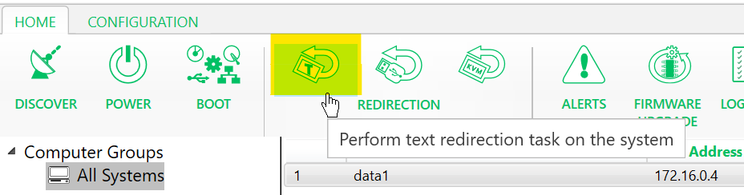
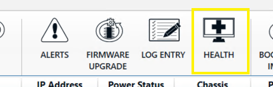
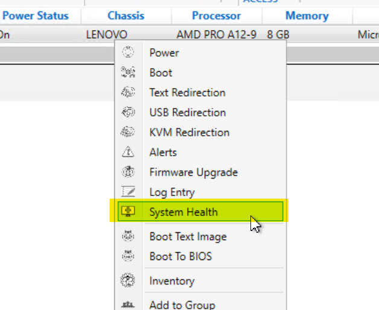
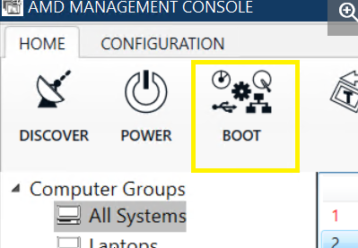

## Lenovo and AMD DASH Management <!-- {docsify-ignore} -->

# Overview

## What is DASH?

DASH (Desktop and mobile Architecture for System Hardware) is a secure out-of-band and remote client management standard. Out-of-band management tasks include powering a system on when it is powered off and obtaining asset and health information when the operating system is not available.

DASH was developed and released by the DMTF (Distributed Management Task Force). DASH profile specification source material can be found at: [DMTF - Management Profiles](http://www.dmtf.org/standards/profiles)

For more information refer to [DMTF - Desktop and Mobile Architecture for System Hardware](https://www.dmtf.org/standards/dash)

AMD Management Console can be downloaded here: [Tools for DMTF DASH](https://developer.amd.com/tools-for-dmtf-dash/) . It can be installed on any Windows workstation or Windows Server OS to use for monitoring and managing the client systems.

## System Requirements

DASH capable client computer systems require DASH be enabled and configured. These settings are not engaged by default. Equipment manufacturers provide the tools and processes to configure DASH. System administrators will need to verify the steps required for their specific hardware.

Operating Systems

- Windows 7 (32 and 64 bit)
- Windows 8 (32 and 64 bit)
- Windows 8.1 (32 and 64 bit)
- Windows 10 (32 and 64 bit)
- Windows Server 2008 R2 (64 bit)
- Windows Server 2012 (64 bit)
- Windows Server 2012 R2
- Windows Server 2016
- Windows Server 2019

**AMC** (AMD Management Console) requires a minimum of 1 GB Disk space and 4 GB RAM. It supports DASH 1.2.

**NOTE: If you have AMC already installed, you will first have to uninstall that version before installing the latest version of AMC.**

Lenovo AMD ThinkPad and ThinkCentre models support management via DASH and ethernet utilizing AMD Management Console, the DASH CLI, or the AMPS Management Plug-in for SCCM (more than 500 clients). These applications all use the Realtek DASH Controller.

The appropriate Realtek DASH Controller, along with all the latest drivers and firmware updates, can be found by searching for your system name or serial number at [https://pcsupport.lenovo.com](https://pcsupport.lenvo.com/).

# Installation

## Installing AMC

This chapter provides the installation instructions and requirements for AMC.

  
### Installation Requirements

Use the _AMC-setup-[version]-AMD.exe_ to install AMC. Detailed instructions and release notes can be found in the installation directory, which by default is _C:\Program Files (x86)\AMD Management Console\docs_.

**Note:** If you have an old AMC version installed, you first must uninstall that version before installing the latest version of AMC.

  
### Authentication

When the AMC Console is launched the first time, you will be prompted to proceed to configuration. Alternatively, you can later access these settings via the **Configuration** tab in the upper right of the AMC Management Console.

The AMC console configuration supports up to three authentication entries. Each credential entry requires a unique Authentication Identifier and Schema. AMC has support for two types of authentication schemas: Digest and Active Directory.

At least one authentication entry must be configured before a client system can be discovered. If there is more than one credential, AMC will try each credential in sequential order.

For the changes to take effect, click **Validate** and then click **Save.**

# Enabling DASH on client systems

DASH capable systems must first have DASH enabled in the BIOS. Next, the Windows software must be configured.

Prerequisites:

- DASH firmware enabled
- Windows DASH client software
- The latest DASH console tool, which can be found[here.](https://developer.amd.com/tools-for-dmtf-dash/)

**Note** : DashConfig, an AMD tool, is packaged with AMC and can be used for configuration. Refer the release notes of DASH Config tool or see [Provisioning tools for DASH standalone systems](https://community.amd.com/t5/amd-manageability-community-tkb/provisioning-tools-for-dash-standalone-systems/ta-p/420927)

Two different DashConfig tools are available: DashConfig for Broadcom and DashConfigRT for Realtek. Most all Lenovo systems will require the DASHConfigRT tool.

## DASH setup

  
### Enable DASH in BIOS

The most recent system BIOS can be found at [https://pcsupport.lenovo.com/](https://pcsupport.lenovo.com/).

 1. First boot into system BIOS and locate DASH Configuration under Security.

    

2. DASH Configuration - Set DASH to Enabled

    

 3. RealTek LAN Controller - Reset the DASH Credentials under RealManage Setup. These credentials are used for Digest Authentication of the management service to the client. Refer to manufacturer documentation for default credentials. It is recommended to change the default credentials.

**NOTE:** You may need to scroll down to see Realtek Manage Setup

   

   

 4.   Save and exit the BIOS

  
### Windows DASH client software

DASH Windows software can be found at [https://pcsupport.lenovo.com/](https://pcsupport.lenovo.com/). Locate the support page for a specific model and select the Drivers &amp; Software menu item on the left side of the page. (Figure 7) Select **Manual Update** , and browse to **Networking: LAN (Ethernet)**

Documentation for attended and unattended installation will be available with the application download and in the installation directory. The default installation location is _C:\Program Files (x86)\AMD Management Console._

# AMC Client Management

## Overview

AMC supports the following DASH functionality :

- Discovery
- Power state management
- Boot – several options
  - USB Redirection
  - KVM Redirection
  - Text Redirection
- Inventory / Health information
- Firmware Update
- Alerts

**Note:** Before performing a discovery operation, make sure that the authentication details are correct. Refer to 2.2 Authentication.

## Discovery

AMC can only discover systems that have hardware which supports the DMTF management specification. Through discovery, AMC determines if a system supports DASH and what features are accessible. On successful discovery, the system is added to the &quot;All Systems&quot; group and inventory is performed on that system.

AMC supports four methods of discovery, which are described below.

**Note:** Discovery requests are queued. If a user chooses Active Directory discovery and then tries to do any of the other types of discovery, then that discovery will be done after the completion of Active Directory discovery.

 

### Hostname

Hostname discovery requires functioning, accurate DNS.

  
### IP Address

AMC will query that address and find out if that system is manageable or not.

  
### IP Subnet

AMC will scan each IP address in that range and find out if the system with that IP address is manageable by AMC or not.

  
### Active Directory

Each system in the domain is checked for AMD manageability when AMPS is first installed. After installation, system discovery can be done manually or on a schedule. (See [Authentication](#_Authentication) section above.)

## Power

AMC can be used to monitor, report, and manage the power state of client systems remotely.

  
### Power States

The table below lists all supported power states.

**Note:** All the power state transitions cannot be requested remotely. The subset of the below list will be visible to the user based on the target computer system&#39;s capabilities.

| **Power State** | **State Number** | **Friendly Name** | **Description** | **Corresponding ACPI State** |
| --- | --- | --- | --- | --- |
| Power On | 2 | On/Power On | Initiate the transition of the system to full on state. | G0/S0 |
| Sleep – Light | 3 | Sleeping Lightly/Sleep Light | Initiate the transition of the system to standby or sleep state. | G1/S1 or G1/S2 |
| Sleep- Deep | 4 | Sleeping/Sleep | Initiate the transition of the system to standby or sleep state. | G1/S3 |
| Power Cycle (Off Soft) | 5 | Immediate Power Reset | Transition the system to off state, followed by a transition to on state. | G2/S5 then G0/S0 |
| Power Off – Hard | 6 | N/A | Initiate the transition of the system to power off state | G3 |
| Hibernate | 7 | Hibernating/Hibernate | Transition the system to hibernation state. – write system context to non-volatile storage, power off the system and devices. | G1/S4 |
| Power Off – Soft | 8 | Off/Immediate Power Off | Initiate the transition of the system to off state, in which the system consumes a minimal amount of power. | G2/S5 |
| Power Cycle (Off Hard) | 9 | N/A | Transition the system to power off state, followed by a transition to on state | G3 to G0/S0 |
| Master Bus Reset | 10 | Immediate Warm Reset | Perform hardware reset on the system. |
 |
| Diagnostic Interrupt (NMI) | 11 | Immediate Diagnostic Interrupt | Assert an NMI on the system. |
 |
| Power Off - Soft Graceful | 12 | Off/Shutdown | Perform an orderly transition to power off state, in which the system consumes a minimal amount of power | G2/S5 |
| Power Off - Hard Graceful | 13 | N/A | Perform an orderly transition to power off state in which the power consumption is zero except for the real-time clock. | G3 |
| Master Bus Reset Graceful | 14 | Warm Restart | Perform an orderly shutdown of the system followed by hardware reset |
 |
| Power Cycle (Off – Soft Graceful) | 15 | Restart | Perform an orderly transition of the system to power off state, in which the system consumes a minimal amount of power, followed by a transition to on state | G2/S5 to G0/S0 |
| Power Cycle (Off - Hard Graceful) | 16 | N/A | Transition the system to power off state, , in which the power consumption is zero except for the real-time clock, followed by a transition to on state | G3 to G0/S0 |

  
### Power Operation on a Single System

1. Right click on the specific system on which the power operation is to be performed.
2. Select **Power** from the menu. You will get the Power screen.
3. The Power Screen will show:
  - The system name against which you are going to perform the power operation
  - The current power state of the system.
  - The list of power states which the system can accept from its current state is shown in the &#39;select power state to apply&#39; drop down list.
4. To start the transition of the system to the new power state, click **Apply**
5. The result of the operation will be displayed. Click **Finish** to close the Power window.

  
### Power Operation on a Group

## DASH Tasks

  
### Boot

A boot configuration specifies the order of boot devices. A computer system can have one or more boot configurations. If there is more than one boot configuration for a computer system, the settings data associated with the boot configurations, is used to determine which boot configurations and boot order should be followed during next boot process.

AMC&#39;s Boot task shows all the boot configurations available for the system being managed. For each boot configuration, it shows the current boot order and allows the user to modify the boot order if required. AMC only informs the present value of the setting data (will it be used for next boot, will it be used only for next boot, will it not be used for next boot) but does not allow the user to modify this.

To manage Boot settings:

 1. Select the target system.

 2. Either right click on the system and select **Boot** menu item or click on the ribbon icon **Boot**.

  3. The Boot Screen appears and displays a drop-down list with all the boot configurations available for the system.

      - Settings information for the selected boot configuration from the drop-down list:

         > This boot configuration will be used during next boot.

         > This boot configuration will not be used during next boot.

         > This boot configuration will be used only for next boot

     - The current boot order for the selected boot configuration from the drop-down list.

4. Select the required boot configuration from the **Name** drop down list.

5. Check the box for **Change boot order** check box if the boot order needs to be changed.

6. Move the Boot Devices to the &#39;New boot order&#39; list box in the order required.

8. Click the **Next** button to have the new boot order take effect. The result screen will show the result, e.g. &#39;boot order was successfully changed&#39;.

9. Close the power screen by clicking **Close**.

  
### Text Redirection

Text redirection provides BIOS-assisted console and keyboard redirection to a remote computer terminal. Boot progress, BIOS setup screen, command line OS or command line diagnostic console text are redirected to the AMC terminal. Text redirection can be to use either Telnet or SSH

To use text redirection:

 1. Select the desired system.
2. Either right click on the system and select **Text**  **Redirection** menu item or click on the text portion of ribbon icon **Redirection**.

3. The **Text Redirection** Screen appears and shows:

   - Drop down list with available protocols for text redirection, SSH and Telnet respectively. (SSH is the default.)
   - The Name of the Service that runs on the system to redirect the text.
   - The port through which the text will be redirected.
   - The information/status is stated – e.g., Support for OTP (one time password)

      
3. Select the required protocol from the drop-down list.
4. Click **Connect**. If the connection is successful, the text redirection screen will close, and the terminal console screen will appear.

[Text Redirection dialog](../img/dash/14-dash.png)

To manage the BIOS remotely using text redirection:

  1. Select a system for which you want to view and manage the BIOS.
  2. Perform steps 2 to 5 above to open a terminal console to receive the redirected text from the system.
  3. Click on **Power** icon and select **graceful power**  **cycle** option in the available power states.
  4. Click **Apply** to change the power state. The AMC terminal screen will receive the boot screen remotely and return keystrokes from the AMC System.

  
### USB Redirection

USB Redirection provides a virtual USB device which reads data from a remote image file.

This allows the BIOS to boot from a remote ISO image. The ISO Image file must be available at C:/AMC-ISO on the management server.

AMC has its own ISO webserver. Use AMC to initiate an action to attach the managed systems&#39; USB to a remote URL. This operation can be performed against a single system or on a group of systems. Place ISOs in C:/AMC-ISO and http:xxx.xx.xxxx:3274/ can be used as USB URL (e.g. [http://10.10.10.2:3274/dos.iso](http://10.10.10.2:3274/dos.iso)).

  
### Boot to Text Image

The AMC Boot to Text Image feature provides an environment where user can boot the managed system to a user defined text based remote image (e.g. .iso image).

  
### Boot to BIOS [KVM Profile]

**Boot to BIOS** implements the DMTF DASH KVM profile and allows the user to boot the managed system to the BIOS setup screen, and remotely connect to the BIOS screen via the VNC viewer. Through the VNC viewer, the user can access the BIOS screen and interact with mouse &amp; keyboard.

To boot to BIOS:

 1. Select the target system you wish to boot into BIOS KVM profile

2. Either right click on the system and select **Boot to BIOS** menu item or click on the ribbon icon **Boot to BIOS** image.

3. When the user starts the **Boot to BIOS** workflow by clicking the Start button, the following tasks are initiated:

4. KVM enable command is sent to the managed system.
5. The managed system is rebooted.

After the managed system boots to BIOS setup screen and the VNC server is ready, VNC viewer is launched.

**NOTE:** When the VNC Viewer is closed, the managed system is rebooted.

  
### Remote Access

Remote Access feature provides support for launching of In-band KVM and Remote Desktop tools.

To use In-band KVM feature, ensure the relevant Windows driver package released by the network interface provider is installed on the DASH system.

## Client Configuration - DASHConfigRT

**DASHConfigRT** is an AMD tool packaged with **AMC** , used to script DASH configuration. The instructions and tool will be in the installation folder, which by default is _C:\Program Files (x86)\AMD Management Console\DASHConfigRT._

**NOTE:** DASHConfigRT is the Realtek-specific version of this tool. The name &quot;DASHConfig&quot; is commonly used to reference the tool regardless of version.

  
### How DASHConfigRT works

**DASHConfigRT** interacts with Windows Management Instrumentation, or WMI. The management agent talks to the DASH firmware and configures the changes provided by the IT administrator in an XML file.

**Note** : User must provide the configuration inputs in the XML file

  
### Tasks Supported in DASHConfigRT Tool

- Enable/Disable DASH management controller
- Set HTTP/HTTPS ports
- Set digital certificates
- Limit discovery (disable HTTP except for discovery)
- Create digest user accounts
- Assign roles
- Active Directory Provisioning
- Security Identifier (SID) configuration
- AD password

  
### DASHConfigRT Tool

DASHConfig provides six case-sensitive parameters ( –v, -xf, -lf, -dxf, -mif and –help ) that are defined in the following table.

| Parameter | Description |
| --- | --- |
| -v | Displays the DASHConfig version information to the console |
| -xf | Represents the XML file parameter that informs the tool of the location of the XML file used to provision a DASH-capable system. |
| -lf | Creates the log file to the user-specified path |
| -dxf | Instructs the DASHConfig utility to delete the provisioning XML file after processing has been completed. |
| -mif | Instructs the DASHConfig utility to create a Microsoft installation status MIF file on exit. This is for integration into Microsoft Configuration Manager. |
| -help | This parameter will print out short help documentation about the command line parameters to the console. |

###

### XML Nodes List

|

### Example Config.xml

## Health

AMC collects and displays sensors of managed computer systems. Administrators can configure alerts and subscribe to notifications.

  
### Monitor the health of system:

1. Select the target system
2. Either right click on the system and select **System Health** menu item or click on the**System Health** ribbon icon.

 The **Health** screen _(Fig. 17)_ will show a tree view of all the sensors and fans in the system in each node.

  

### Subscribe/ Unsubscribe to Alerts

**Note: The port used for alerts should be configured during AMPS installation.**

The types of alerts are platform, boot progress and lifecycle events such as temperature alerts, fan failure, chassis intrusion, and BIOS boot failure. AMC shows available alerts that the managed system can send and available alerts that the managed system is already subscribed to.

To subscribe to Alerts / modify the subscribed Alerts:

1. Select the target system.
2. Either right click on the system and select **Alerts** menu item or click on the ribbon icon **Alerts**.

- The Alert Screen will be displayed
- Available filters as a list box in the left. This is a list of events that this system can send.

- Subscribed filters as a list box in the right. This is a list of events for which the Subscription is already in place.

## System Properties

For AMC, System Properties are:

- Discovery Port
- MAC Address
- Authentication type:
- Username
- Transport protocol
- Transport Port

To view a specific system&#39;s properties, right click the system and select **Properties** from the menu.

## Inventory

Select desired system to see inventory details in the **Inventory** area below the computer system inventory. (See Figure 20.) The asset and inventory information displayed are identity of the system, physical assets, processor, system Configuration Manager, Ethernet port, BIOS, OS and DASH.

## Group Management

  
### Create and Delete Groups

After discovery, all the DASH capable systems are added to the default group **All Systems**. New groups can be added to the computer groups list by right clicking on the **Computer Groups** menu item and selecting **Add Group** or by clicking on the **Add** menu item under **Group** ribbon icon

Groups can be deleted by right clicking the relevant group and selecting **Delete Group** or by selecting the **Delete** menu item under **Group** ribbon icon.

  
### Add / Remove systems to Groups

To add systems to any group, right click on the group to which systems are to be added and select **Add systems** in the menu and select the systems from the new screen. Click on Ok.