## Deploying with Microsoft Configuration Manager (MEMCM)

Dock Manager is provided as an executable.  Here's an example of how to deploy with Microsoft Endpoint Manager Configuration Manager (ConfigMgr) using the Application model.

In the console, navigate to the **Software > Application Management > Applications** node and click **Create Application** in the ribbon bar.

Tick the **Manually specify the application information** radio button, click **Next**
<div style="text-align:center;padding-bottom:40px;padding-top:40px">


</div>

Specify information about the app, click **Next**

<div style="text-align:center;padding-bottom:40px;padding-top:40px">

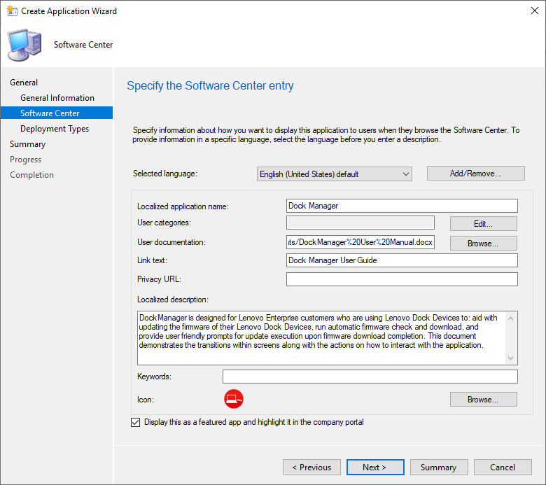
</div>

Enter Software Center details, click **Next**

<div style="text-align:center;padding-bottom:40px;padding-top:40px">

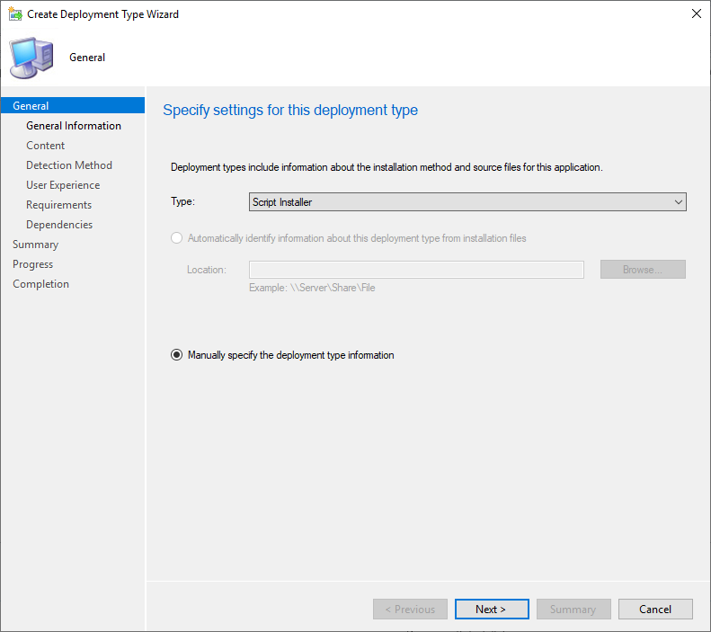
</div>

Set the deployment type to **Script Installer** and click **Next**

<div style="text-align:center;padding-bottom:40px;padding-top:40px">

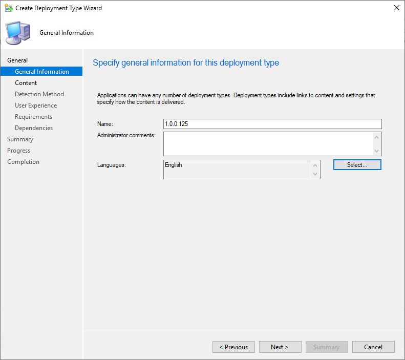
</div>

Set the deployment type name and click **Next**

<div style="text-align:center;padding-bottom:40px;padding-top:40px">

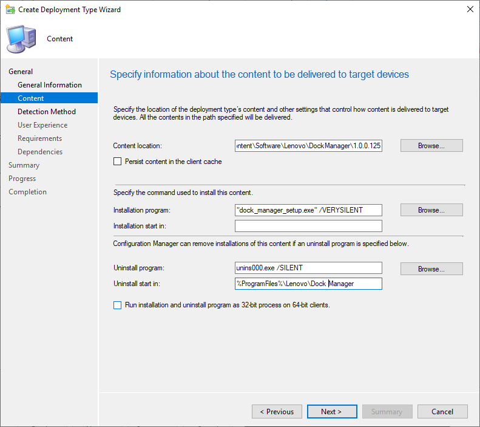
</div>
Enter the content location path to the Dock Manager executable

Install command:
```
"dock_manager_setup.exe" /VERYSILENT
```
Uninstall command:
```
unins000.exe /SILENT
```
Uninstall start in:
```
%ProgramFiles%\Lenovo\Dock Manager
```
<div style="text-align:center;padding-bottom:40px;padding-top:40px">

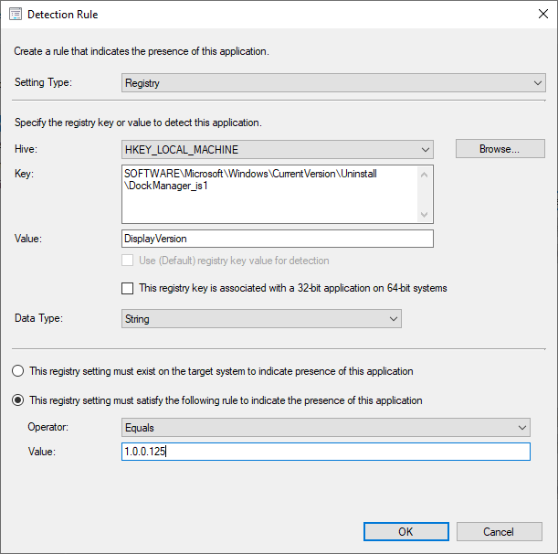
</div>

Set the detection rule setting type to **Registry**

Hive: **HKLM**

Key:
```
SOFTWARE\Microsoft\Windows\CurrentVersion\Uninstall\DockManager_is1
```
Value:
```
DisplayVersion
```

Data Type: **String**

Tick the radio button for **This registry setting must satisfy the following rule...**
Operator: **Equals**
Value:
```
1.0.0.125
```
<div style="text-align:center;padding-bottom:40px;padding-top:40px">

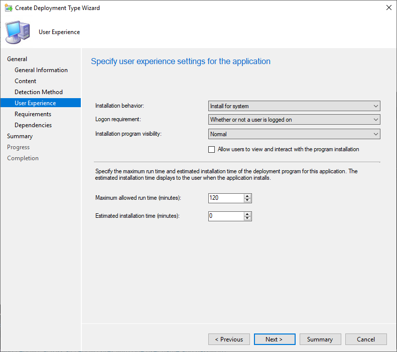
</div>

Set the installation behavior to **Install for system** and logon requirement to " **Whether or not a user is logged on** ".

Add any installation requirements such as Operating system is One of Windows 10 (64-bit)
<div style="text-align:center;padding-bottom:40px;padding-top:40px">

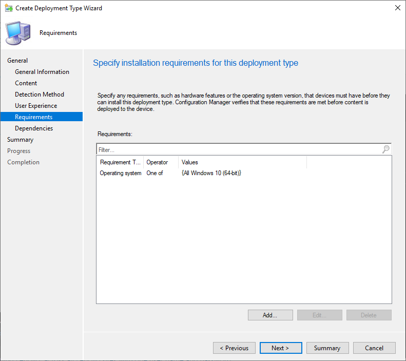
</div>
Complete the deployment type and App wizards.  Deploy to a Device Collection.

## Deploying with Microsoft Intune

Using the Win32 Content Prep [Tool](https://github.com/Microsoft/Microsoft-Win32-Content-Prep-Tool), convert the Dock Manager installer to an .intunewin format.  A sample command would look like this:

```
IntuneWinAppUtil.exe -c "C:\IntuneWin\DM\" -s "dock_manager_setup.exe" -o "C:\IntuneWin\output\" -q
```
<div style="text-align:center;padding-bottom:40px;padding-top:40px">


</div>

Login to the Endpoint admin center [portal](https://endpoint.microsoft.com/#blade/Microsoft_Intune_DeviceSettings/AppsWindowsMenu/windowsApps) to create a new Windows app and select the **Windows app (Win32)** type.

Select the **dock_manager_setup.intunewin** app package file.

Enter required and optional information about the app
<div style="text-align:center;padding-bottom:40px;padding-top:40px">


</div>
Enter the Install command

```
dock_manager_setup.exe /VERYSILENT
```

and Uninstall command

```
%ProgramFiles%\Lenovo\Dock Manager\unins000.exe /SILENT
```

<div style="text-align:center;padding-bottom:40px;padding-top:40px">

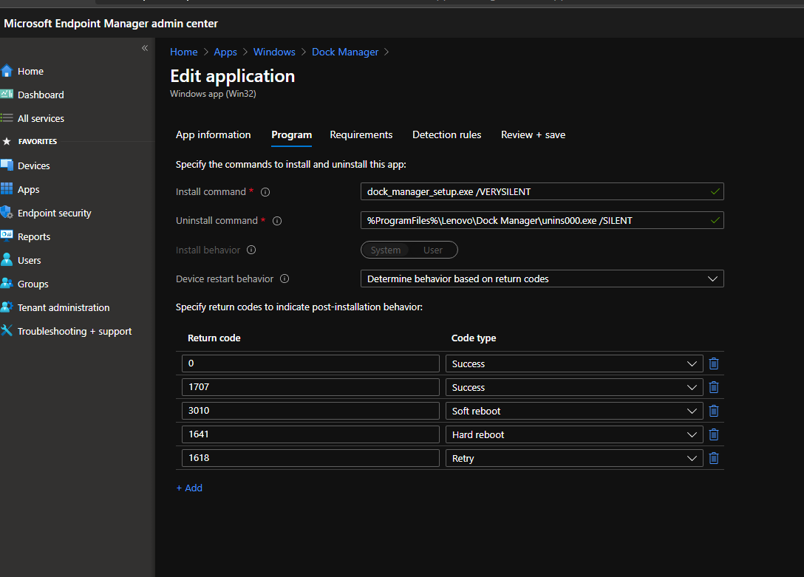
</div>
Set the requirements.  You can take it a bit further with a detection script to check if a supported dock is currently connected to the system.  Here's a sample PowerShell script

```
# Check for Thunderbolt 3 Dock Gen 2
$dock = Get-WmiObject -Class Win32_PnPEntity | Where-Object { $_.DeviceID -like 'USB\VID_2109&PID_8887*' }
if ($dock) {
    Write-Output "Thunderbolt 3 Dock Detected!"
}
else {
    Exit 1
}
```

<div style="text-align:center;padding-bottom:40px;padding-top:40px">

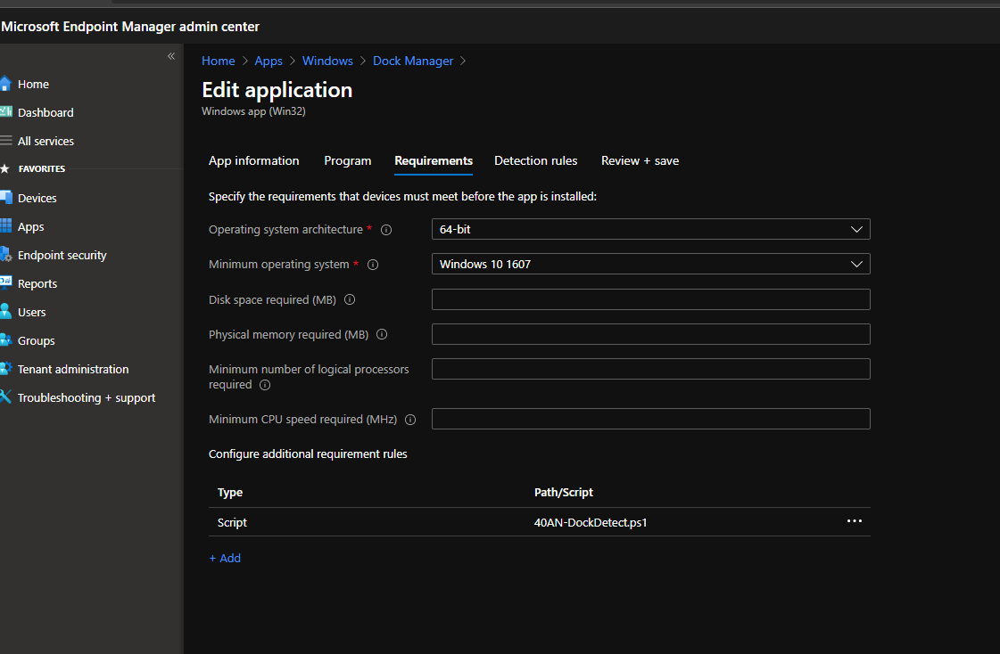
</div>
Enter the detection rules to verify the current version of Dock Manager is installed

Key path:

```
HKEY_LOCAL_MACHINE\SOFTWARE\Microsoft\Windows\CurrentVersion\Uninstall\DockManager_is1
```

Value name: **DisplayVersion**

Detection method: **String comparison**

Operator: **Equals**

Value: **1.0.0.125**

<div style="text-align:center;padding-bottom:40px;padding-top:40px">

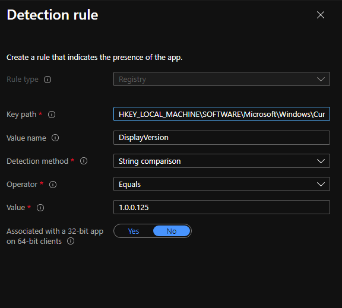
</div>
Finish out the wizard and assign to a group.

## WMI Classes

You can [extend hardware inventory](https://docs.microsoft.com/en-us/mem/configmgr/core/clients/manage/inventory/extend-hardware-inventory) in Config Manager to collect the data written by Dock Manager on your clients by importing the provided .mof file below:

[Download](https://download.lenovo.com/cdrt/blog/ConfigMgr-MOF-DockManager.zip)

An example from Resource Explorer
<div style="text-align:center;padding-bottom:40px;padding-top:40px">

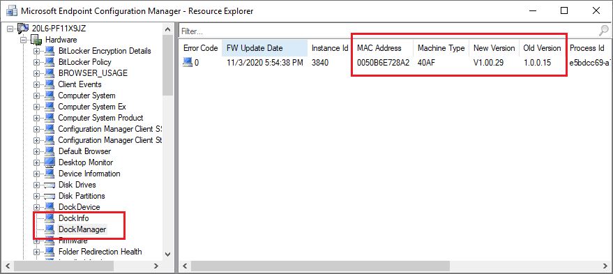
</div>
Sample report of what can be gathered using SSRS
<div style="text-align:center;padding-bottom:40px;padding-top:40px">


</div>