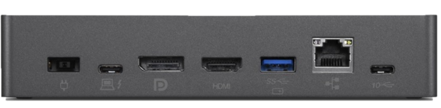
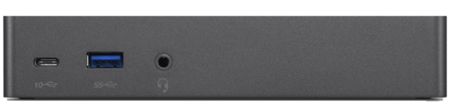
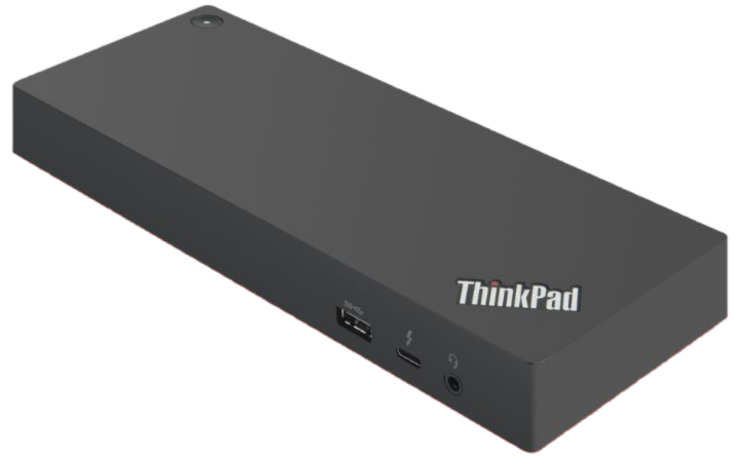
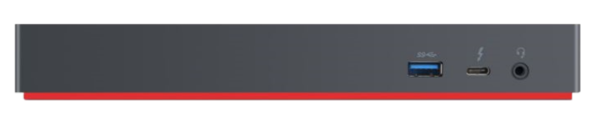
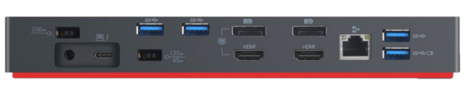
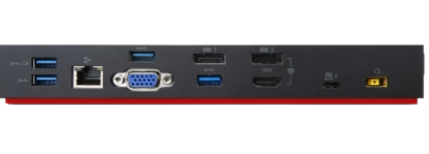
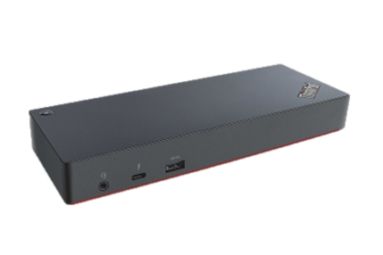

# Introduction

This document will provide collected details about the various Lenovo docks that use USB, USB-C, OneLink or Thunderbolt ports for connectivity to the PC. The intended audience for this document is the IT Administrator tasked with deploying these devices into their enterprise environment. Details will include specifications, driver deployment, firmware updates and hints/tips for managing and using these docks.

# Overview and General Information

You can use the navigation menu on the left side of this page to find:

   - **Current driver links for your dock**
   - **List of ports available on your dock**
   - **Display capabilities for your dock**

Also in this document you will find information that affects deployment options for the dock that you are using, which include:

   - **BIOS options that affect the dock that your organization is using**
   - **Deployment specific information for your dock**
   - **Does your dock support PXE booting?**
   - **What (if any) configuration is necessary for PXE**
   

# General Deployment Information

The information below pertains to deploying Windows 7 and Windows 10 on Lenovo’s enterprise class Think branded laptops using Lenovo's docking solutions. Each family of docks has at least one corresponding Ethernet adapter or Ethernet + video adapter. The basic information in this guide applies to those devices as well.

?>Note: With modern docking solutions, it is critical to the docking experience to ensure several components on the attached system are up to date. Therefore it is important to focus on these other components as well as the individual dock firmware and drivers when deploying and maintaing these solutions. To simplify finding the appropriate content use the [Docking tab on the Driver and Software Matrix for Admins](https://download.lenovo.com/cdrt/tools/drivermatrix/dm_2.html#Docking).

The base process for deployments via the Lenovo docks and dongles all require:

   1. Latest BIOS/UEFI system firmware on the target laptop
    - System BIOS updates available for each model at [Lenovo Support](https://support.lenovo.com/us/en/)
    - If you are interested in deploying BIOS updates during deployment, a guide on configuring and deploying BIOS can be found [here](https://bit.ly/CDRT-BIOS).
   2. Latest Intel ME firmware and software
    - Intel ME is often overlooked as a contributing component in the docking experience.
    - Depending on the target system, some Intel ME firmware updates may not support unattended deployment.
   3. Appropriate Thunderbolt Port Firmware for ThinkPad models with Thunderbolt 3 port(s)
    - **Appropriate updates for each model referenced** [on this page](https://support.lenovo.com/us/en/solutions/HT508988).
    - Depending on the target system, unattended deployment may not be supported
   4. Latest Firmware applied to the dock
    - Use the [Dock Reference Guide](https://pcsupport.lenovo.com/us/en/solutions/pd014572) to locate appropriate dock firmware updates
    - **Dock firmware update packages designed for enterprise deployments can also be found** [here](https://pcsupport.lenovo.com/us/en/downloads/DS540663).
   5. Appropriate WinPE network driver in your boot image for the specific dock
    - See Deployment Recipe for the appropriate dock below
   6. Appropriate Lenovo Software for your specific dock
    - See Deployment Recipe for the appropriate dock below
	
	

This document may make references to deployment tools such as Microsoft’s System Center Configuration Manager (SCCM) and Microsoft Deployment Toolkit (MDT). However, the overall concepts should apply to most Operating System Deployment (OSD) tools in use today.

Use the table below to find the appropriate WinPE driver for your dock:

| Docks                                                                                                                                                                                          | WinPE Driver       |
|------------------------------------------------------------------------------------------------------------------------------------------------------------------------------------------------|--------------------|
| USB-C Dock   USB-C Travel Hub   Thunderbolt Dock   Hybrid USB-C with USB-A Dock   OneLink Dock   OneLink+ Dock   OneLink+ to RJ45 Adapter   3-in-1 ThinkPad  OneLink Adapter   USB 3.0 Ethernet Adapter | [Realtek USB Driver](https://pcsupport.lenovo.com/solutions/HT101981) |
| USB 3.0 Basic Dock   USB 3.0 Pro Dock   USB 3.0 Ultra Dock                                                                                                                                       | [DisplayLink Driver](https://pcsupport.lenovo.com/solutions/HT104480) |

You will also need the appropriate driver for the version of Windows (links provided below in deployment recipe table for each dock) that you are deploying.

| MDT                                                                                                                                                                                                                       | SCCM                                                                                                                                                                                                                      |
|---------------------------------------------------------------------------------------------------------------------------------------------------------------------------------------------------------------------------|---------------------------------------------------------------------------------------------------------------------------------------------------------------------------------------------------------------------------|
| Make sure the driver is included in the  "Out of box" driver folder for your specific  system. If you are utilizing an alternate driver  deployment method make sure to include the  RealTek USB driver in your solution. | Make sure the driver is included in the  "Driver Package" for your specific system.  Again, if you are utilizing an alternate  method of driver deployment make sure to  include the Realtek USB driver in your solution. |

# Using Docking WMI Queries

Each USB Dock or Cable Dock listed below has one or more WMI queries to assist with identifying a dock during deployment. These queries will allow an administrator to apply the correct docking solution driver installation package to a system. The provided PNPIDs can be utilized in a query against the Win32_PNPEntity class in the Root\cimv2 namespace while the dock is attached to the system. Since certain Ethernet devices may appear on multiple dock models, the preferred component to target is the Billboard Device which will appear under Universal Serial Bus devices in Device Manager whenever a dock is attached. The hardware ID of this device will be unique per dock model.

An example of the query for a ThinkPad Thunderbolt 3 Essential Dock using the DeviceID of the Billboard device would look like:

PowerShell:

	Get-CimInstance -Namespace ROOT\CIMv2 -ClassName Win32_PNPEntity | Where-Object {$_.DeviceID -LIKE "USB\VID_17EF&PID_308D"}
	
WQL*:

	SELECT * FROM Win32_PNPEntity WHERE DeviceID LIKE "USB\\VID_17EF&PID_308D"
	
?>Note: WQL requires a second “\” character to escape the first “\” character so it is processed as part of the search string.

# Deployment Related BIOS Settings

As each new Intel chipset is released the new capabilities of each platform are reflected through changes in available BIOS settings. Below are the deployment related settings for the last three Intel chipset platforms that will affect deploying via Lenovo docking solutions.

## Broadwell

Intel 5th generation processors with CPU designation i3-5xxx, i5-5xxx, i7-5xxx)

   - USB 3.0 supported on all Broadwell models.
   - OneLink/OneLink+ docks supported only on models with either OneLink or OneLink+ port.
   
?>Note: If you are deploying via one of our USB 3.0 docks, the default setting of "Auto" for USB 3.0 Mode should allow you to successfully deploy Windows 7, Windows 8.1. and Windows 10.

?>Note: There are no Default BIOS settings that affect OneLink and OneLink+ docks.

## Skylake 

Intel 6th generation processors with CPU designation i3-6xxx, i5-6xxx, i7-6xxx

   - USB 3.0 docks supported on all Skylake systems.
   - OneLink+ docks supported on models with OneLink+ port.
   

| Skylake Exceptions |           |               |                          |
|--------------------|-----------|---------------|--------------------------|
| Model              | USB-C     | Thunderbolt 3 | MAC Address Pass-Through |
| ThinkPad 13        | Supported | Not Supported | * Supported              |
| ThinkPad P50       | Supported | Supported     | Not Supported            |
| ThinkPad P70       | Supported | Supported     | Not Supported            |

* Requires BIOS R0CET28W – Ver. 1.16 or newer for Mac Address Pass-Through

On ThinkPad 13 systems, When MAC Address PassThrough is Enabled you will still need the Realtek NIC driver as it is actually "cloning" (or passing through) the laptop's built-in Intel NIC card's MAC Address. OSD deployments in SCCM are generally targeted to the "unknown computers" collection which is determined by MAC Address up to version 1610 which allows you to Manage Duplicate Identifiers. Whether you have configured SCCM to use an alternate Identifier or not, MAC Address Pass-Through setting allows you to use the same dock for multiple deployments over time. This setting is also suggested for pushing software updates because it will allow management of the system even when it is not docked.

## Kaby Lake

Intel 7th generation processors with CPU designation i3-7xxx, i5-7xxx, i7-7xxx

   - USB 3.0 docks supported on all Kaby Lake systems.
   - USB-C docks supported on Kaby Lake systems with USB-C or Thunderbolt ports.
   - Thunderbolt 3 docks supported on systems with Thunderbolt ports.
   
When MAC Address PassThrough is Enabled you will still need the Realtek NIC driver as it is actually "cloning" (or passing through) the laptop's built-in Intel NIC card's MAC Address. OSD deployments in SCCM are generally targeted to the "unknown computers" collection which is determined by MAC Address up to version 1610 which allows you to Manage Duplicate Identifiers. Whether you have configured SCCM to use an alternate Identifier or not MAC Address Pass-Through setting allows you to use the same dock for multiple deployments over time. This setting is also suggested for pushing software updates etc. Because it will allow management of the system even when it is not docked.  

?>Note:Power Pass-Through on Skylake ThinkPad 13 is not supported with USB-C dock. The dock will charge the system with the supplied power adapter but you cannot power the system on or off via the dock's power switch.

# ThinkPad Thunderbolt 3 Essential Dock (40AV0135)

The Lenovo Thunderbolt 3 Essential Dock (40AV), powered by Intel’s Thunderbolt 3 technology, is designed to boost your productivity with dual 4k displays, blazing-fast 10Gbps data rates, and a range of optimized ports. A single 65W power cable connected to a Thunderbolt or USB-C notebook is all you need to get to work.

Top Features for Thunderbolt 3 Essential Dock
   - Single Cable Convenience: One cable connection delivers data, display and power to USB-c or Thunderbolt systems
   - High Performance: Enjoy Dual 4K displays and blazing-fast 10Gbps data transfer rates with Intel Thunderbolt 3 technology inside
   - Enterprise IT ready: Advanced network security and management features as PXE boot, WOL and MAC address pass thru on selected ThinkPad Notebooks.
   
[>> More Information & Drivers](https://support.lenovo.com/us/en/solutions/pd500373)

[Display Capabilities](https://support.lenovo.com/us/en/solutions/pd029622#Lenovo%20Thunderbolt%203%20Essential%20Dock)

## Connectivity

>Front ports: 
>   - 1 USB 3.0 
>   - 1 Thunderbolt 3<bt/>
>   - 1 Headphone/Mic 
>
>Rear ports: 
>   - 1 USB 3.0 with full-time power 
>   - 1 DisplayPort 
>   - 1 HDMI 
>   - 1 Thunderbolt 3 - To Computer with power 
>   - 1 Thunderbolt 3 
>   - 1 Ethernet 

## Deployment 

<table class="deploymentTable">
<td class="tdDT" rowspan="11" style="width:15%">
<h5 align="center">Deployment (MDT & SCCM)</h5>
</td>
<tr>
<td rowspan="4" class="tdDT">
<h5>Query: </h5>
<tr>
<td class="tdDT">Ethernet </td>
<td class="depTableFont">USB\VID_17EF&PID_3082 </td>
</tr>
<tr>
<td class="tdDT">Audio</td>
<td class="depTableFont">USB\VID_17EF&PID_3092&MI_00</td>
</tr>
<tr>
<td class="tdDT">Billboard </td>
<td class="depTableFont">USB\VID_17EF&PID_308D</td>
</tr>
</td>
</tr>
<tr rowspan="1">
<td rowspan="4" class="tdDT">
<h5>Driver(s): </h5>
<tr>
<td class="tdDT">WinPE </td>
<td class="depTableFont"><a href="https://pcsupport.lenovo.com/solutions/ht101981" target="_blank">https://pcsupport.lenovo.com/us/en/solutions/ht101981</a></td>
</tr>
<tr>
<td class="tdDT">Windows</td>
<td class="depTableFont"><a href=https://pcsupport.lenovo.com/downloads/DS542694" target="_blank">https://pcsupport.lenovo.com/downloads/DS542694</a></td>
</tr>
<tr>
<td class="tdDT">Firmware</td>
<td class="depTableFont">We do not recommend deploying firmware updates during OSD deployment </td>
</tr>
</tr>
</td></tr>
<tr>
<td colspan="2" class="tdDT">
<h5>PXE Capable: </h5>
</td>
<td class="depTableFont">Yes &nbsp;
</td>
</tr>
<tr>
<td colspan="2" class="tdDT">
<h5>Driver Deployment: </h5>
</td>
<td class="depTableFont"><b>MDT</b> (deploy as hardware app in task sequence) 
&nbsp;&nbsp;&nbsp;As Application (tbt_es_dock_driver_v1006.exe /VERYSILENT)   
<b>SCCM </b>  &nbsp;&nbsp;&nbsp;Deploy As Package in task sequence (tbt_es_dock_driver_v1006.exe /VERYSILENT)
  <b>*Restart required*</b> </td>
</tr>
</table>

# ThinkPad Thunderbolt 3 Workstation Dock (40AN0170, 40AN0230) / ThinkPad Thunderbolt 3 Dock Gen 2 (40AN0135)

This Intel® Thunderbolt™ Chipset powered Thunderbolt Dock Gen 2 (40AN) invented to boost productivity with extended compatibility on both USB-C and Thunderbolt enabled laptop. Expand your horizons with multiple 4K displays, and transfer files at record speed. It’s everything you need to enhance your creativity and efficiency today. Maximize Your Productivity with a Thunderbolt 3 Dock. Powerful, versatile and incredibly fast!

Top Features for Thunderbolt Dock Gen 2
   - Expand compatibility on USB-C and Thunderbolt systems
   - Dual UHD Displays provide the best video experience
   - Enhanced performance with professional video solution and exclusive network manageability
	
[>> More Information & Drivers](https://pcsupport.lenovo.com/us/en/solutions/pd500265)

[Display Capabilities](https://support.lenovo.com/us/en/solutions/pd029622#Thunderbolt%203%20Workstation%20Dock%20Gen%202)

## Connectivity

>Front ports:
>   - 1 USB 3.0 
>   - 1 Thunderbolt 3
>   - 1 Headphone/Mic
>
>Rear ports:
>   - 4 USB 3.0 - 1 with full-time power
>   - 2 DisplayPort
>   - 2 HDMI
>   - 1 Thunderbolt - To Computer with power
>   - 1 Ethernet

## Deployment

<table class="deploymentTable">
<td class="tdDT" rowspan="11" style="width:15%">
<h5 align="center">Deployment (MDT & SCCM)</h5>
</td>
<tr>
<td rowspan="4" class="tdDT">
<h5>Query: </h5>
<tr>
<td class="tdDT">Ethernet </td>
<td class="depTableFont">USB\VID_17EF&PID_3082 </td>
</tr>
<tr>
<td class="tdDT">Audio</td>
<td class="depTableFont">USB\VID_17EF&PID_3083 </td>
</tr>
<tr>
<td class="tdDT">Billboard </td>
<td class="depTableFont">USB\VID_2109&PID_8887</td>
</tr>
</td>
</tr>
<tr rowspan="1">
<td rowspan="4" class="tdDT">
<h5>Driver(s): </h5>
<tr>
<td class="tdDT">WinPE </td>
<td class="depTableFont"><a href="https://pcsupport.lenovo.com/solutions/ht101981" target="_blank">https://pcsupport.lenovo.com/us/en/solutions/ht101981</a></td>
</tr>
<tr>
<td class="tdDT">Windows</td>
<td class="depTableFont"><a href="https://pcsupport.lenovo.com/us/en/downloads/DS505148" target="_blank">https://pcsupport.lenovo.com/us/en/downloads/DS505148</a></td>
</tr>
<tr>
<td class="tdDT">Firmware</td>
<td class="depTableFont"><a href="https://pcsupport.lenovo.com/us/en/downloads/DS540663" target="_blank">https://pcsupport.lenovo.com/us/en/downloads/DS540663</a> We do not recommend deploying firmware updates during OSD deployment </td>
</tr>
</tr>
</td>
</tr>
<tr>
<td colspan="2" class="tdDT">
<h5>PXE Capable: </h5>
</td>
<td class="depTableFont">Yes &nbsp;
</td>
</tr>
<tr>
<td colspan="2" class="tdDT">
<h5>Driver Deployment: </h5>
</td>
<td class="depTableFont"><b>MDT</b> (deploy as hardware app in task sequence) &nbsp;&nbsp;&nbsp;As Application(thinkpad_tbt3_gen2_ws_dock_driver_10016.exe /VERYSILENT/NORESTART)   
<b>SCCM</b>  &nbsp;&nbsp;&nbsp;Deploy As Package in task sequence (thinkpad_tbt3_gen2_ws_dock_driver_10016.exe /VERYSILENT/NORESTART)
  <b>*Restart required*</b> </td></tr>
</table>

# ThinkPad Thunderbolt 3 Dock (PN 40AC0135)

The ThinkPad Thunderbolt 3 Dock is an unmatched docking solution powered by Intel Thunderbolt 3 technology. All together 13 ports available enables you to connect all your devices while rapidly charging your system via the USB Type-C port. It delivers conclusive 4K video performance with lightning fast data transfer. Having your most productive and space saving workstation as simple as connecting your notebook or tablet to the ThinkPad Thunderbolt 3 Dock. 

[>> More Information & Drivers](https://support.lenovo.com/accessories/ACC100356)

[Display Capabilities](https://support.lenovo.com/us/en/solutions/pd029622#Thunderbolt%203%20Workstation%20Dock)

## Connectivity

>Front Ports
>   - 1 USB 3.0
>   - 1 Thunderbolt 3
>   - 1 Headphone/Mic
>
>Rear
>   - 4 USB 3.0 - 1 with full-time power
>   - 2 DisplayPort
>   - 1 HDMI
>   - 1 VGA
>   - 1 Thunderbolt - To Computer
>   - 1 Ethernet

## Deployment

<table class="deploymentTable">
<td class="tdDT" rowspan="11" style="width:15%">
<h5 align="center">Deployment (MDT & SCCM)</h5>
</td>
<tr>
<td rowspan="4" class="tdDT">
<h5>Query: </h5>
<tr>
<td class="tdDT">Ethernet </td>
<td class="depTableFont">USB\VID_17EF&PID_3069 </td>
</tr>
<tr>
<td class="tdDT">Audio</td>
<td class="depTableFont">USB\VID_17EF&PID_306A </td>
</tr>
<tr>
<td class="tdDT">Billboard </td>
<td class="depTableFont">USB\VID_0451&PID_ACE1 </td>
</tr>
</td>
</tr>
<tr rowspan="1">
<td rowspan="4" class="tdDT">
<h5>Driver(s): </h5>
<tr>
<td class="tdDT">WinPE </td>
<td class="depTableFont"><a href="https://support.lenovo.com/solutions/ht101981" target="_blank">https://support.lenovo.com/solutions/ht101981</a>>/td>
</tr>
<tr>
<td class="tdDT">Windows</td>
<td class="depTableFont"><a href="https://pcsupport.lenovo.com/us/en/downloads/DS501904" target="_blank">https://pcsupport.lenovo.com/us/en/downloads/DS501904</a></td>
</tr>
<tr>
<td class="tdDT">Firmware</td>
<td class="depTableFont">We do not recommend deploying firmware updates during OSD deployment  <a href="https://pcsupport.lenovo.com/us/en/downloads/DS540663" target="_blank">https://pcsupport.lenovo.com/us/en/downloads/DS540663</a></td>
</tr>
</td>
</tr>
<tr>
<td colspan="2" class="tdDT">
<h5>PXE Capable: </h5>
</td>
<td class="depTableFont">Yes &nbsp;
</td>
</tr>
<tr>
<td colspan="2" class="tdDT">
<h5>Driver Deployment: </h5>
</td>
<td class="depTableFont"><b>MDT</b> (deploy as hardware app in task sequence) 
&nbsp;&nbsp;&nbsp;As Application (thinkpad_thunderbolt-3_dock_and_usb-c_dock_driver_v10017.exe
/VERYSILENT /NORESTART)   
<b>SCCM </b>  &nbsp;&nbsp;&nbsp;Deploy As Package in task sequence
(thinkpad_thunderbolt-3_dock_and_usb-c_dock_driver_v10017.exe /VERYSILENT /NORESTART)
 <b> *Restart required*</b></td>
</tr>
</table>