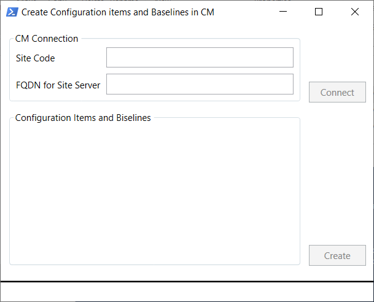
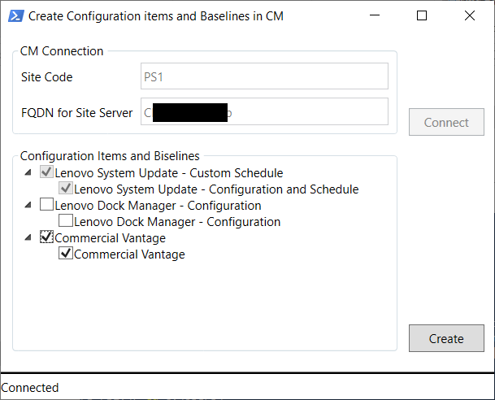
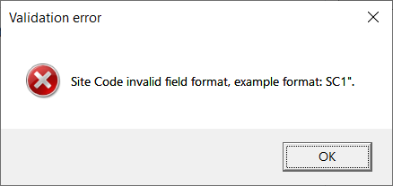
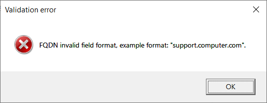
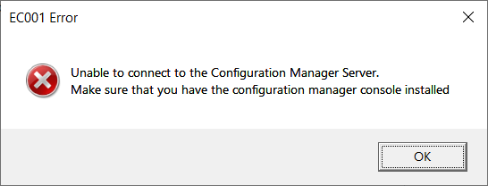

---
Documentation file for LDA companion GUI scripts
Script Name: Configure Dock Manager
upd.date: 03/22/2022
---

# GUI companion scripts

## SYNOPSIS

GUI scripts use GUI window for execution management.
They create [Configuration Baselines and Configuration Items](https://docs.microsoft.com/en-us/mem/configmgr/develop/compliance/about-configuration-baselines-and-configuration-items)  for Lenovo applications in the Microsoft Endpoint Configuration Manager.

## SYNTAX

```powershell
& '.\GUIScripts.ps1'
```

## DESCRIPTION
There are three scripts that are managed by a common window:
* Configuration Items and Baselines for "System Update Configuration and Schedule" script
* Configuration Items and Baselines for "Dock Manager" script
* Configuration Items and Baselines for "Commercial Vantage" script

### Configuration Items and Baselines for "System Update Configuration and Schedule" script
It creates baseline "Lenovo System Update - Custom Schedule" and configuration item "Lenovo System Update - Configuration and Schedule" in the baseline.

The configuration item will contain:

#### Settings:
```yaml
Name: Set AdminCommandLine
Setting Type: Registry key
Hive Name: HKLM
Key Name: SOFTWARE\WOW6432Node\Lenovo\System Update\UserSettings\General
This registry value is associated with a 64-bit application: true
```

```yaml
Name: Set SchedulerAbility
Setting Type: Registry value
Data Type: String
Hive Name: HKLM
Key Name: SOFTWARE\WOW6432Node\Lenovo\System Update\Preferences\UserSettings\Scheduler
Value Name: SchedulerAbility
This registry value is associated with a 64-bit application: true
````

```yaml
Name: Create Scheduled Task
Setting Type: Script
Data Type: String
Discovery Script: script writes "Compliant" if the scheduled task exists or "Non-compliant" if not.
Remediation script: script creates the scheduled task mentioned in the "Schedule System Update" Run Script and disables the default task.
```

#### Compliance Rules:
```yaml
Name: Set AdminCommandLine
Rule Type: Existential (Registry value must exist on client devices)
The setting must comply with the following rule: Set AdminCommandLine
```

```yaml
Name: Set SchedulerAbility
Rule Type: Value (Equals NO)
Remediate noncompliant rules when supported: true
The setting must comply with the following rule: Set SchedulerAbility
```

```yaml
Name: Create Scheduled Task
Rule Type: Value (Equals Compliant)
Run the specified remediation script when this setting is noncompliant: true
The setting must comply with the following rule: Create Scheduled Task
```

### Configuration Items and Baselines for "Dock Manager" script
It creates baseline "Lenovo Dock Manager - Configuration" and configuration item "Lenovo Dock Manager - Configuration" in the baseline.

The configuration item will contain:

#### Settings:
```yaml
Name: Set AskBeforeFirmwareUpdate
Setting Type: Registry value
Data Type: String
Hive Name: HKLM
Key Name: SOFTWARE\WOW6432Node\Lenovo\Dock Manager\User Settings\General
Value Name: AskBeforeFirmwareUpdate
This registry value is associated with a 64-bit application: true
```

```yaml
Name: Set EnableNotifications
Setting Type: Registry value
Data Type: String
Hive Name: HKLM
Key Name: SOFTWARE\WOW6432Node\Lenovo\Dock Manager\User Settings\General
Value Name: EnableNotifications
This registry value is associated with a 64-bit application: true
```

```yaml
Name: Set LogfileAgeToCleanup
Setting Type: Registry value
Data Type: String
Hive Name: HKLM
Key Name: SOFTWARE\WOW6432Node\Lenovo\Dock Manager\User Settings\General
Value Name: LogfileAgeToCleanup
This registry value is associated with a 64-bit application: true
```

```yaml
Name: Set LogfileMaxSize
Setting Type: Registry value
Data Type: String
Hive Name: HKLM
Key Name: SOFTWARE\WOW6432Node\Lenovo\Dock Manager\User Settings\General
Value Name: LogfileMaxSize
This registry value is associated with a 64-bit application: true
```

```yaml
Name: Set RepositoryLocation
Setting Type: Registry value
Data Type: String
Hive Name: HKLM
Key Name: SOFTWARE\WOW6432Node\Lenovo\Dock Manager\User Settings\General
Value Name: RepositoryLocation
This registry value is associated with a 64-bit application: true
```

```yaml
Name: Set Frequency
Setting Type: Registry value
Data Type: String
Hive Name: HKLM
Key Name: SOFTWARE\WOW6432Node\Lenovo\Dock Manager\User Settings\General
Value Name: Frequency
This registry value is associated with a 64-bit application: true
```

```yaml
Name: Set RunAt
Setting Type: Registry value
Data Type: String
Hive Name: HKLM
Key Name: SOFTWARE\WOW6432Node\Lenovo\Dock Manager\User Settings\General
Value Name: RunAt
This registry value is associated with a 64-bit application: true
```

```yaml
Name: Set RunDays
Setting Type: Registry value
Data Type: String
Hive Name: HKLM
Key Name: SOFTWARE\WOW6432Node\Lenovo\Dock Manager\User Settings\General
Value Name: RunDays
This registry value is associated with a 64-bit application: true
```

```yaml
Name: Set RunMonth
Setting Type: Registry value
Data Type: String
Hive Name: HKLM
Key Name: SOFTWARE\WOW6432Node\Lenovo\Dock Manager\User Settings\General
Value Name: RunMonth
This registry value is associated with a 64-bit application: true
```

```yaml
Name: Set RunMonthlyOn
Setting Type: Registry value
Data Type: String
Hive Name: HKLM
Key Name: SOFTWARE\WOW6432Node\Lenovo\Dock Manager\User Settings\General
Value Name: RunMonthlyOn
This registry value is associated with a 64-bit application: true
```

```yaml
Name: Set RunOn
Setting Type: Registry value
Data Type: String
Hive Name: HKLM
Key Name: SOFTWARE\WOW6432Node\Lenovo\Dock Manager\User Settings\General
Value Name: RunOn
This registry value is associated with a 64-bit application: true
```
#### Compliance Rules:
```yaml
Name: Set AskBeforeFirmwareUpdate
Rule Type: Value (One Of ["YES", "NO"])
The setting must comply with the following rule: Set AskBeforeFirmwareUpdate
```

```yaml
Name: Set EnableNotifications
Rule Type: Value (One Of ["YES", "NO"])
The setting must comply with the following rule: Set EnableNotifications
```

```yaml
Name: Set LogfileAgeToCleanup
Rule Type: Existential (Registry value must exist on client devices)
The setting must comply with the following rule: Set LogfileAgeToCleanup
```

```yaml
Name: Set LogfileMaxSize
Rule Type: Existential (Registry value must exist on client devices)
The setting must comply with the following rule: Set LogfileMaxSize
```

```yaml
Name: Set RepositoryLocation
Rule Type: Existential (Registry value must exist on client devices)
The setting must comply with the following rule: Set RepositoryLocation
```

```yaml
Name: Set Frequency
Rule Type: Value (One Of ["DAILY", "WEEKLY", "MONTHLY"])
The setting must comply with the following rule: Set Frequency
```

```yaml
Name: Set RunAt
Rule Type: Existential (Registry value must exist on client devices)
The setting must comply with the following rule: Set RunAt
```

```yaml
Name: Set RunDays
Rule Type: Existential (Registry value must exist on client devices)
The setting must comply with the following rule: Set RunDays
```

```yaml
Name: Set RunMonth
Rule Type: Existential (Registry value must exist on client devices)
The setting must comply with the following rule: Set RunMonth
```

```yaml
Name: Set RunMonthlyOn
Rule Type: Existential (Registry value must exist on client devices)
The setting must comply with the following rule: Set RunMonthlyOn
```

```yaml
Name: Set RunOn
Rule Type: Existential (Registry value must exist on client devices)
The setting must comply with the following rule: Set RunOn
```

### Configuration Items and Baselines for "Commercial Vantage" script
It creates baseline "Lenovo Commercial Vantage - Detection" and configuration item "Lenovo Commercial Vantage - Detection" in the baseline.

The configuration item will contain:

#### Settings:
```yaml
Name: Detect Lenovo Commercial Vantage
Setting Type: File system
Type: Folder
Path: %ProgramFiles%\WindowsApps
File or folder name: *LenovoSettingsforEnterprise*
This registry value is associated with a 64-bit application: true
```

#### Compliance Rules:
```yaml
Name: Detect Lenovo Commercial Vantage
Rule Type: Existential
The setting must comply with the following rule: Folder must exist on client devices
```

## USING
1. Run the script from PS console.



2. Enter valid Site Code and FQDN (Fully Qualified Domain Name) for Site Server and press the "Connect" button. 
If the connection is successful, the "Connect" button will become inactive.
If baseline and configuration item have already been created they will be checked and inactive.
You could check an unchecked baseline or configuration item to mark it for creation.



3. Press the "Create" button to create checked configuration items and baselines. 
The process will take some time. During the creation process messages will be shown in the window footer.

[!NOTE]
>GUI Scripts are for creating baselines and configuration items only. They are removed manually. 
>At the same time, note that you have to remove both baseline and configuration item.

## MESSAGES
The script shows three types of messages: 
* Errors in the messagebox
* Informational messages about process in the footer of the window
* Warnings shown in the PS console window. 

Also, in case of an unexpected error, it will be wrote to the PS console with additional information.
The messages in the PS console could be of two types: *LDA_WARNING_* and *LDA_ERROR* and also annotated with timestamp.

The following messages are possible:

### [LDA_ERROR_%TIMESTAMP%]:
* Unexpected error occurred: %POWERSHELL_ERROR_MESSAGE%

### [LDA_WARNING_%TIMESTAMP%]:
* Rule %RULE_NAME_% for ci %CONFIGURATION_ITEM_NAME% has not been created
* Settings %SETTINGS_NAME_% for ci %CONFIGURATION_ITEM_NAME% has not been created
* Baseline %BASELINE_NAME_% has not been created
* Configuration item %CONFIGURATION_ITEM_NAME% has not been created

### MESSAGEBOXES:
* Site Code validation error:




* FQDN (Fully Qualified Domain Name) validation error:




* Connection error:




## REQUIREMENTS
* [Microsoft Endpoint Configuration Manager](https://docs.microsoft.com/en-us/mem/configmgr/) must be installed on the server machine.

## RELATED LINKS

[About Configuration Baselines and Configuration Items](https://docs.microsoft.com/en-us/mem/configmgr/develop/compliance/about-configuration-baselines-and-configuration-items)


