# Lenovo Deployment Assistant {docsify-ignore}

## Overview
This user guide is intended for IT administrators or those who are responsible for creating
content in Microsoft Endpoint Manager Configuration Manager (hereafter referred to as CM).

The goal of this guide is to help you to get started using Lenovo Deployment Assistant, discover
all useful features, understand the concepts behind it and learn how to perform all common
tasks. These tasks include creating Applications, Configuration Item, Lenovo Inventory Data,
Custom Collections, keeping consistency between LDA and CM and more.

### What is Lenovo Deployment Assistant
LDA is a desktop application which is provided as a single executable downloadable from
Lenovo’s support site.

When the LDA is executed, the package will extract and install the GUI application along with
any required source files. The GUI application portion of the solution allows you to easily create
needed items in your CM environment to simplify the deployment, patching, and management of
Lenovo PCs.

## Installation
### Installing Lenovo Deployment Assistant
This section provides the installation instructions for LDA. It also provides you with installation
requirements, components and considerations.

#### Installation Requirements
To install the LDA on a Windows computer, the following is required:
- Windows 10 or higher
- Microsoft .NET Framework 4.6.1 or higher
- PowerShell 5.0
- Configuration Manager Console build 2010 or higher

#### Languages
The LDA application only supports English.

#### Installation Considerations
This section briefly describes the steps for a desktop-class installation.
1. Log on to your computer as a member of the administrative group that is authorized to
install and use LDA software.
Contact your system administrator to determine whether you have the necessary
permissions to install new software.
2. The process installs LDA at the "%PROGRAMFILES%/Lenovo/Deployment Assistant".
Please note, License agreement and Open Source Licenses notice will be placed in the
installation folder.
3. As a part of the installation process, Windows Registry keys are added. Please see the
[Logging section](#logging) for more details.
4. If one of the LDA versions is already installed, the system offers you to uninstall it within
the installation process.

### Uninstalling Lenovo Deployment Assistant
LDA can be uninstalled using the standard windows tools (Apps and Features, Add or Remove
Programs applets or by running the unins000.exe in the installation directory).

Please note that after the uninstall is complete all the components except local settings and
Shared Database are deleted.

## Initial Content Creation

### Overview
This section provides a brief roadmap of using LDA. It introduces you to a desktop application
that is presented as a wizard. It also gives you the use cases for content creation flow.

### Configuration
After the installation, the application is started and you are prompted to the Configuration screen
where you can specify the required instances.
In order to establish the connection between LDA and CM you should provide the following:
- Site code;
- FQDN (Fully Qualified Domain Name) of Site Server;
- UNC (Uniform Naming Convention) Path for Source Storage.

?>NOTE: LDA uses Shared Database to store the items which are created in CM. The location of
the Shared Database is specified by the user on the Configuration screen as UNC path. If the
Shared Database is missing at the specified UNC path it will be created by LDA once the user
connects to the CM.

!>For the LDA to function properly please do not delete the Shared Database.

If you have connected to the CM environment at least once entering Site Code, FQDN of Site Server, and UNC path, LDA pre-populates the fields the next time it is launched.

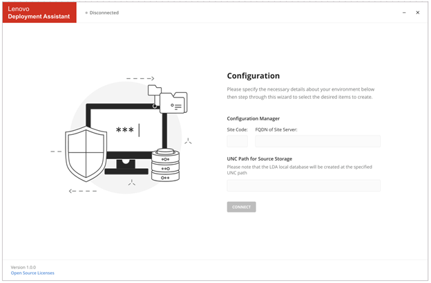

### Create Application and Configuration Item
LDA offers tools to easily create applications and their CIs in CM to deploy to client PCs.
1. Go to the desired application tab menu.
2. Select the “Create application”checkbox.

    You can optionally select the “Create a corresponding Configuration Item” checkbox. Please note that CI is an integral part of application. CI must be created together with the application, or after the application has been already created (CI can not be created in CM without the app).

    Release notes for the specific version of the application can be viewed by clicking the "Version \<version number\>" link under the application description.

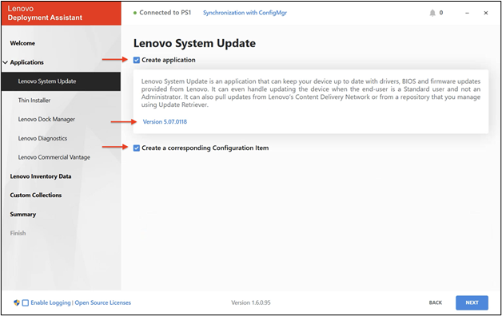

?>NOTE: Full version of the Release Notes can be viewed in a Browser in .txt format by
clicking the “View more information” in the pop-up.

3. Go to the Summary screen.

    Here you can see the summary of the applications and CIs to be created in CM. On the right hand bar the application is presented as about to be created by being highlighted in orange font.

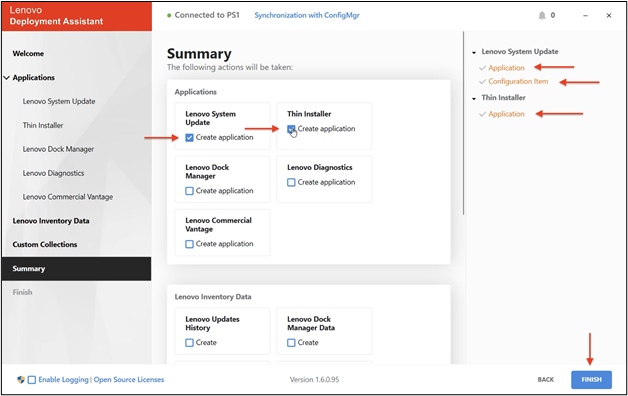

    You can select another application for creation on the Summary screen, however there is no possibility to select the respective CI. In order to do it, you can go to the application screen by clicking the "View Details" link on the right hand bar.

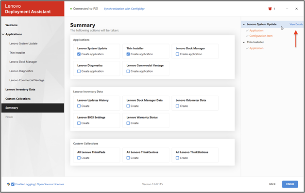

4. Click the “Finish” button.
5. The "Finish" screen can only be viewed when you have clicked the "Finish" button on the "Summary" screen. Otherwise, the screen is not available (greyed out). 

    Once the creation process is started, the UI is blocked until the end of the process.The screen displays the current progress of items creation in CM. When the process is finished, the "Finished" line will be prompted at the end of the progress console.
    
?>NOTE: The progress console output can be copied for further use.

6. You can see the successfully created applications and CIs next time you launch the
application.

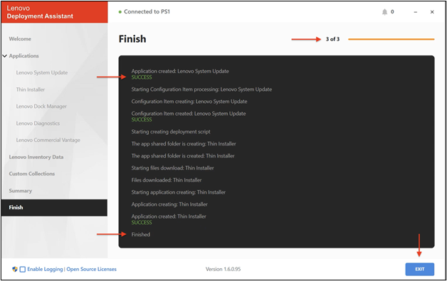

You can find all the created Lenovo applications in the corresponding section of the CM Console. Every Lenovo application is located in "Lenovo -> Application Name -> Application Version" folder. 

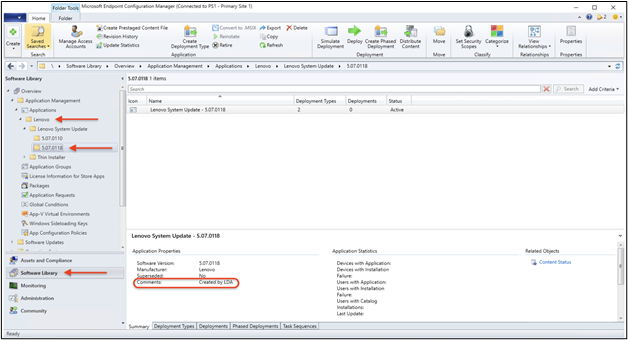

?>NOTE: All the applications created by LDA have the "Created by LDA" text in the Administrative comment.

If the CI was also selected for the respective application it will be created in CM in the Assets and and Compliance tab menu.

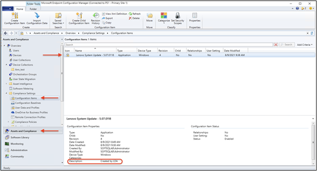

?>NOTE: All the CIs created by LDA have the "Created by LDA" text in the Description.

### Create Next Version of Application
Once the new version of the application is available the “New version available” section appears on the UI. Also the system notifies you about the update by showing indication in the Bell icon and bullets in the tab menu.

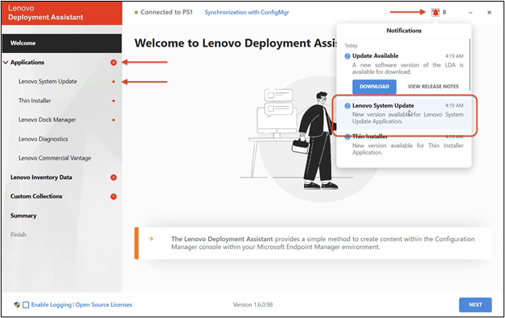

1. Go to the desired application tab menu.
2. Select the "Create New Version <Application Version>" checkbox.

    It is optional to select “Supersedence Relationship”. You can also select the CI if it was not created previously.

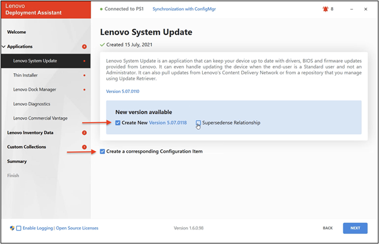 

   Release notes for the current and next versions of the application can be viewed by clicking the corresponding "Version <Application Version>" link. 

?>NOTE: Full version of the Release Notes can be viewed in a Browser in .txt format by clicking the “View more information” in the pop-up.

3. Go to the Summary screen.

    Here you can see the summary of the new versions of the applications and CIs to be created in CM. The system shows it highlighted in orange font "\<old version\>" → "\<new version\>".

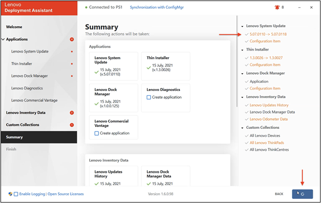

4. Click the “Finish” button.
5. Wait until the process of creation is finished.
    
    You can see the UI is updated with the latest versions of the created applications next time you launch the LDA.

You can find all the created Lenovo applications in the corresponding section of the
Configuration Manager Console. Every Lenovo application is located in "Lenovo -> Application
Name -> Application Version" folder.

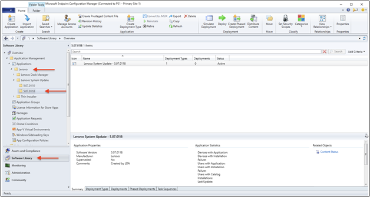

?>NOTE: All the applications created by LDA have the "Created by LDA" text in the Administrative comment.

### Update Configuration Item
Once the new version of the CI is available the system displays it on the UI. Also the system notifies you about the update by showing indication in the Bell icon and bullets in the tab menu.

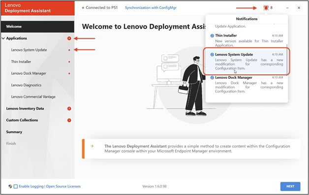

1. Go to the application tab menu where the CI update is located and you will see the sign “Will be modified”.

    The CI update does not require selecting it manually and will be performed automatically when clicking the "Finish" button on the Summary screen.

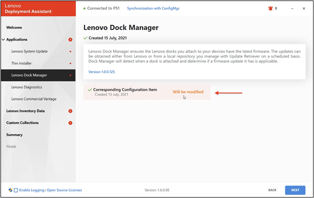

2. Go to the Summary screen.

    Here you can see the CI is displayed on the right hand bar and presented as about to be created (highlighted in orange font).

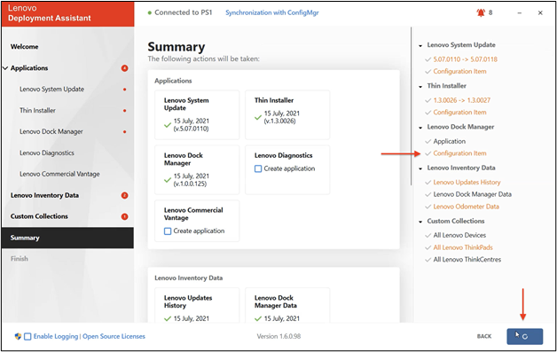

3. Click the “Finish” button.
4. Wait until the process of creation is finished.

    You can see the UI is updated with the latest versions of the updated CIs next time you launch the application.

You can go to the CM in the Assets and Compliance tab menu, and check that the respective CI is updated for the respective Application version.

?>NOTE: All the CIs created by LDA have the "Created by LDA" text in the Description

Please note, when the new version of the application is selected for creation in CM, and there is already a created CI, it will be highlighted with "Will be modified".

In this case, once the application is created in CM, the corresponding CI will be updated with the latest version of the created application.

### Create Lenovo Inventory Data
LDA provides an option to select Lenovo Inventory Data item (group of WMI classes) which can be added to hardware inventory collection in the CM.

1. Go to the Lenovo Inventory Data tab menu
2. Select the required Inventory Data element

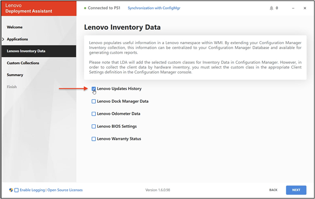

3. Go to the Summary screen

    Here you can see the summary of the Inventory Data to be created in CM. Furthermore, on the right hand bar the item is presented as about to be created by being highlighted in orange font.

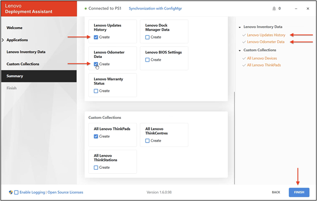

   You can control the creation of Inventory Data by selecting/deselecting them in the Lenovo Inventory Data panel.

4. Click the “Finish” button.
5. Wait until the process of creation is finished.

    You can see the UI is updated with the created Inventory Data next time you launch the application.

?>NOTE: the created WMI classes will be added to the Default Client Settings. 

   In order to collect the client data by hardware inventory, you must select the custom classes in the appropriate Client Settings definition in the CM console.

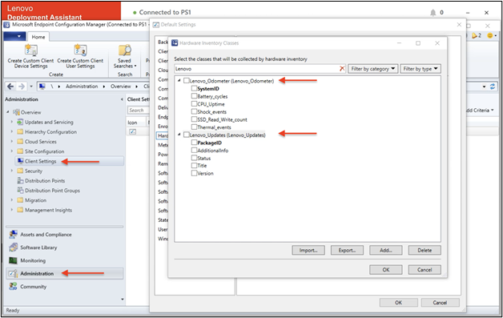

### Update Lenovo Inventory Data
Once the new version of the Lenovo Inventory Data is available the system displays it on the UI. Also the system notifies you about the update by showing indication in the Bell icon and bullets in the tab menu.

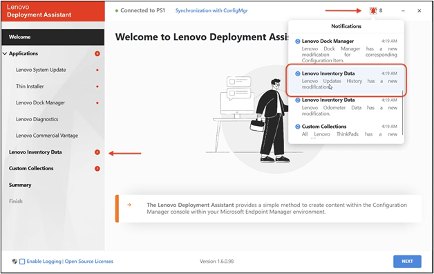

1. Go to the Lenovo Inventory Data tab menu and you will see the sign “will be modified”.

    The Inventory Data update does not require selecting it manually and will be performed automatically when clicking the "Finish" button on the Summary screen.

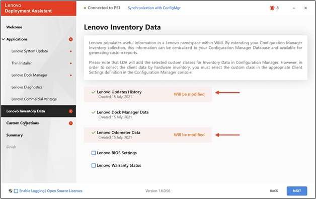

2. Go to the Summary screen.

    Here you can see the Lenovo Inventory Data items are displayed on the right hand bar and presented as about to be created (highlighted in orange font).

3. Click the “Finish” button.
4. Wait until the process of creation is finished.

    You can see the UI is updated with the latest versions of the updated Inventory Data next time you launch the application.

    Please see the updated Inventory Data classes in the appropriate Client Settings definition in the CM console.

### Create Custom Collection
Custom Collections are based on WMI queries and result in a specific set of managed devices
that you may want to perform an action against.
1. Go to the Custom Collection tab menu
2. Select the required Custom Collection

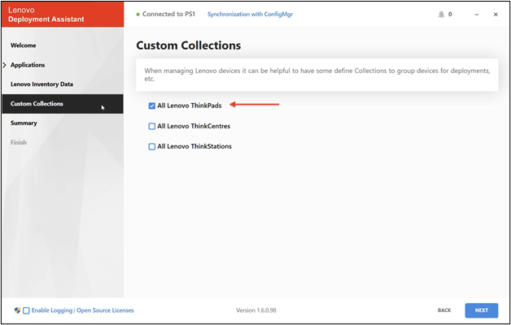

3. Go to the Summary screen

    Here you can see the summary of the Custom Collection to be created in CM. Furthermore, on the right hand bar the item is presented as about to be created by being highlighted in orange font. 

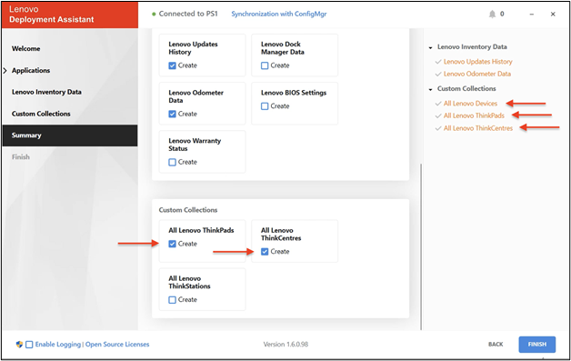

   You can control the creation of Custom Collections by selecting/deselecting them in the Custom Collections panel.

?>NOTE: Some Custom Collections have dependencies on the others. In this case, all the dependent collections are created.

4. Click the “Finish” button.
5. Wait until the process of creation is finished.

    You can see the UI is updated with the latest versions of the created Custom Collections next time you launch the application.

    You can find all the created Custom Collections in the corresponding section of the CM console. Every Lenovo Custom Collection is located in the "Lenovo" folder.

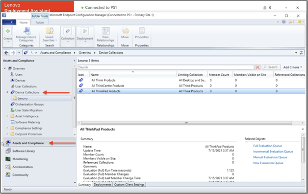

### Update Custom Collection
Once the new version of the Custom Collection item is available the system displays it on the UI. Also the system notifies you about the update by showing indication in the Bell icon and bullets in the tab menu.

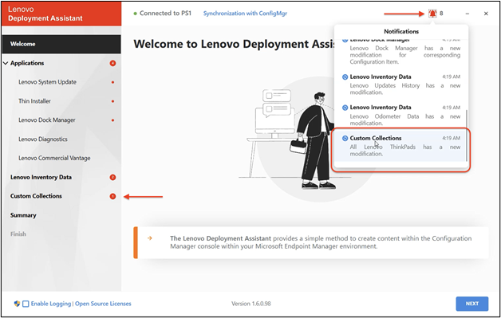

1. Go to the Custom Collection tab menu and you will see the sign “Will be modified”.

   The Custom Collection update does not require selecting it manually and will be performed automatically when clicking the "Finish" button on the Summary screen.

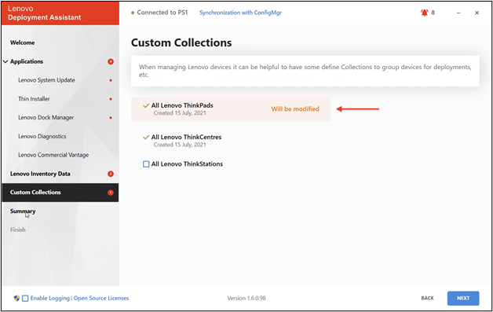

2. Go to the Summary screen.

    Furthermore, on the right hand bar the item is presented as about to be created by being highlighted in orange font.

    Here you can see the Custom Collection item is displayed on the right hand bar and presented as about to be created (highlighted in orange font).

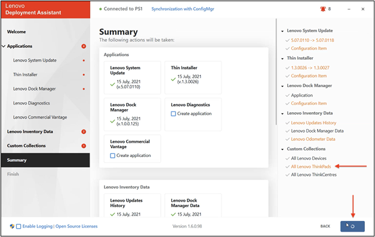

3. Click the “Finish” button.
4. Wait until the process of creation is finished.

    You can see the UI is updated with the latest versions of the updated Custom Collections next time you launch the application.

    You can find all the updated Custom Collections in the corresponding section of the CM console. Every Lenovo Custom Collection is located in the "Lenovo" folder.

## Lenovo Deployment Assistant Update

### Overview
LDA will present updates for itself as well. There are two types of LDA updates: regular updates and mandatory updates.

A Mandatory Update is a type of update where some crucial features are provided which are required for correct LDA functionality. This update cannot be skipped and should be performed right after the application launch.

A Regular update is a standard application update with new features or non-critical bug fixes. This type of update can be postponed.

During the update, you will not be able to use LDA.

### Mandatory Update
Once the Mandatory update is available you will be notified with the dialog window showing the update details.

You are able to skip the update by clicking the “Exit” button in this case the LDA will be closed.

You are able to view the Release Notes in the pop-up.

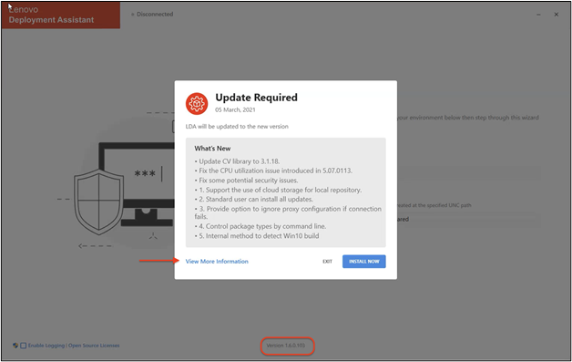

?>NOTE: The full version of the Release Notes can be viewed in a Browser in .txt format by clicking the “View more information” in the pop-up.

You can check the current version of the application at the bottom of the screen (e.g. Version 1.6.0.121).

1. Click the “Install Now” button.

    The system will initiate the downloading process.

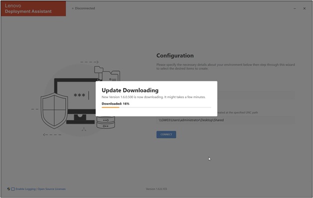

2. After the download is complete the installation process will be run.

    The LDA is closed and the Installation Wizard appears. Please see Installing LDA.

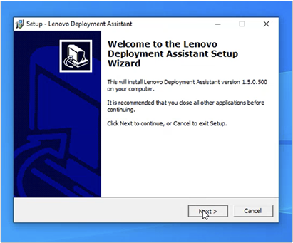

3. After the installation is complete the new version of LDA will be opened.

    You can check the new version of the application at the bottom of the screen (e.g. Version 1.6.0.121).

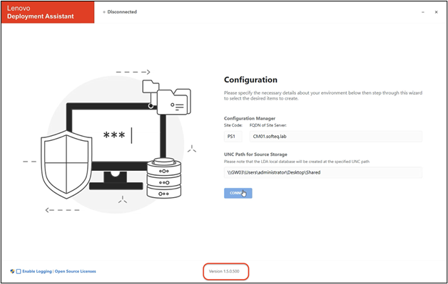

### Regular Update
Once the Regular update is available you will be notified with the bell notification showing the update details.

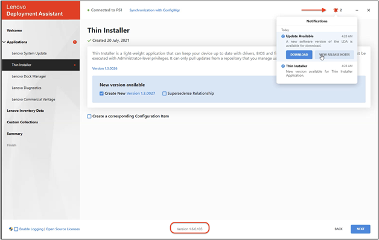

You are able to skip the update and use the current version of the application.

You are able to view the Release Notes in the pop-up or download the update.

1. Click the “Download” button in the notification section.

    The system will initiate the downloading process.

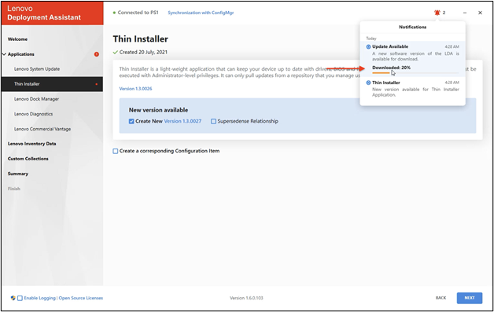

2. Once the download is complete you can start the installation by clicking the "Install" button.

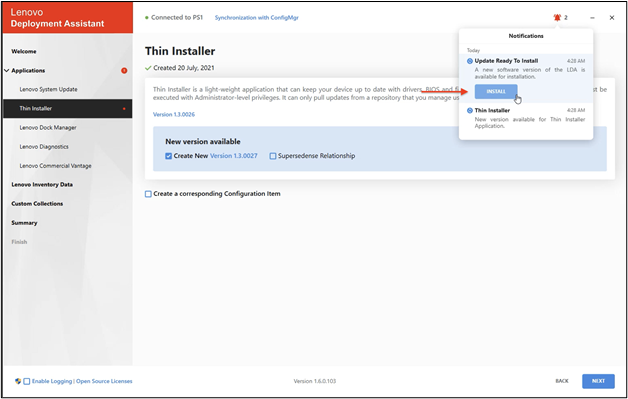

3. In the opened pop up you may see the Release Notes.

    You can initiate the installation process by clicking the “Install” button. The LDA is closed and the Installation Wizard appears. Please see [Installing LDA](#installation).

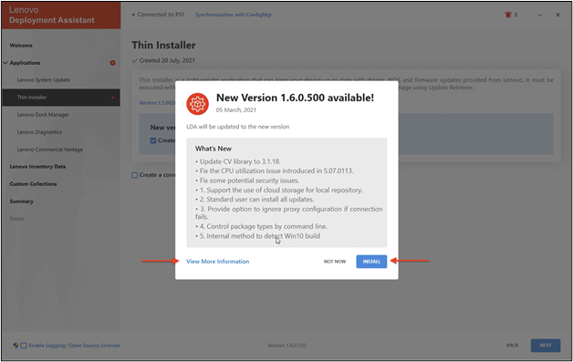

4. After installation is complete the new version of LDA will be opened.

    You can check the new version of the application at the bottom of the screen.

## Synchronization with Configuration Manager

### Overview
The synchronization logic provides the ability for LDA to be in sync with the current state of the content previously added to CM. This tool might be useful for keeping CM and LDA consistent.

The synchronization does not make any changes in CM as it updates only the current state of LDA.

The synchronization works only for application and CIs and for both cases:
- If the item (Application or CI) is created in CM but in LDA it is shown as NOT created
then after the sync, the system displays the item as created in LDA;
- If the item is NOT created in CM but in LDA it is shown as created, then after the sync
the system displays the item as NOT created in LDA.

?>NOTE: To maintain the synchronization capability, please follow the guidelines below.

- Please do NOT rename the created items in CM with “Created by LDA” text (for
application in the Administrative comment, for CI in the Description) otherwise it will not
be synchronized.
- Sync will be performed only for the latest versions of application and CI and for items
with “Created by LDA” property.
- Synchronization does not create or delete items in the CM. It only reflects in LDA what is
already created or NOT created in CM.

### Synchronizing with Configuration Manager
1. Click the “ Synchronization with ConfigMgr” link

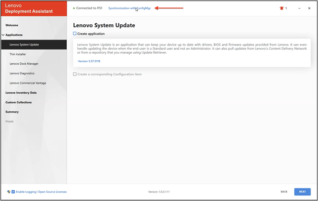

2. In the opened pop-up select the items that you want to scan for the sync.

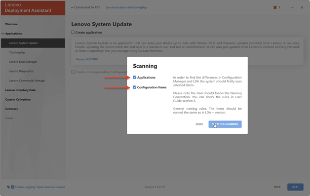

3. Wait until the scanning process is completed.

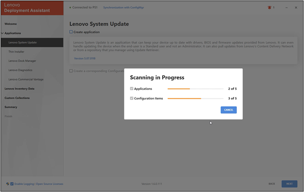

4. Select items which should be synchronized and click the "Start the sync" button.

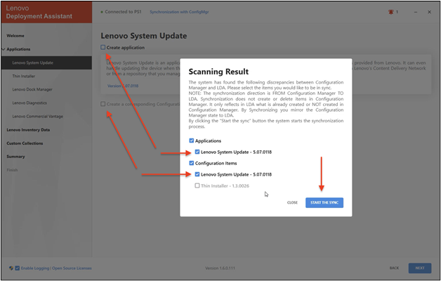

?>NOTE: Since CI is dependent on the application, CI will be disabled (greyed out) until the respective application is not marked as created in LDA or the respective application is not selected on the "Scanning Result" screen.

5. Wait until the sync process completes and check that the selected items reflect the same state in LDA as in CM.

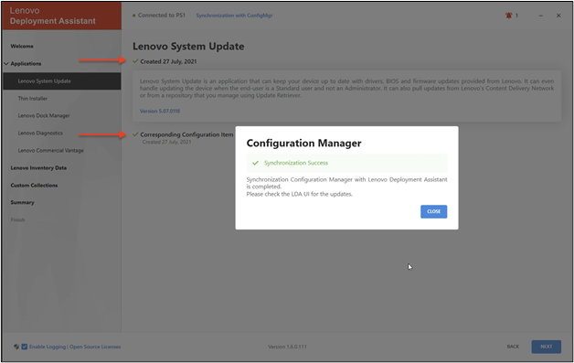

## Logging
### Overview
The LDA offers the logging feature. The log file will contain any user’s interaction with the system and all system responses: success, failure, and all information from the "Finish" screen. Logging may help you to track the interaction with the system and how the system responds. In case some problem happens the logging file can be sent to the Lenovo support team for future investigation.

### Enabling Logging
During the LDA installation the “Enable Logging” registry value will be placed in the following registry key: HKLM\SOFTWARE\Lenovo\Deployment Assistant\Logging. The logging registry value is responsible for enabling and disabling the logging feature.

The logging process can be initiated from any screen of the application.

1. Check the “Enable Logging” checkbox at the left bottom of the screen.

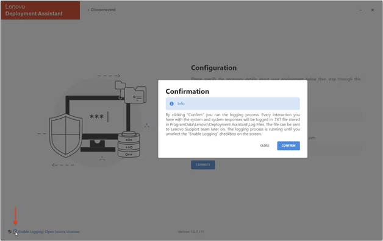

2. Confirm the logging by clicking the “Confirm” button.
3. Perform the actions in LDA.
4. Go to %PROGRAMDATA%\Lenovo\Deployment Assistant\Log Files folder and check that the log .TXT file with name "lda_yyyymmdd_hhmm.txt" is created.

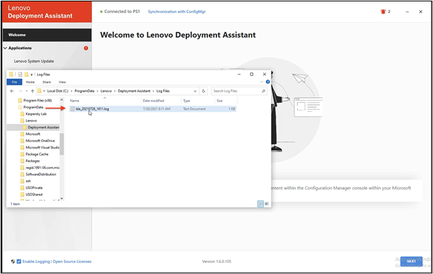

The logging continues for further LDA runs and stops only when you deselect the "Enable Logging" checkbox.

## Troubleshooting
### Overview
If you encounter any issue with LDA you can ask a question on Lenovo forum:

https://forums.lenovo.com/t5/Enterprise-Management-Board/bd-p/sa01_eg

Or if you get an Error Message with an error code, you can click the “Report” button and be redirected to Lenovo forum.

### How to ask questions on the Lenovo forum

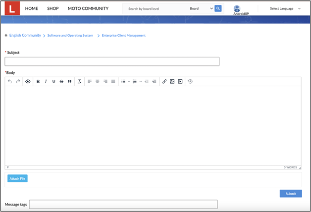

1. Please specify a clear Subject for the question;
2. Provide an Error Code if there is one (e.g. EC002);
3. Provide “Steps to reproduce”, a short description of the issue;
4. Specify the current version of LDA;
5. Attach the recent log files from the %PROGRAMDATA%\Lenovo\Deployment Assistant\Log Files folder.
