# Deployment Guide: Lenovo System Update Suite

**_System Update, Update Retriever, Thin Installer_**


?>Note: Before using this information and the product it supports, read the general information in **Appendix C: Notices**

**Tenth Edition (October 2021)**

**© Copyright Lenovo 2009, 2021.**

LIMITED AND RESTRICTED RIGHTS NOTICE: If data or software is delivered pursuant a General Services Administration &quot;GSA&quot; contract, use, reproduction, or disclosure is subject to restrictions set forth in Contract No. GS-35F-05925.


# 1 Overview

The System Update Suite of tools from Lenovo include System Update, Update Retriever, and Thin Installer. Lenovo provides these free utilities to assist in updating drivers, firmware and software for Lenovo PC products running Microsoft® Windows®operating system. This deployment guide will describe how to install and use the current version of each of these programs. This deployment guide is aimed at IT administrators and will describe configurations and best practices for using these tools in a managed environment.

These tools can be downloaded from the following website: [https://support.lenovo.com/us/en/solutions/ht037099](https://support.lenovo.com/us/en/solutions/ht037099)


## 1.1 System Update

System Update is a program that helps keep the software on a system up to date. System Update can identify applicable update packages which are stored on Lenovo&#39;s Content Delivery Network globally. Update packages can be applications, device drivers, BIOS and firmware, and software updates. System Update can also be configured to pull updates from a local repository managed by Update Retriever. System Update detects the computer machine type, model number, and other system information to determine whether the system needs the available updates. System Update can display a pick list of update packages where the user can select update packages to download and install. System Update can also be configured to install packages based on a scheduled task. System Update provides a method to defer the installation of update packages. This tool can be configured to search for and download update packages from the following locations:

- Lenovo Support web site
- Repository folder on a local system
- Repository folder on a network share


## 1.2 Update Retriever

Update Retriever is a program that enables an administrator to search for and download updates from the Lenovo Support site to a repository folder on a local drive or network share. The repository folder provides the storage for update packages. System Update or Thin Installer can be configured to search for update packages from the repository folder on a network share instead of searching the Lenovo Support site. With Update Retriever, one can manually initiate the search for update packages, or schedule an automatic search for new update packages at a specified time interval. This allows greater control of the updates that are available to managed devices. Update Retriever can help with the following:

- Downloading updates for specific Lenovo systems according to machine types and operating systems
- Downloading update packages for more than one machine type
- Providing the repository that System Update or Thin Installer can pull from

## 1.3 Thin Installer

Thin Installer is a lighter version of System Update. Unlike System Update, Thin Installer does not require installation, does not create any registry keys, and does not have any services. Thin Installer can search for update packages from a repository folder on a local hard disk drive, a network share, a Web share, or external media such as a CD, DVD, or USB hard disk drive.


# 2 Installation

## 2.1 Installing System Update

This chapter provides the installation instructions and requirements for System Update.

### 2.1.1 Installation Requirements

System Update supports the following operating systems:

- Microsoft® Windows® 7 32 &amp; 64 bit
- Windows 10 64-bit
- Windows 11 64-bit

?>NOTE: System Update is qualified and supported on Windows 7, Windows 10 and Windows 11. System Update is not qualified and supported on Windows 8/8.1. If End User decides to install System Update on Windows 8/8.1 it may work without issue and may be used as is, but Lenovo makes no representations about this and has not tested such installation and such installation would not be supported. If having System Update is important to End User Lenovo recommends changing to a Windows version where it is qualified and supported.

System Update requires Microsoft .NET Framework 4.5.2 or a later version. A compatible version of .NET Framework can be downloaded from the following Microsoft website:

[https://dotnet.microsoft.com/download](https://dotnet.microsoft.com/download)


### 2.1.2 Languages

System Update supports all NLS (National Language Support) language packs. In normal cases, System Update loads the language pack set in the LanguageOverride field. That is, at startup, System Update checks the Windows registry for a valid language override code in the LanguageOverride field. If the language override code in the LanguageOverride field is valid and the language pack is available on the system, System Update will load the language pack corresponding to the language override code specified in the LanguageOverride field and display the rest of the session in that language.

The registry location for the LanguageOverride field is:

    HKEY_LOCAL_MACHINE\SOFTWARE\WOW6432Node\Lenovo\System Update\LanguageOverride

The following table presents the languages and the corresponding language override codes for System Update.

| **Language** | **Identifier** | **Language Override Code** |
| --- | --- | --- |
| Danish | 1030 | DA |
| Dutch (standard) | 1043 | NL |
| English | 1033 | EN |
| Finnish | 1035 | FI |
| French | 1036 | FR |
| German | 1031 | DE |
| Italian | 1040 | IT |
| Japanese | 1041 | JP |
| Korean | 1042 | KO |
| Norwegian (Bokmal) | 1044 | NO |
| Portuguese (Brazilian) | 1046 | PT |
| Spanish | 1034 | ES |
| Swedish | 1053 | SV |
| Simplified Chinese | 2052 | CHS |
| Traditional Chinese | 1028 | CHT |

<p style="text-align:center;padding-bottom:40px;font-style: italic;"> Table 2-1. System Update language codes</div>

The following are scenarios in which System Update will load the substitute NLS language pack:

- **_Loading the language pack set in the Windows Regional and Language Options settings_**: If the LanguageOverride field is empty or with an invalid value, or the value specified in the LanguageOverride field is not installed on the system, System Update will get the language override code of the operating system set in the Regional and Language Options settings. If System Update successfully loads the language pack corresponding to the language set in the Regional and Language Options settings, System Update will display the rest of the session in that language.
- **_Loading the language pack set in the DefaultLanguage field_**: If the language pack corresponding to the language set in the Regional and Language Options settings is not available on the system, System Update will attempt to get the default language that has been set in the DefaultLanguage field when the end user used the System Update installer and selected a language during the installation. System Update will load the language pack corresponding to the default language set in the DefaultLanguage field, and display the rest of the session in that language. If the 8 System Update Solution Deployment Guide language pack corresponding to the default language set in the DefaultLanguage field is on the system, System Update will load the default language pack and display the rest of the session. The registry location for the DefaultLanguage field is:

    ```
	HKEY_LOCAL_MACHINE\SOFTWARE\WOW6432Node\Lenovo\System Update\DefaultLanguage
	```

- **_Loading the US English language pack_**: If the DefaultLanguage field is empty or contains an invalid value, or if the language pack corresponding to the default language set in the DefaultLanguage field is not on the system, the default language will not be used. System Update will attempt to load the US English language pack. If the US English language pack is not on the system, an error message will be displayed, saying &quot;System Update has found a critical problem and must close.&quot; This error message is in the US English language.


### 2.1.3 Installation Command Lines

System Update can be installed manually by executing the installation package downloaded from Lenovo. System Update can also be installed silently with the following command line:

    c:\\[System Update installation file name].exe /VERYSILENT /NORESTART

To install System Update silently and control where the installation package extracts to, use the following command:

    C:\\[System Update installation file name].exe /VERYSILENT /NORESTART /DIR="C:\tvsu\temp"
    

System Update is installed to the following folder:

    %ProgramFiles%\Lenovo\System Update

System Update supports the following installation scenarios:

- Clean installation: System Update will be installed with default preferences
- Upgrade or over-installation (earlier version already exists): The installation program will remove the older version and install the current version. Preferences will be preserved.

An installation log file, _tvsusetup.log_, will be automatically generated and stored in the _%temp%_ directory. The location and filename of the log file can be controlled by command line parameter also:

    C:\\[System Update installation file name].exe /VERYSILENT /NORESTART /LOG=c:\tvsu.log


### 2.1.4 Uninstalling System Update

System Update can be uninstalled by using the **Add or Remove Programs** applet located in the Windows operating system. After the uninstall is complete, all program files and settings are deleted.

Alternatively, a command-line can be used to perform a silent uninstall. To silently uninstall System Update, use the following command:

    [Your install dir]\unins000.exe /verysilent /norestart


### 2.1.5 Updating System Update

System Update includes a mechanism by which it will update itself whenever a newer version is released. System Update checks for a newer version before performing a search for updates each time it is launched. If a newer version is found, it will prompt to update itself before proceeding and will guide the user through the update process.

It is recommended to keep System Update running on the most current version; however, if this feature needs to be disabled it can be done by editing the registry. To disable this feature, do the following to clear the registry value:

   1. Using regedit.exe, navigate to the following registry entry:

    ```
	HKEY\_LOCAL\_MACHINE\SOFTWARE\WOW6432Node\Lenovo\System Update\Preferences\UCSettings\HTTPSHelloSettings\ServerName
	```

   2. Delete the ServerName string value, for example:
    ```
	https://download.lenovo.com/ibmdl/pub/pc/pcbs/agent/ 
	```
   3. Click **OK**.

## 2.2 Installing Thin Installer

Thin Installer is provided as an installation package which simply extracts the Thin Installer source files to C:\Program Files (x86)\Lenovo\ThinInstaller. The process does not create any registry entries and does not install any services. The Thin Installer folder can simply be copied to target devices and executed by command line.


### 2.2.1 Installation Requirements

Thin Installer is supported on the following operating systems:

- Windows 10 64 bit
- Windows 7 32 &amp; 64 bit

Thin Installer requires Microsoft .NET Framework version 4.5.2 or higher. A compatible version of .NET Framework can be downloaded from the following Microsoft website:

[https://dotnet.microsoft.com/download](https://dotnet.microsoft.com/download)


### 2.2.2 Removing Thin Installer

No registry keys or temporary files relating to Thin Installer are created when the program finishes installing update packages. Therefore, to uninstall Thin Installer, you only need to delete the folder containing Thin Installer and all its related files.


## 2.3 Installing Update Retriever

Update Retriever is intended to be installed on an administrator&#39;s system and is not installed on the fleet of client computers.


### 2.3.1 Installation Requirements

Update Retriever is supported on the following operating systems:

- Windows 7
- Windows 8.1
- Windows 10
- Windows Server 2012
- Windows Server 2016
- Windows Server 2019

Update Retriever requires Microsoft .NET Framework version 4.5.2 or higher. A compatible version of .NET Framework can be downloaded from the following Microsoft website:

[https://dotnet.microsoft.com/download](https://dotnet.microsoft.com/download)


### 2.3.2 Languages

The following table presents the languages supported by Update Retriever and their corresponding language override codes:

| **Language** | **Identifier** | **Language Override Code** |
| --- | --- | --- |
| English | 1033 | EN |
| French | 1036 | FR |
| German | 1031 | DE |
| Japanese | 1041 | JP |
| Simplified Chinese | 2052 | CHS |

<p style="text-align:center;padding-bottom:40px;font-style: italic;">Table 2-2. Update Retriever language codes</div>

The registry location for the **LanguageOverride** field for a 32-bit machine is:

	HKEY\_LOCAL\_MACHINE\SOFTWARE\Lenovo\Update Retriever\LanguageOverride
	

The registry location for the **LanguageOverride** field for a 64-bit machine is:

	HKEY\_LOCAL\_MACHINE\SOFTWARE\WOW6432Node\Lenovo\Update Retriever\LanguageOverride


### 2.3.3 Installation Command Lines

Update Retriever can be installed manually by executing the installation package downloaded from Lenovo. Update Retriever can also be installed silently with the following command line:

	c:\\[Update Retriever installation file name].exe /VERYSILENT /NORESTART

To silently extract to a specific folder followed by an installation, use the DIR parameter. For example:

	[Update Retriever installation file name].exe /VERYSILENT /NORESTART /DIR="C:\temp"

The installation log file contains information that can be used to debug installation problems. For Update Retriever, the log file name is _tvursetup.log_.

If you install the program by double-clicking the setup.exe file, the log file will be automatically generated and stored in the _%temp%_ directory.

If you want to install the program silently and generate installation log files, use the following command:

	[Update Retriever installation file name].exe /VERYSILENT /NORESTART /LOG=c:\tvur.log

If a previous version of Update Retriever is already installed, the following pop-up is displayed. In order to download the newest version of Update Retriever, the use must click **Yes**. After selecting **Yes** , to uninstall the existing version of Update Retriever, a window will appear asking for install instructions. Please proceed with install instructions.The administrator will NOT lose any of their previous downloads, update packages, machines, or any information in Update Retriever or its repository. Everything that was displayed and available in the existing version of Update Retriever, will be in the new version that is being installed **.**

<div style="text-align:center;padding-bottom:40px;padding-top:40px">

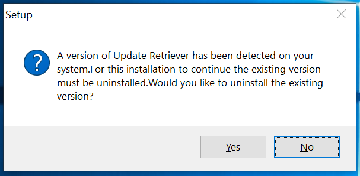

_Figure 2-1. Removing existing version of Update Retriever to download the newest version._
</div>

### 2.3.4 Uninstall Update Retriever

Update Retriever can be uninstalled by using the Add or Remove Programs applet in Windows operating systems. After the uninstall is complete, all program files and settings are deleted. Alternatively, you can use command-lines to perform a silent uninstall. To silently uninstall Update Retriever, use the following command-line:

	[Your install dir]\unins000.exe /verysilent /norestart


# 3 General Usage


## 3.1 System Update

This section will provide an overview of how System Update can be used to install updates either manually using the application&#39;s interface or automatically based on a scheduled task. The various methods of configuring and launching System Update will be covered.


### 3.1.1 Using System Update

Once System Update has been installed, the tool is ready to run. When launching System Update for the first time, the Welcome tab information will appear, giving the user a brief overview of how the tool can be used. Once the user clicks  **Next** , in the bottom left hand corner on the welcome page, System Update will automatically start searching for updates on the system. Of course, the administrator can make changes in group policy to alter how system update searches for updates, this is just the generic way of how System Update will run. Once the tool has finished searching for updates, it will prompt the user with a License notice. The License agreement notice is for all future package downloads and will not be shown again. The user must agree to proceed with the download and installation. Once the tool searches for updates, the update packages will be displayed in three different severity categories; Critical, Recommended, and optional.

<div style="text-align:center;padding-bottom:40px;padding-top:40px">

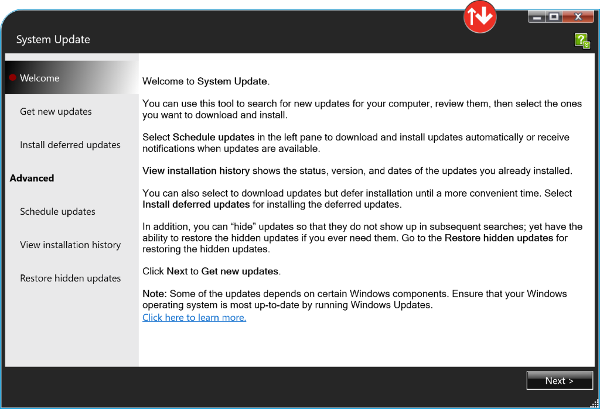

_Figure 3-1. Systems Update Welcome Interface._
</div>

There are multiple functional tabs in System Update, located to the left-hand side of the tool, allowing the user to customize the way they want to update their machine. Designed to help keep systems up-to-date, the System Update tool provides the following functions:

1. **Get New Updates**
   + **Critical updates**
   + **Recommended updates**
   + **Optional updates**

1. **Install Deferred Updates**

1. **Schedule Ppdates**

1. **View Installation History**

1. **Restore Hidden Updates**

Following the numerical order above, the upcoming sections will explain each of the System Update functions in further detail.

?>Note: If the user does not want to proceed with the System Update function they are currently on, the user must click  **Cancel**  before the tool will allow you to exit the function tab and move on to another one.

**1. Get New Updates**

System Update will automatically search for new updates from the Lenovo support site based on the machine type and operating system. Once the updates are found, the tool separates each update applicable to the machine, into critical updates, recommended updates, and optional updates. The critical updates will automatically be checked to download, unlike the recommended or optional updates. The user can check and uncheck any of the updates. The user must click on each individual update tab (critical, recommended, and optional updates) to select the desired update packages before continuing. There is an option to select all the updates or the user can individually select them one by one.

<div style="text-align:center;padding-bottom:40px;padding-top:40px">

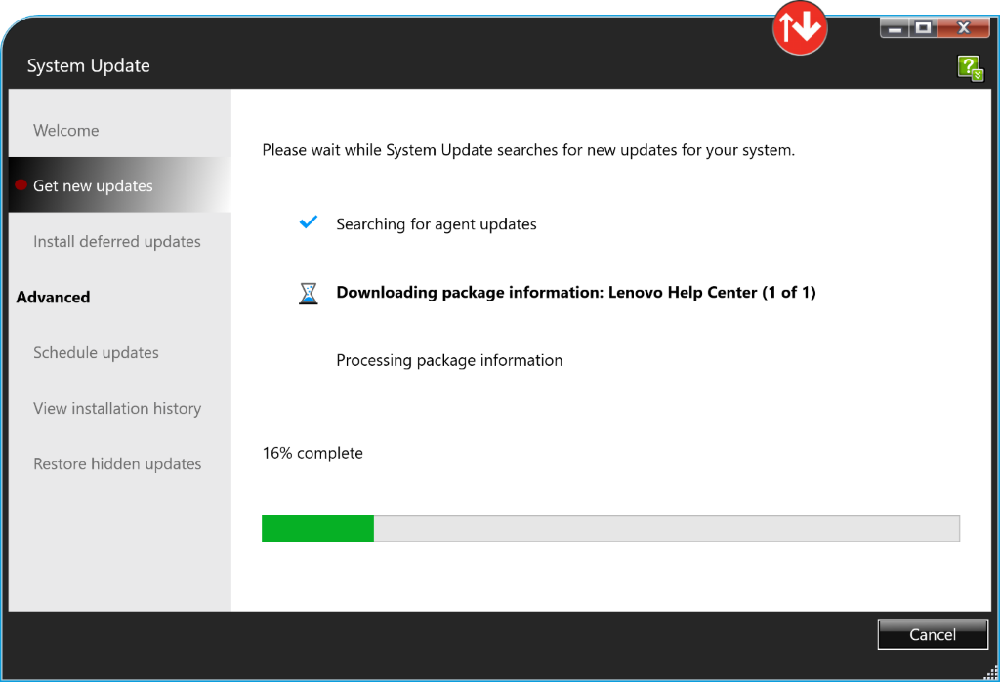

_Figure 3-2. Searching for new updates._

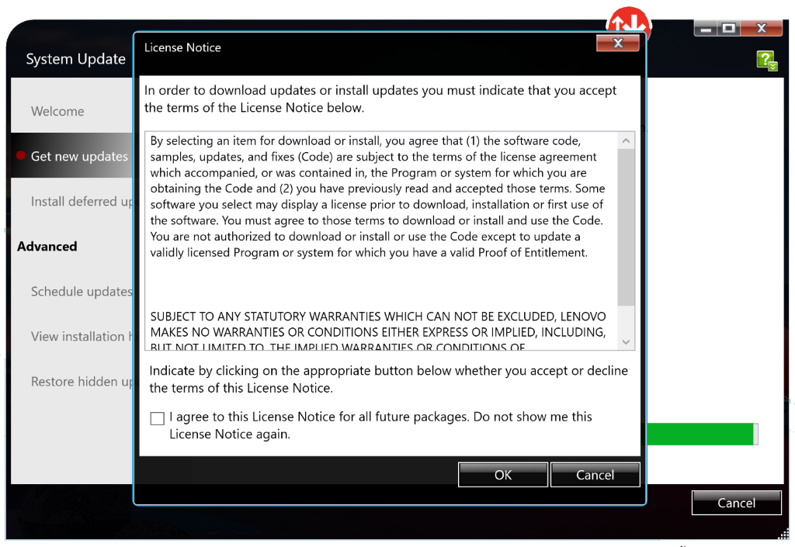

_Figure 3-3. Agree to the License notice before proceeding with System Update._

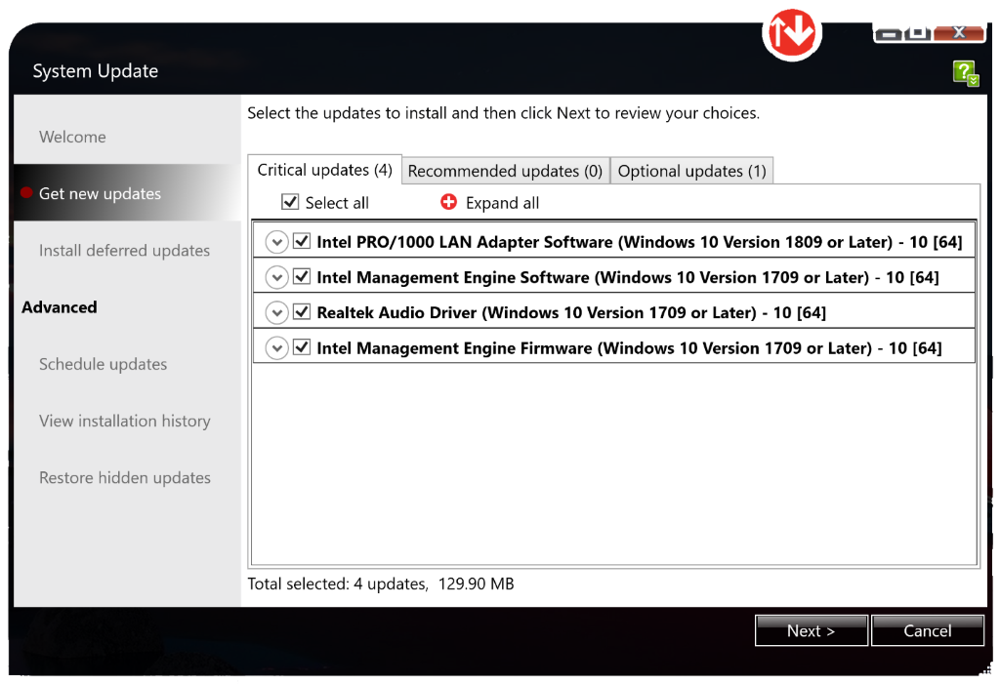

_Figure 3-4. Get New Updates Function, selecting critical updates._

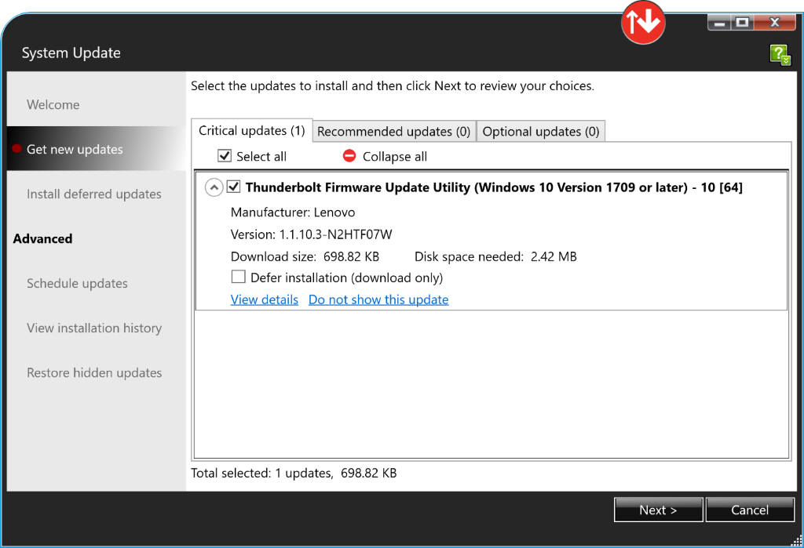

_Figure 3-5. Get New Updates, item details expanded._
</div>
Notice that there is a drop-down arrow by each checkbox for each individual package.  When clicked, the item details will expand. The user can either click the down arrow for each individual update package or they can press the &quot;Expand all&quot; red plus sign above the packages. The expanded view provides more information on each update package including the manufacturer, version, installed version, download size, disk space needed, and the option to defer the update. If the user would like to defer the update, the checkbox must be checked. Furthermore, there is a &quot;View details&quot; link, which displays the contents of the readme file for the update package which offers additional details such as supported models, supported operating systems, supported devices, what the package does, changes in the release, determining which version is installed, installation and uninstallation instructions and more.

When using System Update to search for update packages, System Update will display search results in four severity categories, as explained above: Critical, Recommended, and Optional. For a description and example of each category severity level, see the following:

**Critical update packages**  are considered mandatory for the system to function properly. Failure to install these packages could result in data loss, system malfunction, or hardware failure. The administrator can choose to have critical updates downloaded and installed automatically on a scheduled basis. A critical package can be, for example:

>- A hard disk drive firmware update that if not applied could result in hard disk drive failure.
>- A BIOS upgrade that if not applied will result in system lags.
>- A software patch to an application that if not applied could result in data loss a system.

**Recommended update packages**  are packages recommended by Lenovo to ensure the system working at optimal performance. This severity level should be the default for most drivers. A recommended package can be, for example:

>- A video driver that corrects an issue that may cause blue screen issues.
>- A BIOS update that contains minor fixes that may impact a small group of customers.
>- A power management driver that will allow a mobile system to get the most out of its battery life.

**Optional update packages**  will improve the computing experience but are not necessary. An optional package can be, for example:

>- An application or utility that is not needed for the system to operate but provides benefit if it is installed.
>- Any BIOS or driver upgrade that has been updated only to support newer systems and contains no fixes.

?>Note: Some of updates may depend on certain Window components. Ensure that your Windows operating system is up to date by running Windows Update.

Once all the updates desired have been selected, press **Next**. A review of the updates selected will be displayed. This will also provide a second chance to select updates to defer installation or deselect a package before they are downloaded and installed on the machine. Once the &quot;Download&quot; button is clicked, if any of the packages require a reboot after installation, a message box will appear letting the user know which package(s) requires it. Wait for the machine to reboot and finish the installation before doing anything else. Do not manually shut off the machine or put it into sleep mode during this time.

<div style="text-align:center;padding-bottom:40px;padding-top:40px">

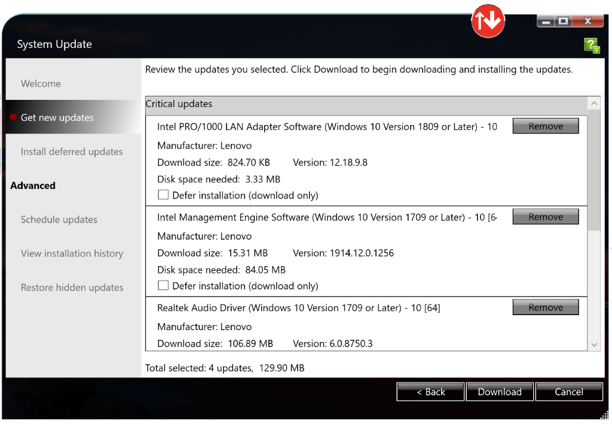

_Figure 3-6. Reviewing Updates before downloading packages._

_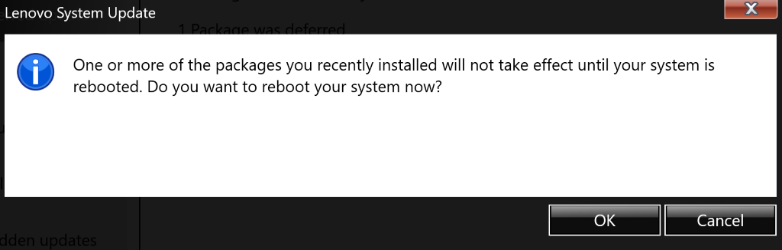_

_Figure 3-7. Certain update packages require reboot before installation is complete. Do not manually shut off the machine at this time._
</div>

**2. Install Deferred Updates**

When selecting update packages to download, instead of installing them immediately, the user can defer the installation for a more convenient time. All the deferred updates will be stored in the &quot;Install deferred updates&quot; tab. To defer an update, the user will check the defer installation checkbox package in the &quot;Get new updates&quot; section. Make sure that each of the update packages have been expanded to check the &quot;defer installation&quot; checkbox.

<div style="text-align:center;padding-bottom:40px;padding-top:40px">

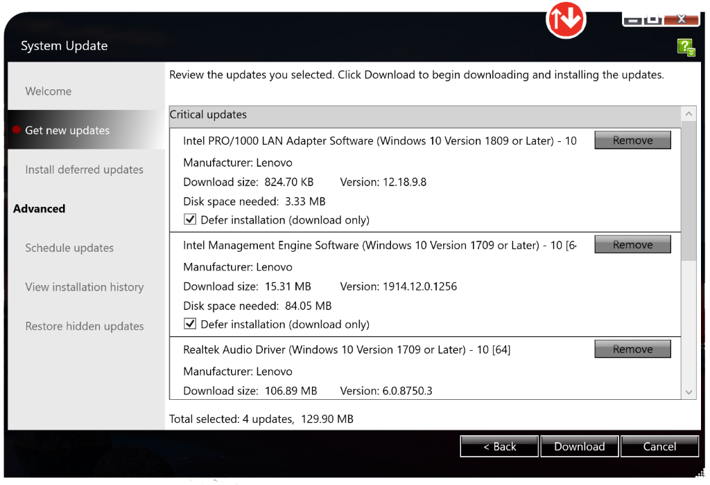

_Figure 3-8. How to Defer an Update Package from Installing (Download Only)._

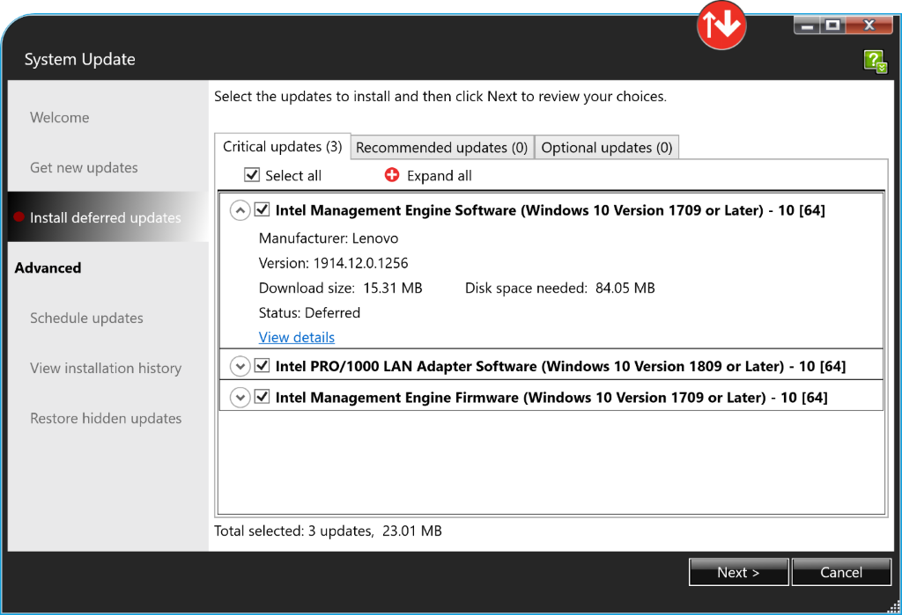

_Figure 3-9. Installing Deferred Update Packages._
</div>

**3. Scheduling Updates**

System Update provides an option to schedule an automatic search for new updates, at a specified time interval. The user can download and install updates automatically or receive notifications when updates are available. When enabling the automatic search for updates, the user can define the package type, the search frequency, and the time of day when System Update searches for new updates.

<div style="text-align:center;padding-bottom:40px;padding-top:40px">

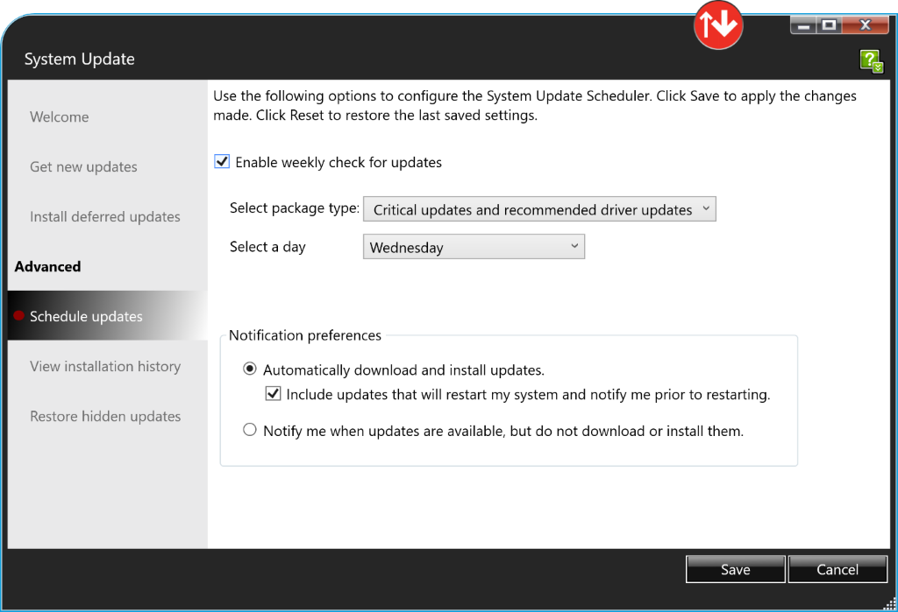

_Figure 3-10. Scheduling Updates for installation._
</div>

**Configuring Automatic Search for Updates**

When configuring System Update to search for new updates automatically on a scheduled basis, the following options are available:

- **Schedule:**  administrators can choose to search for new updates weekly or monthly. For weekly checks, a day of the week and time must be selected. For monthly checks, a date in the month and time must be selected.
- **Notification:**  For recommended and optional updates, users can be notified when new updates are found and have the choice to either download the updates or defer the download. For critical updates, users can configure the application to automatically download and notify them when the download has completed, or they can configure it to download and install all new updates and get notified after the download and installation is completed.

**Configuring the Notification Option for an Automatic Search**

If performing an automatic search, it is best practice to configure the application with one of the following notification options for critical, recommended, and optional updates:

- Provides notification when new updates are found so that the user can manually initiate the download and installation.
- Downloads and installs the new updates and provides notification when completed.
- Automatically downloads updates and notifies the user when the updates are ready to install.

The notification is in form of a toast message from the system tray of the Windows Task Bar.

If the application icon is right-clicked, two options are available:  **Launch**  and **Exit**. Selecting  **Launch**  will start System Update and display the new updates. Selecting  **Exit**  will remove the application icon and will no longer notify the user when new updates are found until the next scheduled search for new updates.

**Scheduling Automatic Searching for Downloading and Installing New Updates**

System Update can be configured to automatically search for, download, and install new updates available to system on a specified schedule. New updates will be found and automatically downloaded and installed to the system. When the installation is completed, the user will be notified with a toast message from the application icon in the notification area. If the balloon tooltip is clicked, System Update will be launched and show the updates that were installed and the results. System Update will also launch by double-clicking the application icon.

The user can right-click and select  **Launch**  or **Exit**. Selecting  **Launch**  will launch System Update and display the results screen. Selecting ** Exit**  will remove the application icon and will no longer notify the user when new updates were installed until the next scheduled search for new updates.

**Working with Updates that Force Reboot**

When installing multiple updates and one of the updates forces a reboot, System Update will automatically continue the installation of the next update after the reboot.

**4. View Installation History**

The history of updates, that were downloaded and installed on each system, are available to view. For each update, the results of the download and installation are noted as either successful or failed. This section will display a list of the downloaded and installed update packages in order of the Name, Version, Date, and Status.

<div style="text-align:center;padding-bottom:40px;padding-top:40px">

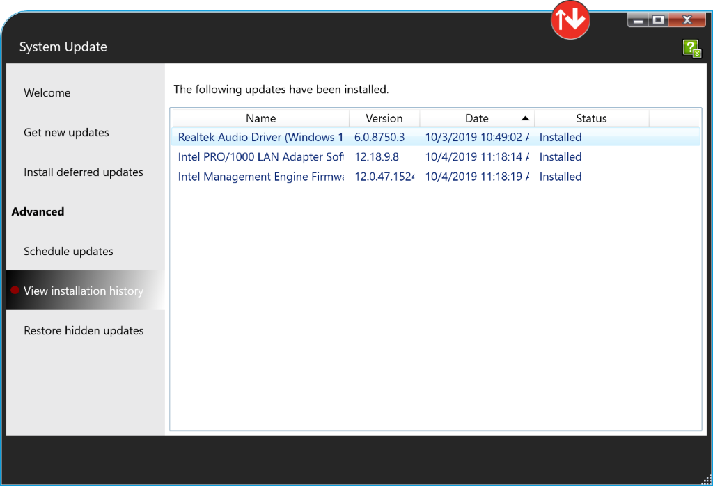

_Figure 3-11. Systems Update View Installation History._
</div>

**5. Restore Hidden Updates**

Updates can be hidden, which means those specific updates will not be displayed as applicable in the future. The user can hide specific versions of an update. One or more updates can be &quot;hidden&quot;, so they don&#39;t show up in subsequent searches.

<div style="text-align:center;padding-bottom:40px;padding-top:40px">

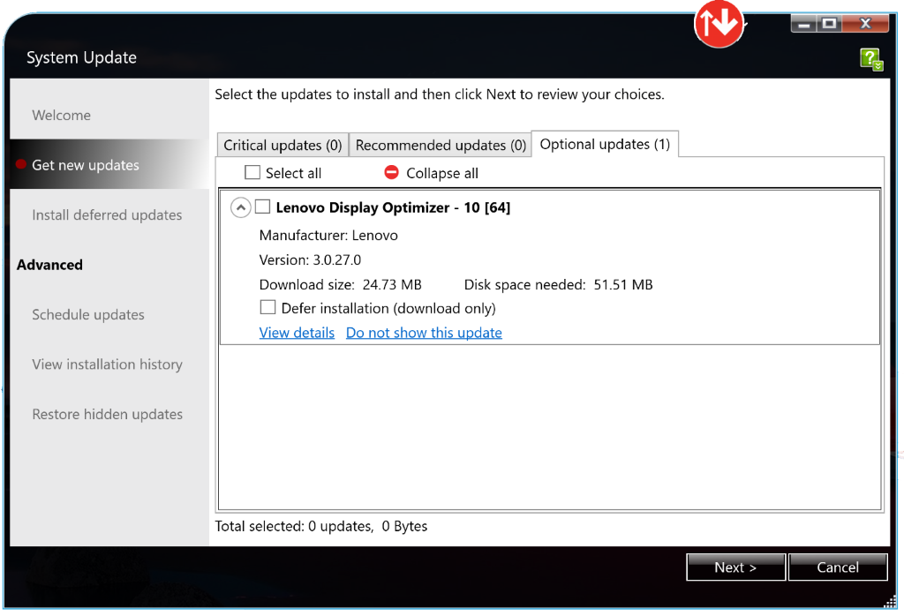

_Figure 3-12. How to hide update packages._
</div>

However, the hidden updates can be restored. Go to the &quot;Restore Hidden Updates&quot; tab for restoring the hidden updates. If the user wants to hide an update, they must do so in the &quot;Get new updates tab.&quot; For each of the update packages displayed for download, there is a dropdown arrow. When the arrow is clicked, and the package information is expanded, click the &quot;Do not show this update.&quot; By doing so, the update will be removed from the list of applicable updates in the &quot;Get new updates&quot; tab and moved to the &quot;Restore hidden updates&quot; tab. The hidden updates will be displayed in the same way they are in the &quot;Get new updates&quot; tab, by critical, recommended and optional updates.

<div style="text-align:center;padding-bottom:40px;padding-top:40px">

_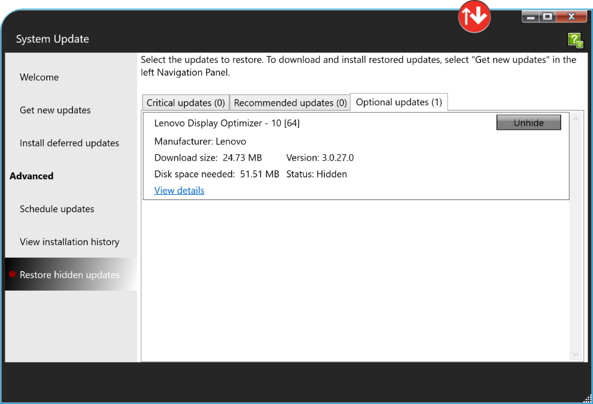_

_Figure 3-13. Systems Update, Restore Hidden Updates, function._
</div>

**Keyboard Shortcuts**

The following table provides the keyboard shortcuts for the main functions of System Update:

| **Function**   | **Shortcut**   |
| --- | --- |
| Get new updates  | CTRL+U  |
| Install deferred updates  | CTRL+D  |
| Schedule updates  | CTRL+S  |
| View installation history  | CTRL+H  |
| Restore hidden updates  | CTRL+R  |
| Close  | CTRL+E  |
| Context Help  | F1  |

<p style="text-align:center;padding-bottom:40px;font-style: italic;">Table 3-1. System Update keyboard shortcuts</div>


## 3.2 Thin Installer

This section will cover how to work with Thin Installer. Although the program is most often used in a scripted and unattended scenario, it can also be executed to install updates manually which will be described in this section.

To use Thin Installer, either run the self-extracting installation package or copy the programs source files to the targeted machine. The default repository that Thin Installer will pull from will be a subfolder within the working directory of Thin Installer. A different repository location can be specified by command line or configured in the Thin Installer configuration file which will described later in this document. Use Update Retriever to create the repository source folder. By default, the program searches for updates in a subdirectory under the Thin Installer folder and expects each update to reside in its own subdirectory.

<div style="text-align:center;padding-bottom:40px;padding-top:40px">

_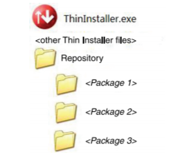_

_Figure 3-14. Default repository._
</div>


### 3.2.1 Running Thin Installer Manually

In the following scenario, the repository used is local on the target machine. Launch Thin Installer to search for applicable updates based on the machine type and OS.

<div style="text-align:center;padding-bottom:40px;padding-top:40px">

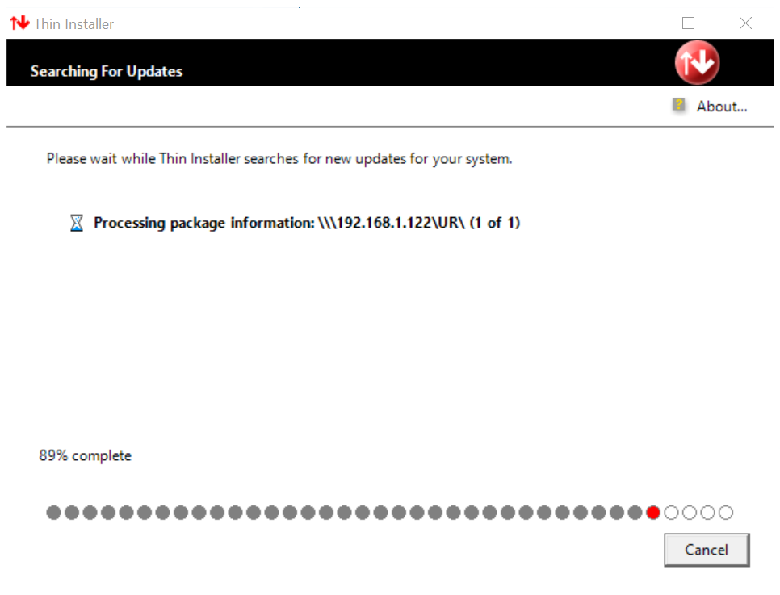

_Figure 3-15. Launching Thin Installer to search for applicable updates._
</div>

Once the search for updates is completed, the application will either display a window with &quot;No packages found,&quot; meaning your system is up-to-date, or a list of applicable update packages.

<div style="text-align:center;padding-bottom:40px;padding-top:40px">

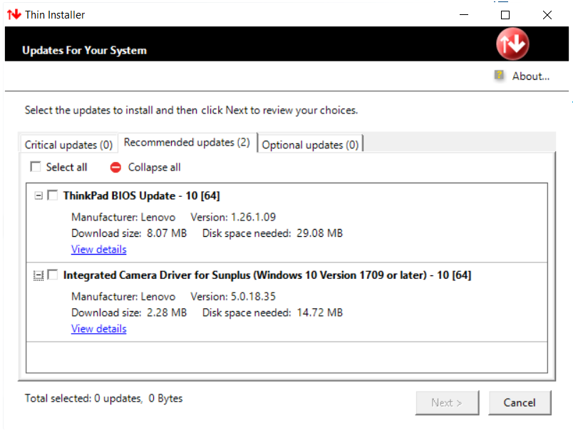

_Figure 3-16. Applicable updates listed in Thin Installer._
</div>

When updates are found in Thin Installer, they are displayed in one of three categories: Critical, Recommended, and Optional. For more information on each update package, click the Expand all button or the expander next to each update. The user may select one, all, or none of the update packages to download. A review of the updates selected is displayed before proceeding with installation.

<div style="text-align:center;padding-bottom:40px;padding-top:40px">

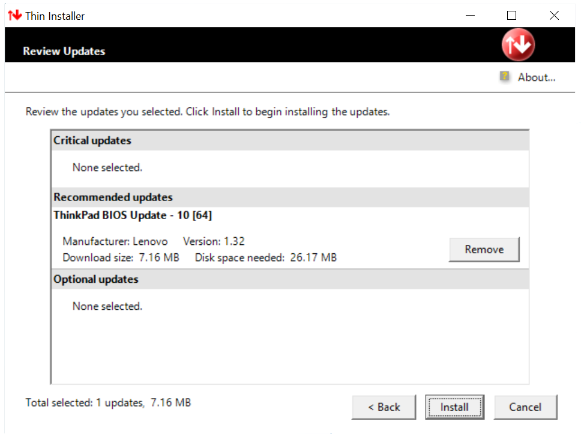

_Figure 3-17. Review installation packages._

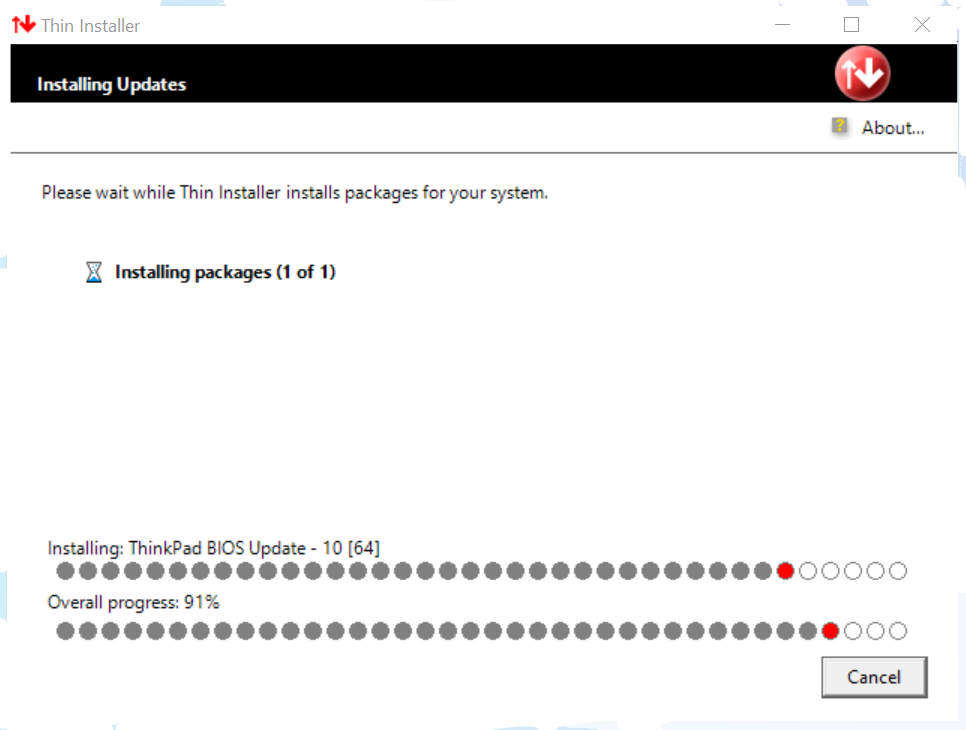

_Figure 3-18. Installing updates._
</div>

If a reboot is necessary to complete the installation of a package, the following window will be displayed. Select **OK** to proceed with installation.

<div style="text-align:center;padding-bottom:40px;padding-top:40px">

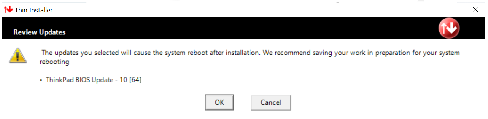

_Figure 3-19. Thin Installer reboot message._
</div>

?>Notes: <br/>1. BIOS installations require user's attention to ensure the update is not interrupted. They cannot be deployed in an unattended mode. <br/>2. Thin Installer installs the updates that force a reboot or shut down after all other updates to reduce the number of reboots.

**Windows 7 and Later OS Considerations**

Some updates that Thin Installer will install may automatically reboot or shut down the sysem. If there are multiple updates like this that are applicable, Thin Installer will attempt to configure the system to run Thin Installer again after the system is rebooted.

With considerations for Windows 7 and later operating systems, after you log in to the Windows desktop, the UAC might stop the program from continuing to install the remaining update packages. To install the remaining update packages, you need to manually click the **Windows has blocked some startup programs** message on the system tray and select **Run blocked program** to run Thin Installer.

!>Note: If the **Windows has blocked some startup programs** message does not display on the system tray, you will need to manually run Thin Installer, search for the remaining updates, and install them.


## 3.3 Update Retriever


### 3.3.1 Update Retriever First Time Setup

When launching Update Retriever the first time, some initial configuration items will need to be set. If launching Update Retriever for the first time, do the following:

   1. Launch Update Retriever.

?>Note: Update Retriever requires elevated privileges to run. Therefore, a UAC prompt may be displayed when launching the program.

   2. Choose between a **Local repository** or a **Lenovo cloud repository** by clicking the appropriate radio button. The **Local repository** option will host packages in a local directory or network share. The **Lenovo cloud repository** will host the actual packages on Lenovo&#39;s global Content Delivery Network and only the repository database and package descriptors will be stored in the local directory or network share. Only System Update supports the **Lenovo cloud repository** feature and not Thin Installer.

<div style="text-align:center;padding-bottom:40px;padding-top:40px">

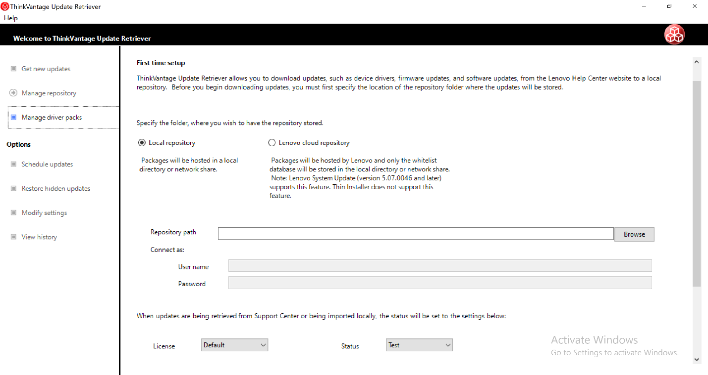

_Figure 3-20. Update Retriever first time setup._
</div>

   3. Specify a repository folder and set the login information by doing the following:

	- Type or browse to an existing folder path to use as the share repository in the **Repository path** field. This can be a local folder path or a network share path.
	- Type a **User name** and **Password** for the share drive used as the network share repository in the user name and password fields.

<div style="text-align:center;padding-bottom:40px;padding-top:40px">

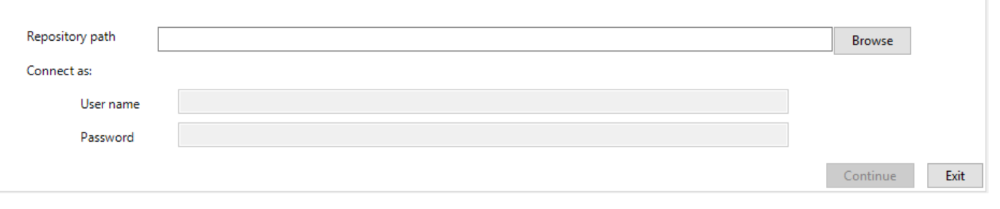

_Figure 3-21. Setting the repository path in Update Retriever, first time setup._
</div>

   4. Select a default license and status. The License can either be set to **Default** , **Display** , or **Do not display**. The status can either be set to **Test** or **Active**. If it is set to **Test** the packages will only be visible to clients configured to look for Test packages. This allows updates to be tested on a controlled set of devices before changing the status to Active so that all devices in the production environment can see them.
   
   5. An Advanced Option is available that allows the administrator to control how changes to local package descriptor XML files are handled. Normally Update Retriever will show packages in new search results if it detects that the XML descriptor file on Lenovo&#39;s servers is different than the file in the local repository. If this is not the desired behavior, check the box and the modified items will be recognized as the same updates and will not be offered for download in the search results.

<div style="text-align:center;padding-bottom:40px;padding-top:40px">

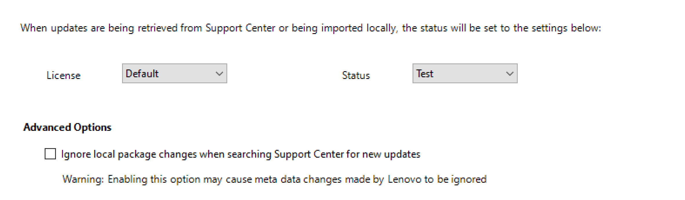

_Figure 3-22. Update default status and Advanced Options in Update Retriever first time setup._
</div>

?>Note: After the initial settings are complete, the Welcome screen will not open the next time Update Retriever is launched. To change the repository path and update's default status, click Modify settings.


### 3.3.2 Searching for and Downloading Updates

After initial setup is complete, Update Retriever can be used to search for and download updates. The following will describe these steps.

   1. In the **Get new updates** panel, click **Add**.

<div style="text-align:center;padding-bottom:40px;padding-top:40px">

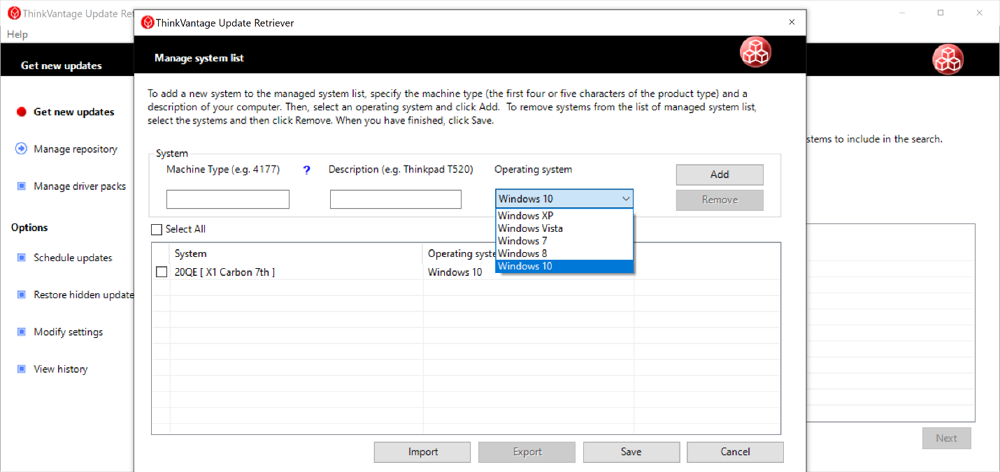

_Figure 3-23. Getting new updates with Update Retriever, first time setup._
</div>

   2. In the **Manage systems list** window, set the triplet information for a system by doing the following:

	- a) Type the applicable machine type. You can find the machine type on the bottom of a notebook computer or on the rear of a desktop computer. You can also find it by pressing Windows key + R and typing &quot;msinfo32&quot; then OK. Look at the system name, and the first 4 numbers and letters are the machine type. For example, 20HQ.
	- b) Enter a description, which will appear as the name of the machine, like ThinkPad T490. This field is optional.
	- c) Select the applicable operating system.
	- d) Click **Add** and then click **Save**. You can do this for multiple model + operating system combinations. Once the systems list is saved, check the box next to the systems to search for and click **Next**. Update Retriever will connect to the Lenovo CDN and search for updates applicable to the selected systems.
	- e) **Accept** the License agreement to continue. There is a check box available to agree to all future license notices to avoid this dialog for future searches.

<div style="text-align:center;padding-bottom:40px;padding-top:40px">

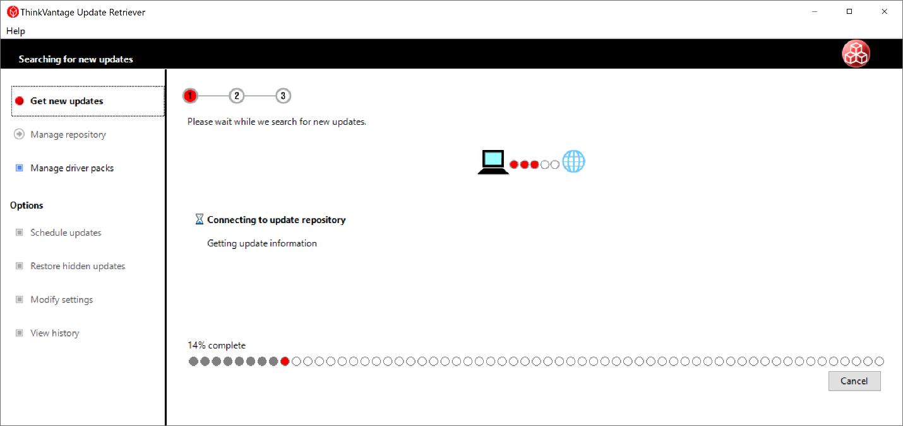

_Figure 3-24. Searching for updates._

	
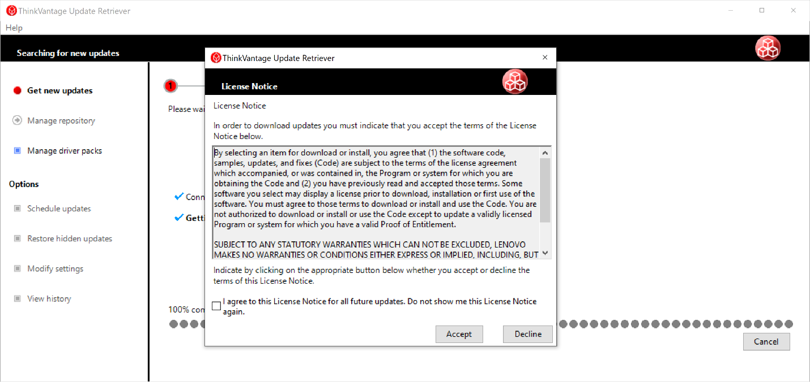

_Figure 3-25. Accept the License agreement._
</div>

   3. On the next screen, select the check box next to the applicable updates to be downloaded. The results can be filtered using the filters available above the list of updates.

?>Note: If you want to select all the update packages found, simply select the **Select all** check box.

<div style="text-align:center;padding-bottom:40px;padding-top:40px">

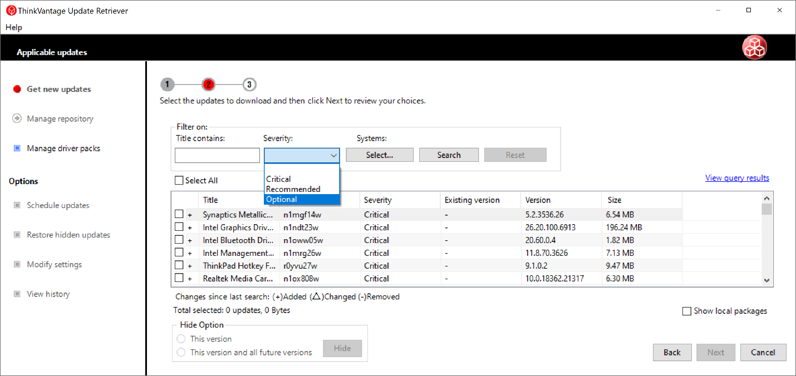

_Figure 3-26. Selecting update packages from search results._
</div>

   4. Click **Next**. A confirmation summary of the selected updates per system is shown. Click **Finish** to begin downloading the selected updates. Update Retriever will place the updates in the repository folder and update the database file that associates the updates to the systems they support. A completion summary will be displayed at the end.

<div style="text-align:center;padding-bottom:40px;padding-top:40px">

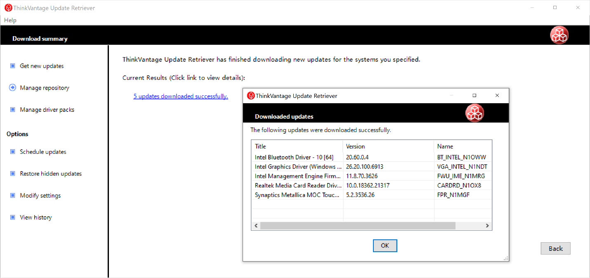

_Figure 3-27. Completed download list displayed._
</div>


### 3.3.3 Manage Repository

To view updates that have been downloaded into the local repository, click on the **Manage repository** tab and then select **Update view**.

<div style="text-align:center;padding-bottom:40px;padding-top:40px">

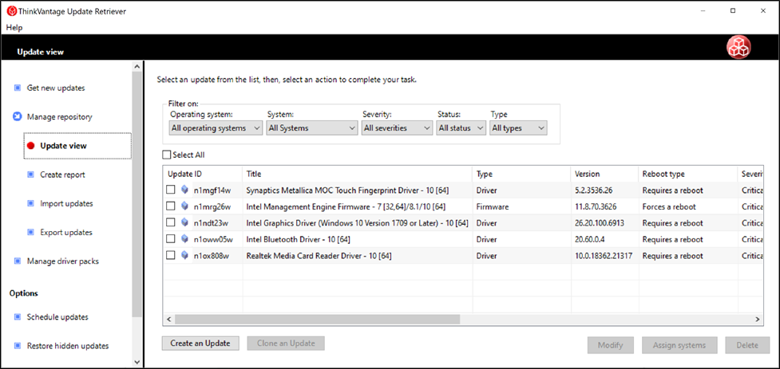

_Figure 3-28. Viewing updates and managing the repository in Update Retriever._
</div>

The updates displayed can be by filtered by Operating system, System, Severity, Status and Type. In the Update view panel, the administrator can sort the list of updates by Update ID, Title, Type, Version, Reboot type, Severity, License, or Status by clicking the column header. Double-clicking the Update ID of an item will display the details from the package descriptor. It is recommended that the values displayed are not altered unless directed to do so by Lenovo support personnel. Altering any of the values will invalidate the signature on the package descriptor file which will cause System Update to no longer apply the update. Only Thin Installer can work with modified updates.

  
#### 3.3.3.1 Modify an Update Package

The Administrator can modify the reboot type, severity, license, and status of one or more update packages in the repository. Select one or more packages by clicking the check box next to the item.

<div style="text-align:center;padding-bottom:40px;padding-top:40px">

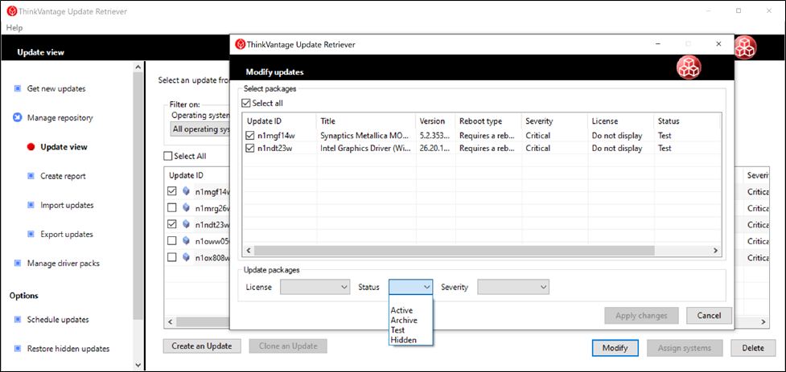

_Figure 3-29. Modifying updates._
</div>

The following table provides the values that an administrator can set for the selected update package(s).

|     Option         |     Possible   Value                                                                                                                                                                                                                                                                                                                                                                                                                                                                                                                                                       |
|--------------------|----------------------------------------------------------------------------------------------------------------------------------------------------------------------------------------------------------------------------------------------------------------------------------------------------------------------------------------------------------------------------------------------------------------------------------------------------------------------------------------------------------------------------------------------------------------------------|
|     Reboot type    |     • (Blank)<br />      • No reboot: reboot type 0<br />      • Forces a reboot: reboot type 1<br />      • Reserved<br />      • Requires a reboot: reboot type 3<br />      • Shut down: reboot type 4<br />     • Forced reboot delayed:    reboot type 5<br /><br />     **NOTE:**  Changing this value   does not change how the update is designed to function.  This only alters the flag used to inform   System Update or Thin Installer how the package will function. For example,   changing an update that automatically reboots the system to reboot type 3   will not prevent it from rebooting the system.    |
|     Severity       |     • (Blank)<br />      • Critical<br />      • Recommended<br />      • Optional                                                                                                                                                                                                                                                                                                                                                                                                                                                                                                           |
|     License        |     • (Blank)<br />      • Display<br />      • No display                                                                                                                                                                                                                                                                                                                                                                                                                                                                                                                             |
|     Status         |     • (Blank)<br />      • Test<br />      • Active<br /><br />      **Attention:** By   default, System Update and Thin Installer will only see packages marked as   Active.  The default value was set in   the first-time setup of Update Retriever. You can change the default value by   using the Modify settings option in the Update Retriever navigation pane.                                                                                                                                                                                                                                |

<p style="text-align:center;padding-bottom:40px;font-style: italic;">Table 3-2. Configurable values for an update package</div>

  
#### 3.3.3.2 Create Report

Update Retriever can generate a report, which is a list of active updates, archived updates, hidden updates, and test updates. This list is saved in a TXT file that you can use in most spreadsheet applications.

To create a report, do the following:

1. Click **Manage repository** in the left pane. The menu expands to show several options for managing the repository.
2. Click **Create report** in the left pane. The Create report window opens.
3. Type a directory to save the TXT file or click **Browse** to find a location.
4. Type a name for the TXT file.
5. Select the separator type.
6. Select the types of updates to include in the report:
   - **Active updates** : These are updates that have been downloaded to the repository and are available for deployment.
   - **Archived updates** : These are updates that have been downloaded and archived to a separate location. These updates cannot be deployed until they are restored to the active updates list.
   - **Hidden updates** : These are updates that have not been downloaded and are hidden from the list of available updates when searching the Lenovo(R) Help Center.
   - **Test updates** : These are updates that have been downloaded and for test.

   ?>Note: The report does not contain available updates that have not been downloaded.

7. Select the columns that you want to include the related information in the report:
   - **Update ID**
   - **Title**
   - **Version**
   - **Reboot type**
   - **Severity**
   - **License**
   - **Status**
   - **System**
   - **Silent install command**
   - **Extract command**

8. Click **Create Report**. The Report created successfully window opens. Click **View** to view the file. You also can navigate to the folder where you saved the TXT file and open the file in the folder.

   !>Note: If the file name already exists in the designated folder, a warning window will be displayed. Click **Yes** to overwrite the old report or click **No** to decline overwriting.

<div style="text-align:center;padding-bottom:40px;padding-top:40px">

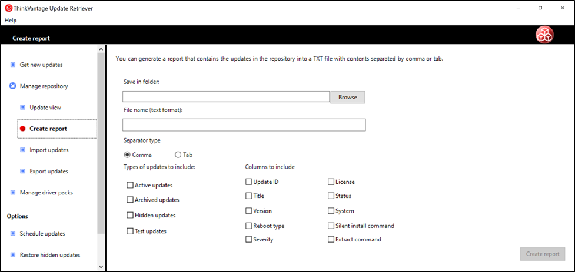

_Figure 3-30. Create report with Update Retriever._
</div>

  
#### 3.3.3.3 Import Updates

Update Retriever enables you to import updates to your repository from a local location or network share. Once the updates are in the repository, you can assign them to specific systems and deploy them to multiple computers.

?>Note: Update packages cannot be deployed until they are assigned to one or more systems. For more information, see section 3.3.3.3.1 Assigning Systems.

To import updates, do the following:

   1. Click **Manage repository** in the left pane. The menu expands to show several options for managing the repository.
   2. Click **Import updates** in the left pane. The Import updates window opens.
   3. Click **Browse** to navigate to the folder that stores your updates, and then click **OK**.

  ?>Note: Each update must be in its own subfolder. If you are importing one update, specify the directory that contains that update. If you are importing multiple updates, put each update subfolder under the same parent directory and specify that parent directory.

   4. Select **Search subfolders** if you want Update Retriever to search through all subfolders located in the specified directory.
   5. Click **Next**. Update Retriever searches the folder that you specified for updates. When the search completes, the Review updates to import window opens. You can double-click the title of an update to view its additional details.
   6. Select updates that you want to import or select **Select all** to include all updates displayed. Then click **Import**. The import process begins. When the import process completes, the Import completed window opens and the updates that you have selected are imported into your repository folder.

<div style="text-align:center;padding-bottom:40px;padding-top:40px">

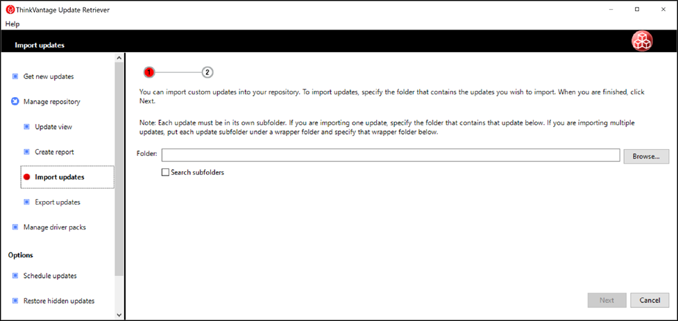

_Figure 3-31. Import Updates with Update Retriever_
</div>

    
##### 3.3.3.3.1 Assigning Systems

When updates are imported the will initially have no supported systems associated with them. You can assign and unassign systems to updates in the repository, where system stands for the combination of machine type and operating system. When assigning systems to updates, you can choose one or more systems from the available System/Operating system list.

To assign or unassign systems to updates, do the following:

   1. Click **Manage repository & Update view** in the left pane to view the updates.
   2. Select one or more updates in the list that have been imported. The **Assign systems** button is activated.
   3. Click **Assign systems**. The Assign system window opens, displaying the updates you selected and the System/Operating system list. By default, all the updates are selected and the checkbox before the System/Operating system list is in one of the following statuses:
     - Selected: Indicates that the system is assigned to all the updates selected
     - Deselected: Indicates that the system is not assigned to all the updates selected
     - Intermediate: Indicates that the system is assigned to some of the updates selected
   4. Select systems from the System/Operating system list to assign systems to the updates selected, or clear systems to unassign them to the updates selected. You can add new systems to the list by clicking **Add new system**.
   5. Click **Save**. The updates are assigned to the systems selected.

?>Note: There is an icon next to the **Update ID** for each update that is originated from the Lenovo Help Center Web site. You cannot modify the systems assigned to these updates. You can modify the systems assigned to custom updates that were created or imported by the user.

  
#### 3.3.3.4 Export Updates

Update Retriever enables you to export driver updates in your repository to a designated target folder. During the export process, Update Retriever will extract each driver update to a subfolder. Then, these extracted driver updates can be easily imported into common operating system deployment tools such as Microsoft System Center Configuration Manager or LANDesk Management Suite for easy integration and deployment.

!>Note: Before exporting updates, make sure you have downloaded the relevant driver updates for target systems from the Lenovo Help Center to your repository.

To export the driver updates, do the following:

   1. Click **Manage repository** in the left pane of the main window. The menu expands to show several options for managing the repository.
   2. Click **Export updates** to begin the process of exporting driver updates in the right pane of the main window.
   3. Type the directory of the target folder in the **Folder** field or click **Browse** to locate the target folder. You can create the target folder if it does not exist.
   4. Click **Next**. Select a system from the Machine type/Operating system/Language list, and then select the driver update(s) assigned to the system you selected or select **Select all** to include all the updates displayed.
   5. Repeat step 4 for other systems if desired.
   6. Click **Finish**. The export starts, and you can view the export progress in the right pane.
   7. When the export completes, the results and the location link of the target folder are displayed. You can click the results link to view the export history and click the location link to open the target folder that contains the extracted driver updates.

<div style="text-align:center;padding-bottom:40px;padding-top:40px">

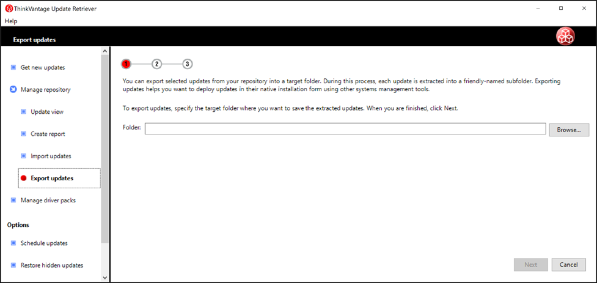

_Figure 3-32. Export Updates with Update Retriever._
</div>

?>Note: When exporting updates from a repository located on the network instead of a repository on a local drive, an Open File - Security Warning dialog will be displayed for each update that is to be extracted during the export process. To prevent the dialog from being displayed, you can change the Local intranet settings in the Microsoft Internet Explorer Web browser, either temporarily or permanently as you need.

To change the Local intranet settings in the Microsoft Internet Explorer Web browser, do the following:

   1. Open the Microsoft Internet Explorer Web browser.
   2. Click **Tools** and select **Internet Options**.
   3. Click the **Security** tab.
   4. Click the **Local intranet** icon and click **Sites**.
   5. The Local intranet dialog box is displayed. If the **Automatically detect intranet network** check box is selected, clear it and then select **Include all network paths (UNCs)**. It is recommended that you also select **Include all local (intranet) sites not listed in other zones**and** Include all sites that bypass the proxy server** unless otherwise instructed by your system administrator.
   6. Click **OK** to save the Local intranet settings.
   7. On the **Security** tab, click **Default level** to view the default security level. If the security level is set to **Medium-low** or **Low** , no other changes are necessary. Otherwise, go to step 8.
   8. If the security level is set to **High, Medium-high, Medium,** or **Custom** , change the security level to **Medium-low** (the default setting) by moving the security level slider. However, you can keep the security level higher than **Medium-low** yet still be able to prevent the Open File - Security Warning dialog from being displayed by customizing the security setting. To customize the security setting, do the following:
     - a) Click **Custom level**. The Security Settings-Internet Zone dialog is displayed.
     - b) Locate the **Launching applications and unsafe files** option.
     - c) Select **Enable**.
     - d) Click **OK**. A dialog box for confirmation is displayed.
     - e) Click **Yes** to confirm your selection.
     - f) Click **OK** to exit the Internet Options dialog box.


### 3.3.4 Manage Driver Packs

This feature allows an admin to create a collection of the hardware drivers for a specified model in a format that can be imported into Microsoft System Center Configuration Manager (SCCM) or Microsoft Deployment Toolkit (MDT) to support OS deployment.

This feature displays a list of only hardware drivers for a specified model based on what is currently available on the Lenovo Support web site instead of basing search results on content ready for use with System Update or Thin Installer.

?>Note: Only Windows 10 is in scope for this feature.

Follow these steps to use the Manage Driver Pack option in Update Retriever:

   1. Click the Manage Driver packs tab, in Update Retriever.
   2. Specify a parent folder to hold &quot;driver packs&quot; generated by Update Retriever. Select a specific model using brand, series and model values that are available in the drop-down list.

<div style="text-align:center;padding-bottom:40px;padding-top:40px">

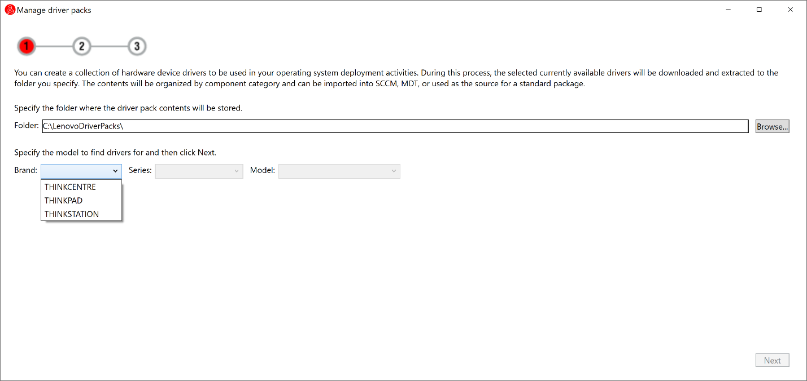

_Figure 3-33. Managing Driver Packs in Update Retriever._
</div>

   3. Select specific drivers. Only Windows 10 drivers are supported. Where available, the specific build(s) of Windows 10 supported drivers are listed in the driver title.

<div style="text-align:center;padding-bottom:40px;padding-top:40px">

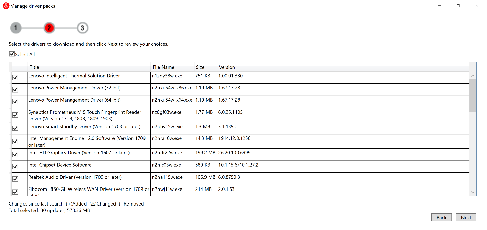

_Figure 3-34. Managing Driver Pack selections in Update Retriever._
</div>

   4. Update Retriever downloads and extracts selected drivers. As Update Retriever executes each package to extract the files, users may notice application focus change. It is recommended to let Update Retriever finish before doing other work.

<div style="text-align:center;padding-bottom:40px;padding-top:40px">

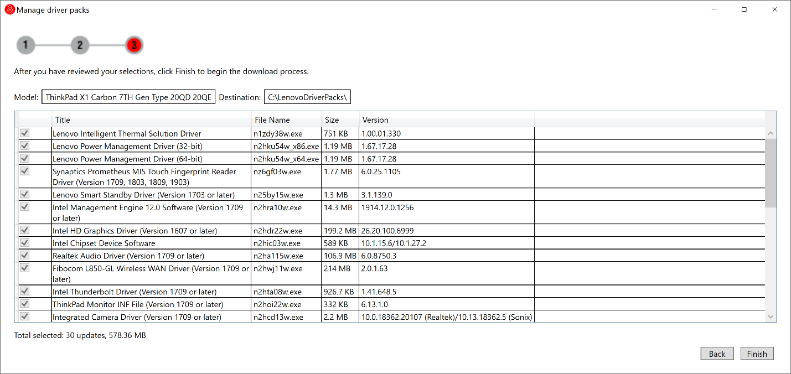

_Figure 3-35. Downloading and extracting selected Drivers in Update Retriever._
</div>

A collection of source files for the driver packages are generated, along with a CSV report text file.

?>Note: This new feature is intended to support the OS deployment process of new drivers which only works with INF installable hardware drivers. Application updates and firmware updates cannot be included. The feature also only supports ThinkPad, ThinkCentre and ThinkStation PCs launched in 2018 or later.


### 3.3.5 Scheduling the Search for Updates

The administrator can configure Update Retriever to search for new updates automatically on a scheduled basis. The administrator is notified depending on how Update Retriever was configured, in the form of an e-mail or a balloon tooltip from the application icon in the notification area.

<div style="text-align:center;padding-bottom:40px;padding-top:40px">

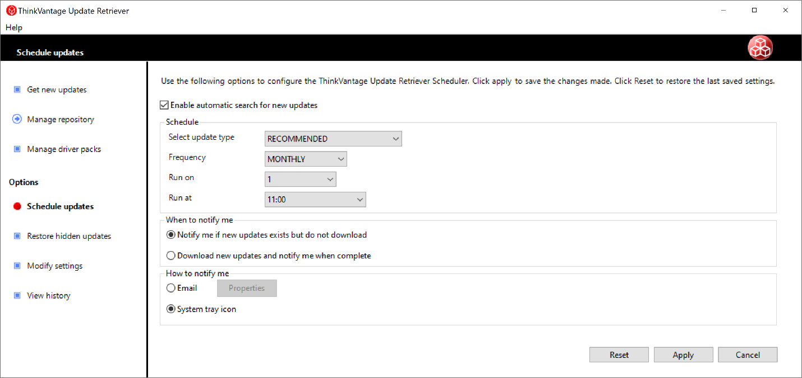

_Figure 3-36. Scheduling updates in Update Retriever._
</div>

The administrator can configure Update Retriever to search for new updates automatically on a scheduled basis by checking the box to **Enable automatic search for new updates**. The following options are available:

- **Schedule:**

  - **Select update type:** Choose between Critical, Recommended or Critical &amp; Recommended.
  - **Frequency:** Choose to search for new updates weekly or monthly.
  - **Run on:** For weekly checks, a day of the week must be selected. For monthly checks, a date in the month must be selected.
  - **Run at:** Specify the time of day the search should occur.

- **When to notify me:** Two options are available; click the radio button to select the appropriate one.

  - Notify if there are new updates available but do not download them
  - Download the new updates and notify when complete

- **How to notify me:** Update Retriever can notify by sending an email or by popping up a toast message from the application icon in the system tray. If the email option is selected, click the Propertiesbutton to provide additional details. The email option may only work with certain configurations. The e-mail notification includes the date and time of the check, the number of packages found, and a list of updates.


### 3.3.6 Restore Hidden Updates

Administrators can hide updates, which means that the hidden updates including the current and future versions will not be displayed as relevant (from the Lenovo Help Center) in the future. There are two options:

- Hide just a specific version of an update
- Hide all future versions of an update

If in the future, if the administrator wants to have those updates displayed again, they can unhide them. To unhide an update package, do the following:

   1. Go to the Restore hidden updates menu tab.
   2. Check the box next to the update package(s) to unhide it or check the select all updates checkbox to unhide all the update packages in the list.
   3. There may be multiple models that use the same package ID. If the administrator only wants to unhide a package for a certain model type, they need to double click on the package ID and select from the system model type displayed. Once the model type is selected, click OK.

<div style="text-align:center;padding-bottom:40px;padding-top:40px">

 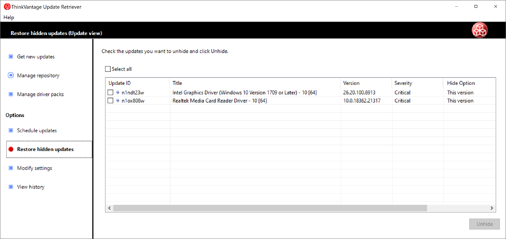

_Figure 3-37. Unhide specific packages in Update Retriever._
</div>

   4. Click the **Unhide** button in the bottom right corner of the tool. The update package will then be displayed in the **Update View**.


### 3.3.7 Modify Settings

The **Modify settings** option allows the administrator to make changes to any of the settings that were configured during the first-time setup process. For details on the settings that can be configured, please refer to section 3.3.1 **Update Retriever First Time Setup**.


### 3.3.8 Viewing History

The **View history** function enables you to view the detailed information about the download history and export history.

<div style="text-align:center;padding-bottom:40px;padding-top:40px">

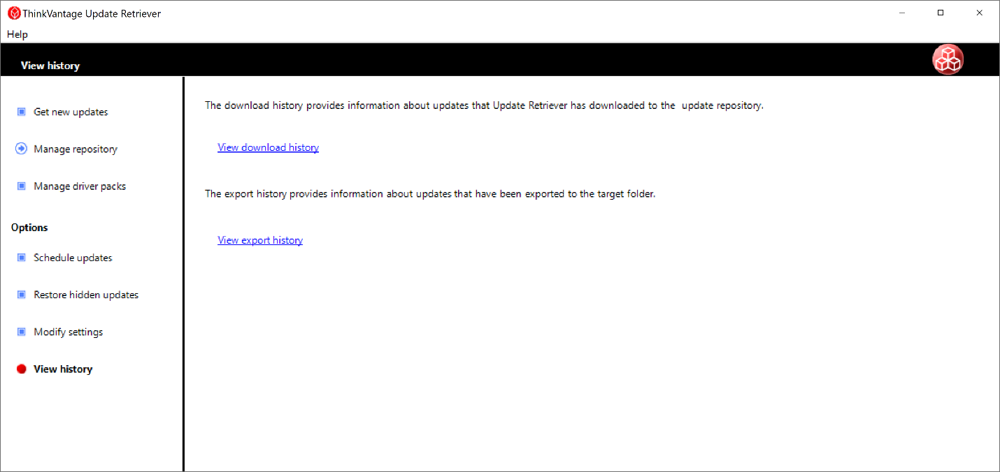

_Figure 3-38. View download history in Update Retriever._
</div>

The download history provides detailed information about all updates that the Update Retriever has downloaded to the update repository, as well as updates that are hidden.

To view the download history, do the following:

1. Click **View history** in the left pane of the main window. The View History window opens.
2. Click the View download history link to view the following information:

- **Title:** The title of the update.
- **Version:** The version number of the update.
- **Name:** The name of the update.
- **Downloaded Time:** The date and time when the update was downloaded (not displayed for current results).

The export history provides detailed information about updates that have been exported to the target folder.

To view the export history, do the following:

1. Click **View history** in the left pane of the main window.
2. Click the **View export** history link to view the following information:

- **Exported Time:** The date and time when the update was exported.
- **Status:** Successful or Failed (followed by the cause of failure).
- **Source Location:** The directory where the driver update is saved in the repository.
- **Target Location:** The directory where the exported driver update is saved.
- **Subfolder Name:** The name of subfolder where the exported driver update is saved. For the driver update that fails to be exported, the subfolder name just indicates its title and version number.


# 4 Troubleshooting


## 4.1 System Update

Typically the first step in isolating issues when running System Update is to make sure System Update can access the repository, whether that is over the Internet to access content directly from Lenovo or over an intranet network to access a local repository. Use standard network troubleshooting steps to verify the logged-on user account has access as required.

When pulling content from Lenovo, System Update uses HTTPS to access content at [https://download.lenovo.com/catalog](https://download.lenovo.com/catalog) and [https://download.lenovo.com/pccbbs](https://download.lenovo.com/pccbbs). These sites may need to be white listed to have access through a corporate firewall. There are no special ports required to be opened for System Update. In some cases the System Update application itself will need to white listed to have access to the Internet. To ensure complete access for System Update to function properly, enable the following programs:

	%PROGRAMFILES%\Lenovo\System Update\TvsuCommandLauncher.exe	

	%PROGRAMFILES%\Lenovo\System Update\Tvsukernel.exe

The next step would be to review the log files generated by System Update. These files can be found in C:\ProgramData\Lenovo\SystemUpdate\logs. System Update will create a new log file each time it performs a search and install session. The log file name will include a timestamp to ensure the files are unique, such as: tvsu\_200103171352.log

The log file may be quite long. If there is a particular update that is having an issue, it may help to search the log file for the title of the update. In some cases an update may not be installing because System Update has determined it is not applicable based on the package descriptor meta data for the package. It may be easier to see the results of this applicability check when running System Update by command line if the &quot;-exporttowmi&quot; parameter is used. Various tools such as WMI Explorer can be used to then view the information located at:

	root\Lenovo\Lenovo Updates

Here you will find information similar to:

|     n2irx01w    |     Critical    |     NotApplicable    |     Intel PRO/1000 LAN Adapter Software (Windows 10 Version   1709 and 1803) - 10 [64]    |
|-----------------|-----------------|----------------------|-------------------------------------------------------------------------------------------|

The following is a list of strings that can be searched for in the log file to find certain details from the System Update session that generated the log:

- **Tvsukernel.CommandLineParameters.ValidateArguments** : This will locate the section of the log where the command line used to execute System Update is parsed. This can be useful to determine if the proper command line parameters are being used.

Example:

>Info 2020-01-03 , 05 : 13 : 56  
>&nbsp;&nbsp;&nbsp;&nbsp;&nbsp;at Tvsukernel.CommandLineParameters.ValidateArguments(String[] args)  
>&nbsp;&nbsp;&nbsp;&nbsp;&nbsp;Message: The command is: 
>-search R -action INSTALL -exporttowmi -nolicense -noicon -noreboot -includerebootpackages 1,3,4,5

- **QOS (Quest OS)**: Locates the portion of the log where the device is identified where this session of System Update ran. This information will include the operating system and the Machine Type – Model of the device. The first four characters of the Machine Type – Model represents the Machine Type and will need to be specified when requesting support.

Example:

>QOS (Quest OS): Windows 10
>
>QOSLang (Quest language): EN
>
>MTM: 20N6Z4Q9US

- **Resulted order of candidate list** : This will represent the list of updates System Update found to assess for applicability.

Example:

>Message: Resulted order of candidate list:
>Alcor Micro USB Smart Card Reader Driver (Windows 10 Version 1709 or Later) - 10 [64][reboot type 0]
>
>MultiCard Reader Driver (Windows 10 Version 1709 or Later) - 10 [64][reboot type 0]
>
>Intel PRO/1000 LAN Adapter Software (Windows 10 Version 1809 or Later) - 10 [64][reboot type 0]
>
>ThinkPad Ultra/Pro/Basic Docking Station PD Controller FW Utility (Windows 10 Version 1709 or Later) - 10 [64][reboot type 0]
>
>ThinkPad Pro Docking Station DP Hub FW Utility (Windows 10 Version 1709 or Later) - 10 [64][reboot type 0]
>
>MultiCard Reader Driver (Windows 10 Version 1709 or Later) - 10 [64][reboot type 0]

- **Return install Updates** : The first occurrence of this string will locate the beginning of the process where updates are being installed.

Example:

>Info 2019-10-28 , 05 : 29 : 39
>
>	at Tvsu.Sdk.SuSdk.InstallUpdates(Update[] updatesInstall, Update[] updatesDefer, downloadingDelegate downDelegate)
>
>Message: Return install Updates

If assistance is required in troubleshooting System Update issues, please consider posting a question in the Enterprise Client Management forum which can be linked to from the Enterprise Deployment Solutions page ([https://support.lenovo.com/us/en/solutions/ht104232](https://support.lenovo.com/us/en/solutions/ht104232)). Please provide the applicable log files, the machine type (e.g. 20AN) and operating system (e.g. Windows 10 1903) where the problem is occurring, and a detailed description of the symptoms.


## 4.2 Thin Installer

Troubleshooting Thin Installer issues will generally follow the same path as troubleshooting System Update (see section above). Although Thin Installer does not pull content directly from Lenovo it may still require troubleshooting access to the local repository on the intranet network. Typically network related issues for Thin Installer are access related. For instance, if Thin Installer is launched using a process under the Local System context, it may not have access to a network share that has been granted read/write access to Everyone. This is because Thin Installer in this case is not running under the context of a known user on the domain; &quot;Everyone&quot; does not include Local System.

The log file for Thin Installer will be placed in a &quot;logs&quot; folder within the working directory of Thin Installer unless a different path is specified by the -log command line parameter or in the \<LogPath\> tag within the ThinInstaller.exe.configuration XML file. The default file name of the log file will be similar to &quot;Update\_log\_190328112207.txt&quot; with a timestamp portion to make each log file name unique.

The same search strings provided above for System Update can be used to traverse the Thin Installer log file. Likewise the &quot;-exportowmi&quot; parameter can also be used to obtain applicability status data for updates processed by Thin Installer. In addition to this information source, Thin Installer also can generate the **Update\_ApplicabilityRulesTrace.txt** by either specifying the &quot;-debug&quot; parameter or specifying YES for \<DebugEnable\> in the ThinInstaller.exe.configuration file.

In the Update\_ApplicabilityRulesTrace.txt file, installed updates will be shown with &quot;**-DetectInstall(True)**&quot; and applicable updates will be shown with &quot;**-DetectInstall(False)**&quot; and &quot;**-Dependencies(True)**&quot;. Updates that are not applicable to the target system will be shown with &quot;**-DetectInstall(False)**&quot; and &quot;**-Dependencies(False)**&quot; as shown in the example below:

	-n2ic202w
		-DetectInstall(False),
			-Or(False),
				-_Driver(False),
					-HardwareID(NE), PCI\VEN_8086&DEV_9DA4
					-Version(NE), 10.1.15.6^
				-_Driver(False),
					-HardwareID(NE), PCI\VEN_8086&DEV_02A4
					-Version(NE), 10.1.27.2^
	
	-o-o-o-o-o-o-o-o-o-o-o-o-o-o-o-o-o-o-o-o-o-o-o-o-o-
	
	-n2ic202w
		-Dependencies(False),
			-And(False),
				-_OS(True),
					-OS(False), WIN10
					-OS(False), WIN10.*
					-OS(False), WIN10-ENT
					-OS(False), WIN10-ENT.*
					-OS(True), WIN10-PRO
					-OS(True), WIN10-PRO.*
				-_CPUAddressWidth(True),
					-AddressWidth(True), 64
				-Or(True),
					-_PnPID(True), PCI\VEN_8086&DEV_3E34
					-_PnPID(False), PCI\VEN_8086&DEV_02A4
				-_Bios(True),
					-Level(True), *
					-Level(True), N2IET*
					-Level(False), N2RET*
				-_ExternalDetection(False), %PACKAGEPATH%\inboxdrivercheck.exe 				n2ic202w_2_.xml
				-Not(True),
					-_ExternalDetection(False), %PACKAGEPATH%\getw10ver6.exe
	
	-o-o-o-o-o-o-o-o-o-o-o-o-o-o-o-o-o-o-o-o-o-o-o-o-o-

If assistance is required in troubleshooting Thin Installer issues, please consider posting a question in the Enterprise Client Management forum which can be linked to from the Enterprise Deployment Solutions page ([https://support.lenovo.com/us/en/solutions/ht104232](https://support.lenovo.com/us/en/solutions/ht104232)). Please provide the applicable log files, the machine type (e.g. 20AN) and operating system (e.g. Windows 10 1903) where the problem is occurring, and a detailed description of the symptoms.


## 4.3 Update Retriever

The most common issues encountered with Update Retriever are typically related to the catalogs and the content being pulled from Lenovo servers. Within the process used by Update Retriever to process catalogs for specified models, there are several CRC checks performed on the files that are downloaded. There may be times when the catalogs and the content are out of synch as the catalogs are being refreshed. In this case Update Retriever may report that it failed to download an update or may not offer any update that should be available. These types of issues are typically addressed automatically due to the continuous nature of the catalog maintenance processes but may take a day or two to be resolved. In other cases there may be an incorrect CRC value specified for a file causing it to continuously fail to download. These issues will be identified in the error messages presented by Update Retriever and can be reported in the Enterprise Client Management forum which can be linked to from the Enterprise Deployment Solutions page ([https://support.lenovo.com/us/en/solutions/ht104232](https://support.lenovo.com/us/en/solutions/ht104232)). Please specify the machine type (e.g. 20AN) and operating system combination that was used in the search.

Update Retriever does not create a log file. Instead it generates an Event Log which can be viewed by launching the Event Viewer app. In the Event Viewer, navigate to Application and Service logs > Lenovo > ThinkVantage > Update Retriever to find two event logs that can be used to troubleshoot issues.

<div style="text-align:center;padding-bottom:40px;padding-top:40px">

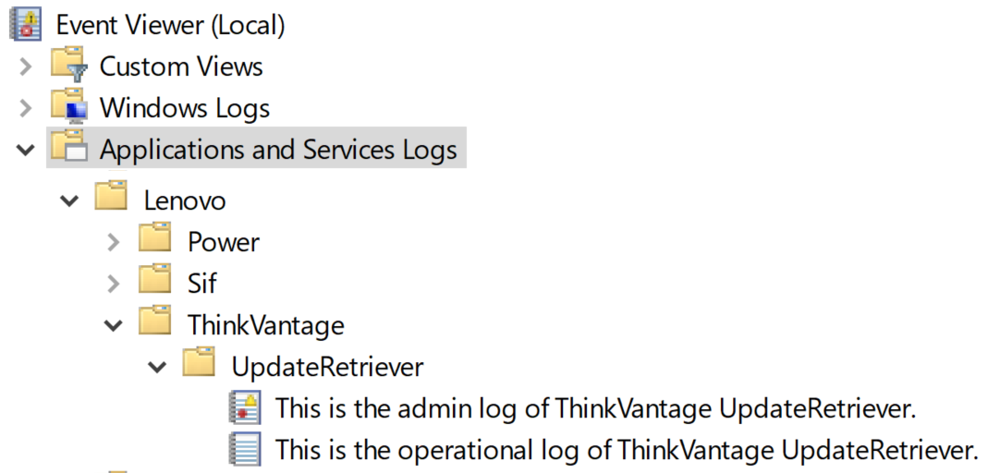

_Figure 4-1. Update Retriever event logs_
</div>

The following list contain some common issues and how to address them:

- _System Update or Thin Installer do not see any updates in the local repository_: Verify that the Status value for the updates in the repository is set to &quot;Active&quot;. If the updates have a status of &quot;Test&quot; then System Update and Thin Installer will not see them by default.
- _An update&#39;s Reboot Type was changed from &quot;Forces Reboot&quot; to &quot;Reboot Required&quot; in Update Retriever; however, systems still reboot when the update is installed:_ In Update Retriever this setting is just a flag to indicate how an update behaves. Update Retriever cannot change how an update was designed to run. Therefore, it is typically recommended to not change this value for any updates using Update Retriever.
- _Update Retriever has been installed on a new system; however, the System List is empty:_ The System List is recorded in the registry and can be copied from the old system to the new system. Use regedit.exe to copy the &quot;Systems&quot; value from 

   ```
   Computer\HKEY\_LOCAL\_MACHINE\SOFTWARE\WOW6432Node\Lenovo
   \Update Retriever\Preferences\UserSettings\General
   ```


# 5 Command Line Reference


## 5.1 System Update

System Update can be controlled via command line by leveraging the group policy control for the Administrator Command Line. A typical scenario would have System Update executed by a task in the Windows Task Scheduler set to run on a recurring basis to ensure the device stays current. That scheduled task would execute:

	C:\Program Files (x86)\Lenovo\System Update\tvsu.exe /CM

The rest of the command line parameters would be specified as a Policy in the registry using either Group Policy or by manipulating the registry directly at:

	HKLM\Software\Policies\Lenovo\System Update\UserSettings\General

	Value: [REG\_SZ] AdminCommandLine

?>Note: When using a custom scheduled task, a new task should be created, and the default task created when System Update is installed should be disabled. Additionally, the &quot;SchedulerAbility&quot; setting must be set to &quot;NO&quot; in the registry at: ```HKLM:\SOFTWARE\WOW6432Node\Lenovo\System Update\Preferences\UserSettings\Scheduler```

This will prevent System Update from re-enabling the default tasks.

**Parameters:**

<!--
?>NOTE: The parameters of -defaultupdate and -schtask should not be used in a custom command line.
-->

**/CM**

Required. Identifies the running instance of System Update is executing by command line instead of being launched directly.

**-search**

Required. Specifies the updates to search for based on severity. Possible values are:

   - C = Critical only
   - R = Recommended and Critical
   - A = All (Optional, Recommended and Critical)

**-action**

Required. Specifies the action to take with the updates found. Only specify one action; cannot specify combination of actions

Possible values are:

   - **DOWNLOAD:** Updates for the system are automatically downloaded only; updates can be filtered using -packagetypes parameter only
   - **LIST:** User is notified with a list of available updates to choose from; updates can be filtered using -packagetypes parameter only
   - **INSTALL:** Updates are downloaded and installed; updates can be filtered using -includerebootpackages and -packagetypes parameters

**-scheduler**

Optional. Specifies that System Update is running from a scheduled task so the pick list license notice should not be displayed.

**-includerebootpackages**

Optional. Specifies by number the reboot types to include in the set of updates found to be downloaded and/or installed. Possible values are 1, 3, 4, 5. The values of 0 and 2 have no effect. Multiple reboot types can be specified by separating with a comma.

   **1** : Forced reboot (update itself initiates the reboot)
   
   **3** : Requires reboot (System Update initiates the reboot)
   
   **4** : Forces shutdown (update itself initiates shutdown)
   
   **5** : Delayed forced reboot (used for firmware, System Update will enforce reboot with dialog displaying count-down timer)

?>Note: When used with -packagetypes, the resulting set of updates is the intersection of both filters.

**-packagetypes**

Optional. Specifies by number a filter for the package types to be applied. Multiple package types can be specified by separating with comma.

   **0** : _Reserved – unused at this time._<br/>
   **1** : Application<br/>
   **2** : Driver<br/>
   **3** : Bios<br/>
   **4** : Firmware<br/>

?>Note: When used with -includerebootpackages, the resulting set of updates is the intersection of both filters.

**-noreboot**

Optional. In normal operation, if System Update installs one or more Reboot Type 3 (Requires reboot) updates, it will initiate a reboot after the last installation completes. To suppress this reboot simply specify this parameter. This parameter only has an effect for Reboot Type 3 packages. For Reboot Type 1 and4, the reboot or shutdown is orchestrated by the update itself and is not under the control of System Update. For Reboot Type 5 packages a reboot must be executed immediately after update and is forced by System Update.

**-noicon**

Optional. Suppresses the balloon tooltip from the notification area of the system tray.

**-nolicense**

Optional. Suppresses the license notice from System Update.

**-rebootprompt**

Optional. Forces the display of the reboot prompt dialog before installing updates that will require a restart. This parameter is used in conjunction with the -noicon parameter to skip the toast message but still have the warning before reboot.

**-repository**

Optional. Specifies the full path to the local repository location. This must be a local folder path, a UNC file share path, or a URL to a web-hosted repository.

**-exporttowmi**

Optional. Causes System Update to store update history data in a WMI table:

	Root\Lenovo\Lenovo\_Updates\


### 5.1.1 User Prompt Handling

When System Update finds updates that will cause a restart of the system, it will display a warning dialog to the end user to allow them to save their work before proceeding with the updates. There are limited ways of controlling this behavior depending on which updates are found applicable and which command line parameters are used.

   - If -noreboot and -noicon are used and only Reboot Type 0 or 3 updates are found, then System Update will install the updates with no prompting and the system will not be restarted.
   - If only -noicon is used and only Reboot Type 0 or 3 updates are found, then the updates will be installed and the system will be restarted with no prompting.
   - If -noicon and -rebootprompt are used and Reboot Type 0 or 3 updates are found, then the user is prompted before installation to ensure they save their work.
   - If Reboot Type 1, 4 or 5 updates are found then System Update will always prompt the user before proceeding to install the updates. With Reboot Type 1 and 4 updates, the system will be restarted or shutdown respectively by the update itself. With Reboot Type 5 updates, a reboot timer will be displayed and the system will be restarted within 5 minutes.


## 5.2 Thin Installer

Thin Installer must be executed with administrative privileges in order to function properly and it can be controlled by command line. Since Thin Installer does not require installation it can be executed from the folder it resides in, such as:

	C:\\<source folder>\ThinInstaller.exe /CM -search R -action INSTALL -includerebootpackages 3 -noreboot -noicon -repository <path> -exporttowmi

**Parameters:**

**/CM**

Required. Identifies the running instance of Thin Installer is executed with command line parameters instead of being launched directly.

**-search**

Required. Specifies the updates to search for based on severity. Possible values are:

   - **C** = Critical only
   - **R** = Recommended and Critical
   - **A** = All (Optional, Recommended and Critical)

**-action**

Required. Specifies the action to take with the updates found. It can only specify one action; cannot specify combination of actions. Possible values are:

   - **DOWNLOAD** : Applicable updates for the system are automatically downloaded only; updates can be filtered using -includerebootpackages and -packagetypes parameters
   - **LIST** : User is notified with a list of available updates to choose from
   - **INSTALL** : Updates are downloaded and installed; updates can be filtered using -includerebootpackages and -packagetypes parameters
   - **SCAN** : Assesses applicability of updates available in the repository; generates an Update\_ApplicabilityRulesTrace.txt file automatically; updates **cannot** be filtered using -includerebootpackages and -packagetypes parameters
   - **INSTALLDEFERRED** : install the updates which were previously downloaded using the DOWNLOAD parameter; any filtering parameters on the command line are **ignored**

?>Note: The return codes used by Thin Installer will vary by the action performed. See section 5.2.1 Thin Installer Return Codes

**-includerebootpackages**

Optional. Specifies by number the reboot types to include in the set of updates found to be downloaded and/or installed. Possible values are 1, 3, 4, 5. The values of 0 and 2 have no effect. Multiple reboot types can be specified by separating with a comma.

   **1** : Forced reboot (update itself initiates the reboot)
   
   **3** : Requires reboot (Thin Installer initiates the reboot)
   
   **4** : Forces shutdown (update itself initiates shutdown)
   
   **5** : Delayed forced reboot (used for firmware, Thin Installer will enforce reboot with dialog displaying count-down timer)

?>Note: When used with -packagetypes, the resulting set of updates is the intersection of both filters.

**-packagetypes**

Optional. Specifies by number a filter for the package types to be applied. Multiple package types can be specified by separating with comma.

   **0** : _Reserved – unused at this time._
   
   **1** : Application
   
   **2** : Driver
   
   **3** : Bios
   
   **4** : Firmware

?>Note: When used with -includerebootpackages, the resulting set of updates is the intersection of both filters.

**-noreboot**

Optional. In normal operation, if Thin Installer installs one or more Reboot Type 3 (Requires reboot) updates, it will initiate a reboot after the last installation completes. To suppress this reboot simply specify this parameter. This parameter only has an effect for Reboot Type 3 packages. For Reboot Type 1 and 4, the reboot or shutdown is orchestrated by the update itself and is not under the control of Thin Installer. For Reboot Type 5 updates a reboot must be executed immediately after the update and is forced by Thin Installer.

**-noicon**

Optional. Suppresses the balloon tooltip from the notification area of the system tray.

**-nocancel**

Optional. Hides the Cancel button so that user cannot interrupt scheduled task to update the system using Thin Installer while displaying GUI to notify user that updates are being applied.

**-nocontinueafterreboot**

Optional. By default, if there are multiple Reboot Type 1 or 4 updates that are applicable, Thin Installer will create a Run Once key to continue installation of updates after the first update reboots or shuts down the system. Unless the next logged-on user is an Administrator level user, Thin Installer will not be able to run. In this scenario, use -nocontinueafterreboot to prevent Thin Installer from creating the registry key. Thin Installer will need to be executed again with administrator level privileges in order to install the remaining updates.

**-debug**

Optional. Enables debug mode without having to specify it in the _ThinInstaller.exe.configuration_ file. This causes Thin Installer to generate the _Update\_ApplicabilityRulesTrace.txt_ file in the log file location.

**-showprogress**

Optional. Displays the progress of downloading and installing updates. Not recommended when using Thin Installer in a task sequence as it will interrupt the execution of the task sequence.

**-scheduler**

Optional. If -action is specified as INSTALL or INSTALLDEFERRED and the ThinInstaller.exe.configuration file specifies YES for \&lt;DisplayLicenseNotice\&gt;, then this parameter will cause Thin Installer to ignore the configuration file and will not display the license notice before displaying the list of available updates.

**-repository**

Optional. Specifies the full path to the local repository location. This can be a local folder path, a UNC file share path, or a URL to a web-hosted repository.

**-exporttowmi**

Optional. Causes Thin Installer to store update history data in a WMI table:

	root\Lenovo\Lenovo\_Updates\

**-log**

Optional. Specifies fully qualified path for storing the log file


### 5.2.1 Thin Installer Return Codes

There are specific return codes used by Thin Installer based on which -action parameter is used.

 |     INSTALL     |              |                                                                                                                                         |
|-----------------|--------------|-----------------------------------------------------------------------------------------------------------------------------------------|
|                 | 3010         |     Indicates a reboot is required because one or more Reboot Type 3   updates were installed with the -noreboot parameter specified    |
|                 |              |                                                                                                                                         |
|     SCAN        |              |                                                                                                                                         |
|                 | 10000        |     No applicable updates found                                                                                                         |
|                 | 10001        |     Applicable updates found                                                                                                            |
|                 |              |                                                                                                                                         |
|     DOWNLOAD    |              |                                                                                                                                         |
|                 |     20000    |     All applicable packages were downloaded                                                                                             |
|                 |     20001    |     Some applicable packages failed to download while others   succeeded                                                                |
|                 |     20002    |     Applicable packages were found but none were downloaded   successfully                                                              |
|                 |     20003    |     No applicable updates were found to download                                                                                        |                                                                                  |


## 5.3 Update Retriever

Update Retriever can be launched from its default installation location at

	C:\Program Files (x86)\Lenovo\Update Retriever\UpdateRetriever.exe

It does require Administrator privileges to run.

**/SCHEDULER**

Optional. Used to launch Update Retriever to perform the automatic search actions specified under &quot;Schedule updates&quot;.

**/GUI**

Optional. Launches Update Retriever to the &quot;Get new updates&quot; screen.

**/CATALOGSCAN**

Optional. Launches Update Retriever silently to automatically search for new content since the last search in the catalogs of all the model + OS pairs that have been specified. If there has been no new content released, Update Retriever exits. If new content is found, Update Retriever UI will appear to display the search results.


# 6 Appendix A: Advanced Configurations


## 6.1 System Update

System Update can be configured directly by modifying registry values. It may also be configured through Group Policy.

**Attention:** To edit registry configurations, exit System Update. If System Update is running while changes are made in the registry, the old registry entries will be recovered.

The following table lists the configurable and modifiable items for System Update and their registry locations, after the first launch of System Update.

| Setting                                                                                                                               | Registry Location                                                                          |
|---------------------------------------------------------------------------------------------------------------------------------------|--------------------------------------------------------------------------------------------|
| **Disable** System Update user interface.                                                                                                 |     HKLM\SOFTWARE\WOW6432Node\Lenovo\System   Update\Preferences\UCSettings\General        |
| **RetryLimit** for the Self-Update process of System Update                                                                               | HKLM\SOFTWARE\WOW6432Node\Lenovo\System Update\Preferences\UCSettings\HTTPSHelloSettings   |
| **RetryWaitTime** for the Self-Update process                                                                                             | HKLM\SOFTWARE\WOW6432Node\Lenovo\System Update\Preferences\UCSettings\HTTPSHelloSettings   |
| **ServerName** for the Self-Update process<br/><br/>   **Note:** The value can be set to an empty string to prevent System Update from  updating itself | HKLM\SOFTWARE\WOW6432Node\Lenovo\System Update\Preferences\UCSettings\HTTPSHelloSettings   |
| **RetryLimit** for HTTPSPackageSettings.                                                                                                  | HKLM\SOFTWARE\WOW6432Node\Lenovo\System Update\Preferences\UCSettings\HTTPSPackageSettings |
| **RetryWaitTime** for HTTPSPackageSettings.                                                                                               | HKLM\SOFTWARE\WOW6432Node\Lenovo\System Update\Preferences\UCSettings\HTTPSPackageSettings |
| Proxy server connection settings<br/> - CSMaxAttempts<br/> - Password<br/> - User                                                                   | HKLM\Software\WOW6432Node\Lenovo\System Update\Preferences\UserSettings\Connection         |
| **DebugEnable**                                                                                                                          | HKLM\SOFTWARE\WOW6432Node\Lenovo\System Update\Prefereces\UserSettings\General             |
| **DisplayLicenseNotice**                                                                                                                 | HKLM\SOFTWARE\WOW6432Node\Lenovo\System Update\Preferences\UserSettings\General            |
| **DisplayLicenseNoticeSU**                                                                                                               | HKLM\SOFTWARE\WOW6432Node\Lenovo\System Update\Preferences\UserSettings\General            |
| **IgnoreLocalLicense**                                                                                                                   | HKLM\SOFTWARE\WOW6432Node\Lenovo\System Update\Prefereces\UserSettings\General             |
| **IgnoreRMLicCRCSize**                                                                                                                   | HKLM\SOFTWARE\WOW6432Node\Lenovo\System Update\Prefereces\UserSettings\General             |
| **NotifyInterval**                                                                                                                       | HKLM\SOFTWARE\WOW6432Node\Lenovo\System Update\Prefereces\UserSettings\General             |
| **RepositoryLocation1**                                                                                                                  | HKLM\SOFTWARE\WOW6432Node\Lenovo\System Update\Prefereces\UserSettings\General             |
| **UNCMaxAttempts**                                                                                                                       | HKLM\SOFTWARE\WOW6432Node\Lenovo\System Update\Prefereces\UserSettings\General             |
| **Scheduler Frequency**                                                                                                                  | HKLM\SOFTWARE\WOW6432Node\Lenovo\System   Update\Preferences\UserSettings\Scheduler        |
| **Scheduler Notify Options**                                                                                                             | HKLM\SOFTWARE\WOW6432Node\Lenovo\System   Update\Preferences\UserSettings\Scheduler        |
| **Scheduler RunOn**                                                                                                                      | HKLM\SOFTWARE\WOW6432Node\Lenovo\System   Update\Preferences\UserSettings\Scheduler        |
| **SchedulerAbility**                                                                                                                     | HKLM\SOFTWARE\WOW6432Node\Lenovo\System   Update\Preferences\UserSettings\Scheduler        |
| **SchedulerLock**                                                                                                                        | HKLM\SOFTWARE\WOW6432Node\Lenovo\System   Update\Preferences\UserSettings\Scheduler        |
| **SearchMode**                                                                                                                           | HKLM\SOFTWARE\WOW6432Node\Lenovo\System   Update\Preferences\UserSettings\Scheduler        |

<p style="text-align:center;padding-bottom:40px;font-style: italic;">Table 7-1. Advanced System Update Registry settings</div>


### 6.1.1 Using Active Directory

Active Directory is a directory service that gives administrators the ability to manage computers, groups, end users, domains, security policies, and any type of user-defined objects. The mechanism used by Active Directory to accomplish this is known as Group Policy. With Group Policy, administrators define settings that can be applied to computers or users in the domain. The following examples are settings that Active Directory can manage for System Update:

   - Command line execution
   - Mapped Network Drive settings


#### 6.1.1.1 Managing Network Share Repositories

This section provides a description of the policy settings for the network share repository. Setting these policies will prompt an end user for a username and password when the System Update end user interface is launched or when a scheduled update task runs. When an end user authenticates into a domain and has appropriate rights to access the network share repository, then no prompt for the username and password is displayed on the System Update end user interface.

  
#### 6.1.1.2 Administrative Template Files

The administrative template file (ADMX file) defines policy settings used by applications on the client computers. Policies are specific settings that govern the operation of applications. Policy settings also define whether the end user will be allowed to set specific settings through an application. Settings defined by an administrator on the server are defined as policies. Settings defined by an end user on the client computer for an application are defined as preferences. As defined by Microsoft, policy settings take precedence over preferences. When System Update checks for a setting, it will look for the setting in the following order:

   1. Computer policies
   2. Computer preferences

As described previously, computer and user policies are defined by the administrator. These settings can be initialized through a Group Policy in Active Directory. Computer preferences are set by the end user on the client computer through options in the application&#39;s interface.

To add the ADMX file and customize the settings, do the following:

   1. Download and install the System Update Administrator Tools package from the Lenovo Web site at: [https://support.lenovo.com/us/en/solutions/ht037099](https://support.lenovo.com/us/en/solutions/ht037099)

    This will extract the System Update ADMX file into the ```C:\SWTOOLS\TOOLS\Admin\ ```	folder.

   ?>Note: If using an ADMX file and the Group Policy Editor to set policy settings, make sure that you are using the ADMX file released specifically for each application. For example, if customizing policies for System Update, you must use the ADMX file designed for System Update.

   2. On your server, launch Active Directory.
   3. Click **servername.com** and then click **Properties**.
   4. On the **Group Policy** tab, highlight New **Group Policy Object** and click **Edit.**

   ?>Note: You can also type _gpedit.msc_ in the **Open** or **Start Search** box to launch the Group Policy Editor.

   5. Copy the ADMX file (tvsu.admx) located in the ```C:\SWTOOLS\TOOLS\Admin\ ``` folder and paste the file to ```\\\<domain\>\SYSVOL\\<domain\>\Policies\PolicyDefinitions ``` folder.

    Example: 
    >[\\contoso.com\SYSVOL\Contoso.com\Policies\PolicyDefinitions](smb://contoso.com/SYSVOL/Contoso.com/Policies/PolicyDefinitions)

   6. Then, copy the ADMX language file (tvsu.adml) from the en-US folder, and paste it into the ```\\\<domain>\SYSVOL\\<domain>\Policies\PolicyDefinitions\en-US ``` _folder._

    Example: 
    >[\\contoso.com\SYSVOL\Contoso.com\Policies\PolicyDefinitions\en-US](smb://contoso.com/SYSVOL/Contoso.com/Policies/PolicyDefinitions/en-US)

   7. The **ThinkVantage** tab is created under the Administrative Templates folder.

   ?>Note: Under the **ThinkVantage** tab, there is a **System Update** tab. If you do not see the applicable policy, make sure that your Group Policy Editor is set to display all policy settings.

   8. Navigate the Group Policy Editor to the following location:

	```
	Computer Configuration\Policies\AdministrativeTemplates\
	ThinkVantage\System Update\UserSettings\General\RepositoryLocation1 
	```

   9. Double-click Repository Location.
   10. In the Local Repository Location 1 field, change the value from SUPPORTCENTER to your network repository share or web repository, for example:

	```
	\\Server\_X\TVSU\_repository\ 
	``` 

    Or

	```
	https://server\_x.net/repository 
	```

   11. Click Apply.


To apply policy settings immediately after configuring the settings for the ADM file, do the following:

   1. From the Windows **Start** menu, click **Run**.
   2. Type _ **gpedit.msc /force** _ and then click **OK**.


#### 6.1.1.3 Group Policy Settings

The following tables provide policy settings for System Update.

**UserSettings**

This table provides the settings for the User Settings policies.

|     Policy                        |     Setting                                                                                                                                           |     Description                                                                                                                                                                                                                                                                                                                                                                                                                                                                                                                                                                                                                                                                                                           |
|-----------------------------------|-------------------------------------------------------------------------------------------------------------------------------------------------------|---------------------------------------------------------------------------------------------------------------------------------------------------------------------------------------------------------------------------------------------------------------------------------------------------------------------------------------------------------------------------------------------------------------------------------------------------------------------------------------------------------------------------------------------------------------------------------------------------------------------------------------------------------------------------------------------------------------------------|
|     **Connection**                    |     Allow Proxy Fail to Direct                                                                                                                        |     When enabled, if the proxy server cannot be reached, then System  Update will attempt a direct connection instead.  If disabled and  the proxy server cannot be reached, then System Update will  present an error message and stop.                                                                                                                                                                                                                                                                                                                                                                                                                                                                                  |
|                                   |     User Name                                                                                                                                         |     This setting specifies the user name for connection.                                                                                                                                                                                                                                                                                                                                                                                                                                                                                                                                                                                                                                                                  |
|                                   |     User Password                                                                                                                                     |     This setting specifies the password for connection.  It stores   the encrypted password of proxy.                                                                                                                                                                                                                                                                                                                                                                                                                                                                                                                                                                                                                     |
|                                   |     Proxy/*/AutoConfigURL<br/>      **Note:** * refers to the number  of different proxy servers  that may be encountered.  The count must not exceed five.    |     This setting stores the automatic configuration Uniform Resource  Locator (URL) path such as file://c:/Proxy1.pac  or http://10.10.1.1/Proxy1.pac.                                                                                                                                                                                                                                                                                                                                                                                                                                                                                                                                                                    |
|                                   |     Proxy/*/ProxyServer<br/>      **Note:** *   refers to the number  of different proxy servers  that may be encountered.  The count must not exceed five.    |     This setting stores the proxy server location such as  http=10.10.1.1:8080 or socks=10.10.1.1:1080.                                                                                                                                                                                                                                                                                                                                                                                                                                                                                                                                                                                                                   |
|                                   |     Proxy/*/ProxyEnable<br/>      **Note:** * refers to the number  of different proxy servers  that may be encountered.  The count must not exceed five.      |     This setting specifies whether proxy is enabled.  “0” stands for the disabled status and “1” stands  for the enabled status.                                                                                                                                                                                                                                                                                                                                                                                                                                                                                                                                                                                          |
|     **General**                       |     Repository Location                                                                                                                               |     This setting specifies the repository location that update  packages will be downloaded from and installed.  The default setting is **SUPPORTCENTER** and enables System  Update to download updates from the Lenovo Help Center.  When SUPPORTCENTER is used it should always be specified  as Repository Location #1. You can also specify a repository  path on a network share drive or a URL to a web server,  and this will enable System Update to search for update  packages in the network share or web-hosted repository folder.  System Update will present the most current update packages  from the available repositories when multiple locations are  specified.                                         |
|                                   |     UNC Max Attempts                                                                                                                                  |     This setting specifies the maximum number of local  repository authentication attempts allowed.                                                                                                                                                                                                                                                                                                                                                                                                                                                                                                                                                                                                                       |
|                                   |     Ignore Local License                                                                                                                              |     This setting enables you to show or hide the license dialog when  System Update is downloading and installing an update package  located in a repository folder such as the network share repository.<br/><br/>      • If **YES**, the license dialog will not be displayed when a repository  is used to store update   packages.<br/><br/>    **Note:** If you obtain packages directly from the Lenovo Help Center  and do not use a repository for update package storage,  the IgnoreLocalLicense value will be ignored and the  license dialog will be displayed.<br/><br/>           • If **NO**, the license dialog will be displayed when a  repository is used to store update packages.                                                              |
|                                   |     IgnoreRMLicCRCSize                                                                                                                                |     This setting enables users to enable or disable  the CRC and file size check functions when System  Update downloads update packages from the  Lenovo Help Center Web site.     You can set the value to **YES** or **NO**:<br/>      • If **YES**, System Update will ignore these  files and will not check the file CRC and file size.<br/>        • If **NO**, System Update will check the file  CRC and file size.<br/><br/>      **Note:** System Update does not check file size and  corruption of readme files and license agreement  files when you download packages from a local  repository even if you set this value to NO.                                                                                                                   |
|                                   |     NotifyInterval                                                                                                                                    |     This setting specifies the amount of time between restart  notifications when you download and install update packages  that require a   reboot.<br/><br/>      You can specify any value between 60 seconds and 86400 seconds.  By default, you will be prompted with a restart notification  every 300 seconds when you begin to download and install an  update package that forces a reboot or defer the download and  installation process.<br/><br/>   System Update will use the default value when an invalid value  is set. For example, if you set a value greater than  86400 seconds (24   hours), System Update will use the  default value of 300 seconds.                                                                  |
|                                   |     Metrics Enabled                                                                                                                                   |     This setting enables or disables the Metrics collection.                                                                                                                                                                                                                                                                                                                                                                                                                                                                                                                                                                                                                                                              |
|                                   |     Administrator Command Line                                                                                                                        |     This setting enables the administrator to specify the desired  command-line when launching the tvsu.exe file with the parameter /CM.                                                                                                                                                                                                                                                                                                                                                                                                                                                                                                                                                                                  |
|                                   |     OfferEnabled                                                                                                                                      |     **OBSOLETE**:  No longer used.                                                                                                                                                                                                                                                                                                                                                                                                                                                                                                                                                                                                                                                                                            |
|     **Scheduler**                     |     Scheduler Lock                                                                                                                                    |     This setting enables you to show, hide, disable, or lock  the **Schedule updates** option in the System Update user interface.<br/><br/>     • If **SHOW**, the **Schedule updates** option is available  in the left navigation pane.<br/>      • If **HIDE**, the Schedule updates option is not  visible to the end user.<br/><br/>    **Note**: System Update for Windows 7 and later  operating systems provides a weekly scheduler setting.  However, you also can use the Task Scheduler tool  on Windows 7 and later operating systems to create a  customized scheduler for System Update to provide more  scheduler options to   achieve the best scheduling  practice. When using Task Scheduler, it is  recommended to change this setting to **HIDE**.    |
|     **Mapped Network Drive**          |     UNC                                                                                                                                               |     This setting specifies the UNC location for the mapped  network drive (format: \\**server\share**).  The default value is none                                                                                                                                                                                                                                                                                                                                                                                                                                                                                                                                                                                            |
|                                   |     User                                                                                                                                              |     This setting enables you to use the mapdrv.exe /view  command to create an encrypted value for this field.  The default value is none.                                                                                                                                                                                                                                                                                                                                                                                                                                                                                                                                                                                |
|                                   |     Password                                                                                                                                          |     This setting enables you to use the mapdrv.exe /view  command to create an encrypted value for this field.  The default value is none.                                                                                                                                                                                                                                                                                                                                                                                                                                                                                                                                                                                |

<p style="text-align:center;padding-bottom:40px;font-style: italic;">Table 7-2. Computer Configuration \> Administrative Templates \> ThinkVantage \> System Update \> User Settings.</div>

**UserSettings Configurable Items**

This section provides descriptions for the configurable items available in the UserSettings registry key that are not exposed in the administrative template for group policy.

The following table and example provide the settings and values for the **Connections** key. These configurable items are for proxy server connections.

|     Configurable Item         |     Description                                                                                           |     Value                                                                                                                                                                                  |     Action                                                                                                                                                                                                                                                                                      |
|-------------------------------|-----------------------------------------------------------------------------------------------------------|--------------------------------------------------------------------------------------------------------------------------------------------------------------------------------------------|-------------------------------------------------------------------------------------------------------------------------------------------------------------------------------------------------------------------------------------------------------------------------------------------------|
|     User                      |     Specifies the username to  use for the connection.                                                    |     Default value: None<br/><br/>      This setting is only used for the  connection type of proxy, the HTTP  proxy, when the proxy server requires  authentication.<br/><br/>     Possible values: Any string |     This setting is used for  authentication to access  the HTTP proxy server.                                                                                                                                                                                                                  |
|     Password                  |     Specifies the password to  use for the connection.                                                    |     Default value: None<br/><br/>     Possible values: Any string                                                                                                                                    |     This setting is used for  authentication to access  the HTTP proxy server.<br/><br/>     System Update will connect  to the   HTTP proxy server  defined in **ServerName** using  the username defined in **User**.  The end user is prompted for  this information when the  information is needed.          |
|     AllowProxyFailToDirect    |     If enabled, System Update will  attempt a direct connection if  it cannot connect to proxy server.    |     Default vale:  No<br/><br/>     Possible values:<br/> Yes, No                                                                                                                                         |     This allows users to get updates  while connected to the Internet  away from the office network.                                                                                                                                                                                            |

<p style="text-align:center;padding-bottom:40px;font-style: italic;">Table 7-3. \UserSettings\Connection</div>


The following table and example provide the settings and values for the **General** key.

|     Configurable Item                                                                                                                                                                                                                                                                                                                                                              |     Description                                                                                                                                                                                  |     Value                                                                                                                                                           |     Action                                                                                                                                                                                                                                                                                                                                                                                                                                                                                                                                                                                                                                                                          |
|------------------------------------------------------------------------------------------------------------------------------------------------------------------------------------------------------------------------------------------------------------------------------------------------------------------------------------------------------------------------------------|--------------------------------------------------------------------------------------------------------------------------------------------------------------------------------------------------|---------------------------------------------------------------------------------------------------------------------------------------------------------------------|-------------------------------------------------------------------------------------------------------------------------------------------------------------------------------------------------------------------------------------------------------------------------------------------------------------------------------------------------------------------------------------------------------------------------------------------------------------------------------------------------------------------------------------------------------------------------------------------------------------------------------------------------------------------------------------|
|     ContentMode                                                                                                                                                                                                                                                                                                                                                                    |     Refers to the status of the update  packages that System Update will  search for in the Update Retriever  repository                                                                         |     Default value: Active<br/><br/>  Possible Values:<br/> • Active<br/>  • Test                                                                                                        |     • If **Active**, System Update will search  the Update Retriever repository for the  update packages in active status.<br/><br/>      • If **Test**, System Update will search the  Update Retriever repository for the  update packages in test status.<br/><br/>      **Note**: If there is no database.xml file  in the Update Retriever repository folder,  System Update will ignore the value of  **ContentMode** and search for all the update  packages                                                                                                                                                                                                                                                     |
|     DebugEnable                                                                                                                                                                                                                                                                                                                                                                    |     Enables you to log process results  to the file named  ApplicabilityRulesTrace.txt.                                                                                                          |     Default value: NO                                                                                                                                               |     • If **YES**, System Update will log the process  results to the log file.<br/><br/>      • If **NO**, System Update will not log the process  results.                                                                                                                                                                                                                                                                                                                                                                                                                                                                                                                                           |
|     DisplayLicenseNotice                                                                                                                                                                                                                                                                                                                                                           |     Enables you to skip the license agreement  that will be displayed before the update  packages pick list is populated.                                                                        |     Default value: YES<br/><br/>      Possible Values:<br/> • YES<br/> • NO                                                                                                              |     • If **YES**, the license agreement screen will be  displayed prior to the update packages pick list.<br/> <br/>       • If **NO**, the license agreement screen will not  be displayed.                                                                                                                                                                                                                                                                                                                                                                                                                                                                                                            |
|     DisplayLicenseNoticeSU                                                                                                                                                                                                                                                                                                                                                         |     Enables you to skip the license agreement  that is displayed in the Schedule updates  panel of System Update                                                                                 |     Default value: YES<br/><br/>      Possible Values:<br/> •YES<br/> •NO                                                                                                                |     • If **YES**, the license agreement will be displayed  prior to saving the changes in the Schedule updates  panel.<br/><br/>      • If **NO**, the license agreement will be displayed  and the changes will be saved directly to the  Windows Registry subkey.                                                                                                                                                                                                                                                                                                                                                                                                                                   |                                                                                                                                                                                                                                                                                                   
|     IgnoreLocalLicense<br/><br/>      **Note**: By implementing  this setting, you are  accepting the End User  License Agreement and  the Terms and Conditions  on behalf of the end user  for each package to be  installed. Do not use this  setting if you do not have  the authority to accept  the End User License Agreement  and the Terms and Conditions  on behalf of the end user.    |     Enables you to show or hide the  license dialog when System Update  is downloading and installing an update  package located in a repository folder  such as the network share repository    |     Default value: NO<br/><br/>     Possible Values:<br/> • YES<br/> • NO                                                                                                               |     • If **YES**, the license dialog will not be displayed  when a repository is used to store update packages.<br/><br/>      **Note:** If you obtain packages directly from the  Lenovo Help Center and do not use a repository to  store update   packages, the IgnoreLocalLicense  value will be ignored and the license dialog will  be displayed. <br/><br/>     • If **NO**, the license dialog will be displayed when  a repository is   used to store update packages.                                                                                                                                                                                                                                     |
|     IgnoreRLicCRCSize                                                                                                                                                                                                                                                                                                                                                              |     This setting enables users to enable  or disable the CRC and file size check  functions when System Update downloads  update packages from the Lenovo Help Center  Web site.                 |     Default value: YES<br/><br/>      Possible values:<br/> • YES<br/> • NO                                                                                                              |     You can set the value to **YES** or **NO**:<br/>       • If **YES**, System Update will ignore these files  and will not check the file CRC and file size.<br/>         • If **NO**, System Update will check the file CRC  and file size.<br/><br/>       **Note**: System Update does not check file size and  corruption of readme files and license agreement  files when you download packages from a local  repository even if you set this value to **NO**.                                                                                                                                                                                                                                                           |
|     NotifyInterval                                                                                                                                                                                                                                                                                                                                                                 |     Specifies the amount of time  between restart notifications when  you download and install update  packages that require a reboot.                                                           |     Default value: 300 (seconds)<br/><br/>      Possible values: Any value between 60 seconds and 86 400 seconds                                                               |     You can specify any value between 60 seconds and  86 400 seconds. By default, you will be prompted  with a restart notification every 300 seconds when  you begin to download and install an update package  that forces a reboot or defer the download and  installation process.     System Update will use the default value when an  invalid value is set. For example, if you set a value  greater than 86 400 seconds (24 hours), System Update  will use the default value of   300 seconds.                                                                                                                                                                             |
|     RepositoryLocation1                                                                                                                                                                                                                                                                                                                                                            |     Specifies the repository folder  path. The key value name should be  RepositoryLocation%N% where N is a  number between 1 and 20,  including 1 and 20.                                       |     Default value: SUPPORTCENTER<br/><br/>      Possible values:<br/>  •SUPPORTCENTER<br/> • A local folder path<br/> • A UNC path to a network share<br/> • A URL path to a web-hosted repository |     This setting specifies the repository location that  update packages will be downloaded from and installed.  The default setting is **SUPPORTCENTER** and enables  System Update to download updates from the Lenovo Help Center.    When SUPPORTCENTER is used it should always be specified as  RepositoryLocation1. You can also specify a repository path  on a network share drive or a URL to a web server, and this  will enable System Update to search for update packages in  the network share or web-hosted repository folder.  System Update will present the most current update packages  from the available repositories when multiple locations are  specified.    |
|     UNCMaxAttempts                                                                                                                                                                                                                                                                                                                                                                 |     Specifies the maximum number of tries  that System Update will attempt when  connecting to a network share folder  before it completely fails.                                               |     Default value: 2<br/><br/>     Possible values: Any valid integer                                                                                                         |     System Update will attempt the number of tries when connecting  to a network share folder.                                                                                                                                                                                                                                                                                                                                                                                                                                                                                                                                                                                      |                                                                  

<p style="text-align:center;padding-bottom:40px;font-style: italic;">Table 7-4. HKEY\_LOCAL\_MACHINE\SOFTWARE\WOW6432Node\Lenovo\System Update\Preferences\UserSettings\General</div>


### 6.1.2 Recommendations for Managed Environments

When System Update is used in a managed environment, the following settings are recommended:

| HKLM:\SOFTWARE\WOW6432Node\Lenovo\System Update\Preferences\UserSettings\General |
| --- |
| AskBeforeClosing:&nbsp;&nbsp; NO |
| DisplayLicenseNotice:&nbsp;&nbsp; NO |
| MetricsEnabled:&nbsp;&nbsp; NO |
| DebugEnable:&nbsp;&nbsp; YES |

When a custom scheduled task is being used to control System Update, it is recommended to also set the following:

| HKLM:\SOFTWARE\WOW6432Node\Lenovo\System Update\Preferences\UserSettings\Scheduler |
| --- |
| SchedulerAbility: &nbsp; NO |


## 6.2 Thin Installer

Thin Installer provides an XML file, **ThinInstaller.exe.configuration** , to configure settings. The XML file is located at the root of the Thin Installer folder.

The default configuration is shown as follows:

<div style="text-align:center;padding-bottom:40px;padding-top:40px">

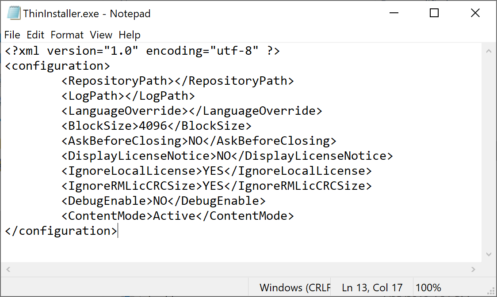

_Figure 7-1. ThinInstaller.exe.configuration file._
</div>


|     Configurable Item       |     Description                                                                                                                                                                                                                                                                                           |     Value                                                                                                               |     Action                                                                                                                                                                                                                                                                                                                                                                                                                      |
|-----------------------------|-----------------------------------------------------------------------------------------------------------------------------------------------------------------------------------------------------------------------------------------------------------------------------------------------------------|-------------------------------------------------------------------------------------------------------------------------|---------------------------------------------------------------------------------------------------------------------------------------------------------------------------------------------------------------------------------------------------------------------------------------------------------------------------------------------------------------------------------------------------------------------------------|
|     RepositoryPath          |     Specifies the repository path.  By default, Thin Installer searches  for updates in a subdirectory under  the Thin Installer folder. This can  be a local path, UNC path, or URL.                                                                                                                     |     Default value: blank                                                                                                |     If specified, Thin Installer  searches for updates from the  specified repository path.                                                                                                                                                                                                                                                                                                                                     |
|     LogPath                 |     Specifies the log path. By default,  the log is created in a subdirectory  under the Thin Installer folder.                                                                                                                                                                                           |     Default value: blank                                                                                                |     If Thin Installer does not have  write access to the specified  log path, Thin Installer will  create the log at the default  location.                                                                                                                                                                                                                                                                                     |
|     LanguageOverride        |     Specifies the language to be used                                                                                                                                                                                                                                                                     |     Default value: EN<br/><br/>     Possible values:<br/> • DA<br/> • NL<br/> • RN<br/> • FI<br/> • FR<br/> • DE<br/> • IT<br/> • JP<br/> • KO<br/> • NO<br/> • PT<br/> • ES<br/> • SV<br/> • CHS<br/> • CHT |     Changes the language to the  specified one.                                                                                                                                                                                                                                                                                                                                                                                 |
|     BlockSize               |     Specifies the number of bytes to be read  each time data is downloaded.                                                                                                                                                                                                                               |     Default value: 4096<br/><br/>     Possible values:<br/> • 4096<br/> • 8192                                                              |     Sets the number of bytes to  the specified one.                                                                                                                                                                                                                                                                                                                                                                             |
|     AskBeforeClosing        |     Prompts the user whether to close  Thin Installer.                                                                                                                                                                                                                                                    |     Default value: NO                                                                                                   |     • If **YES**, a dialog box will  prompt to ask whether to close  Thin Installer.<br/>     • If **NO**, no dialog box will  prompt to ask whether to close  Thin Installer, and Thin Installer  will close directly.                                                                                                                                                                                                                     |
|     DisplayLicenseNotice    |     Enables you to skip the license agreement  that is displayed before the update package  pick list is populated.                                                                                                                                                                                       |     Default value: NO<br/><br/>     Possible values:<br/> • YES <br/>• NO                                                                   |     • If **YES**, the license agreement  screen will be displayed prior to  the update package pick list.<br/>      • If **NO**, the license agreement  screen will not be displayed.                                                                                                                                                                                                                                                        |
|     IgnoreLocalLicense      |     Shows or hides the license dialog when  Thin Installer is downloading and  installing an update package.                                                                                                                                                                                              |     Default value: YES<br/><br/>     Possible values:<br/> • YES<br/> • NO                                                                  |     • If **YES**, the license dialog  will not be displayed when  Thin Installer is downloading  and installing an update package.<br/>      • If **NO**, the license dialog will  be displayed when Thin Installer  is downloading and installing an  update package.<br/><br/>        **Note**: Some Microsoft updates may  require the end user to accept the  license, and this cannot be disabled  by the **IgnoreLocalLicense** configurable  item.      |
|     IgnoreRMLicCRCSize      |     Use this setting to enable or disable the  following functions when Thin Installer  downloads packages:<br/>      • **CRC** - checks the file corruption of  readme and license agreement files when  you download   packages.<br/>      • **File size** - checks the file size of  readme and license agreement files. |     Default value: YES<br/><br/>     Possible values:<br/> • YES<br/> • NO                                                                  |     • If **YES**, Thin Installer skips  checking the corruption or the  size of these files.<br/>      • If **NO**, Thin Installer checks  the corruption or the size of  these files.                                                                                                                                                                                                                                                       |
|     DebugEnable             |     Specifies whether Thin Installer should  create the log file named  Updates_ApplicabilityRulesTrace.txt.                                                                                                                                                                                              |     Default value: NO<br/><br/>     Possible values:<br/> • YES<br/> • NO                                                                   |     • If **YES**, Thin Installer will  create the log file.<br/>      • If **NO**, Thin Installer will  not create the log file.                                                                                                                                                                                                                                                                                                             |
|     ContentMode             |     Refers to the status of the update packages.  Set the value depending on the status of  update packages in the repository.                                                                                                                                                                            |     Default value: Active<br/><br/>     Possible values:<br/> • Active<br/> • Test                                                          |     • If **Active**, Thin Installer will search the Update Retriever repository  for update packages in active status.<br/>      • If **Test**, Thin Installer will search  the Update Retriever repository for  update packages in test status.<br/><br/>       **Note**: If there is no database.xml file  in the Update Retriever repository folder,  Thin Installer will ignore the value of  ContentMode and search for all the update  packages.    |

<p style="text-align:center;padding-bottom:40px;font-style: italic;">Table 7-5. Description of configurable items.</div>


# 7 Appendix B: Mapdrv Utility

The MapDrv utility provides network share related functions for System Update. To define the network share information, use the MapDrv utility to connect or disconnect network shares. The MapDrv utility maintains network share information in a registry key that is protected by administrator access only. The network share information includes the network share name (in UNC format), user name (saved in the registry as an encrypted string), and the password (saved in the registry as an encrypted string).

The MapDrv utility can be found in the System Update installation directory. The default installation directory is located at ```C:\Program Files (x86)\Lenovo\System Update```.


The network share information is stored in the following registry entry:

	HKLM\Software\Wow6432Node\Lenovo\MND\TVSUAPPLICATION

If an Active Directory policy is used, these values are stored in the following registry entry:

	HKLM\Software\Policies\Lenovo\MND\TVSUAPPLICATION


The strings stored in the **TVSUAPPLICATION** key are:

| **String** | **Description** |
| --- | --- |
| UNC | The value of this string specifies the stored network share. |
| User | The value of this string specifies the stored encrypted user name for this share. |
| Pwd | The value of this string specifies the stored encrypted password for this share. |
| NetPath | The value is generated by the MapDrv utility to indicate the actual connection path. It might be in IP dotted format if the **ServerName** string is not working. The actual connection path may not be the same as the stored **UNC** value. |

<p style="text-align:center;padding-bottom:40px;font-style: italic;">Table 8-1. The MapDrv settings and values</div>

The MapDrv utility also enables an administrator to use the encryption engine to generate an encrypted user name and password, which can be used to pre-populate network share information on multiple systems. Using the encryption engine in this manner does not update the registry on the system.


### 7.1.1 Command-line Interface

The command-line interface to the MapDrv utility is as follows:

	Mapdrv /<function><app id> /unc <sharename> /user <username\> /pwd <password> [/timeout <seconds>] [/s]

| **Parameter** | **Description** |
| --- | --- |
| /function | Identifies the function to provide. Valid values are store, connect, disconnect, and display. |
| app id | Identifies the application. The value specified is used to form the registry key name that contains the network share information, for example:  **TVSUAPPLICATION** . |
| /unc sharename | Identifies the network share name to store. The share name should be in the UNC form, for example: [**\\\myserver\myshare**](smb://myserver/myshare) |
| /user username | Specifies the user name to store. |
| /pw password | Specifies the password to store. |
| /timeout seconds | Specifies the connection timeout value to store. The default is 30 seconds. |
| /s | Enables a silent operation. |

<p style="text-align:center;padding-bottom:40px;font-style: italic;">Table 8-2. Parameters</div>

The return code is **0** if an operation was successful. Otherwise, the return code is greater than **0**.

When the MapDrv utility is launched with no parameters, the end user will be prompted for the network share, user name and password, and then MapDrv will attempt to connect to the specified network share using the specified credentials.


### 7.1.2 Displaying Encrypted User Name and Password Strings

This function displays the registry key of the network share information where the encrypted user name and password is stored. Using the /display function will not store the user name and password in the registry. You need to copy the encrypted user name and password to the appropriate registry key.

	mapdrv /view <app id> /user <username> /pwd <password>

Example:
>mapdrv /view TVSUAPPLICATION /user temp/pwd password
>
>app id: TVSUAPPLICATION
>
>user: temp
>pwd: password

This command captures the encrypted user name and password to set up the repository with UNC path with authentication.


### 7.1.3 Storing Network Share Information for a ThinkVantage Application

This function stores the network share information in the registry using to define the subkey from the main MapDrv registry key:

	mapdrv /store <app id> /unc <sharename> /user <username> /pwd <password> [/timeout <seconds>]

This sets the UNC, user name, and password values in the registry.


### 7.1.4 Connecting to the network share for a ThinkVantage application

Connect the network share for the specified ThinkVantage application:

	mapdrv /connect <app id> [/s]

Connects to the share using the UNC, user name, and password values in the registry. The actual connection UNC is output to the NetPath value.


### 7.1.5 Disconnecting the Network Share for a ThinkVantage Application

The following command disconnects the network share for the specified ThinkVantage application if the application is currently connected:

	mapdrv /disconnect <app id>

Performs a _**net use /d [NetPath stored in registry]**_ to disconnect the network connection.


# 8 Appendix C: Notices

Lenovo may not offer the products, services, or features discussed in this document in all countries. Consult your local Lenovo representative for information on the products and services currently available in your area. Any reference to a Lenovo product, program, or service is not intended to state or imply that only that Lenovo product, program, or service may be used. Any functionally equivalent product, program, or service that does not infringe any Lenovo intellectual property right may be used instead. However, it is the user&#39;s responsibility to evaluate and verify the operation of any other product, program, or service.

Lenovo may have patents or pending patent applications covering subject matter described in this document. The furnishing of this document does not give you any license to these patents. You can send license inquiries, in writing, to:

_Lenovo (United States), Inc._

_8001 Development Dr – Building 8_

_Morrisville, NC 27560 U.S.A._

_Attention: Lenovo Director of Licensing_

LENOVO PROVIDES THIS PUBLICATION &quot;AS IS&quot; WITHOUT WARRANTY OF ANY KIND, EITHER EXPRESS OR IMPLIED, INCLUDING, BUT NOT LIMITED TO, THE IMPLIED WARRANTIES OF NON-INFRINGEMENT, MERCHANTABILITY OR FITNESS FOR A PARTICULAR PURPOSE. Some jurisdictions do not allow disclaimer of express or implied warranties in certain transactions, therefore, this statement may not apply to you.

This information could include technical inaccuracies or typographical errors. Changes are periodically made to the information herein; these changes will be incorporated in new editions of the publication. Lenovo may make improvements and/or changes in the product(s) and/or the program(s) described in this publication at any time without notice.

The products described in this document are not intended for use in implantation or other life support applications where malfunction may result in injury or death to persons. The information contained in this document does not affect or change Lenovo product specifications or warranties. Nothing in this document shall operate as an express or implied license or indemnity under the intellectual property rights of Lenovo or third parties. All information contained in this document was obtained in specific environments and is presented as an illustration. The result obtained in other operating environments may vary.

Lenovo may use or distribute any of the information you supply in any way it believes appropriate without incurring any obligation to you.

Any references in this publication to non-Lenovo Web sites are provided for convenience only and do not in any manner serve as an endorsement of those Web sites. The materials at those Web sites are not part of the materials for this Lenovo product, and use of those Web sites is at your own risk Any performance data contained herein was determined in a controlled environment. Therefore, the result in other operating environments may vary significantly. Some measurements may have been made on development-level systems and there is no guarantee that these measurements will be the same on generally available systems. Furthermore, some measurements may have been estimated through extrapolation. Actual results may vary. Users of this document should verify the applicable data for their specific environment.

**Trademarks**

The following terms are trademarks of Lenovo in the United States, other countries, or both:

   - Lenovo
   - The Lenovo logo
   - ThinkPad
   - ThinkCentre
   - ThinkStation
   - ThinkVantage

Intel is a trademark or registered trademark of Intel Corporation or its subsidiaries in the United States and other countries.

Microsoft, Active Directory, Internet Explorer, and Windows are trademarks of the Microsoft group of companies.

Other company, product, or service names may be trademarks or service marks of others

©Lenovo 2021, All Rights Reserved