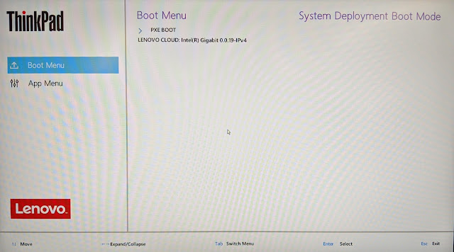
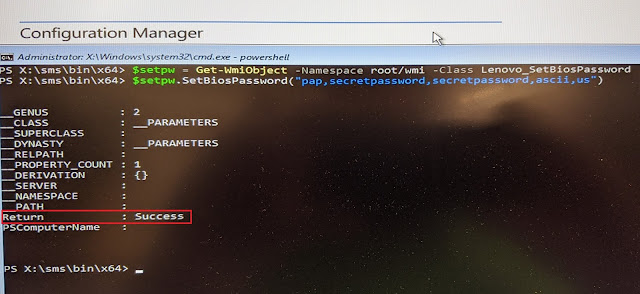
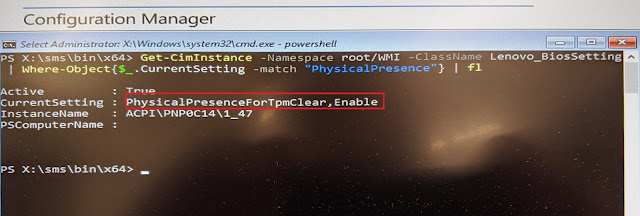
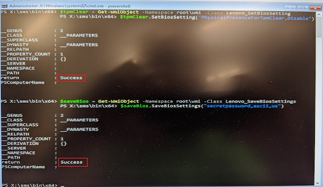
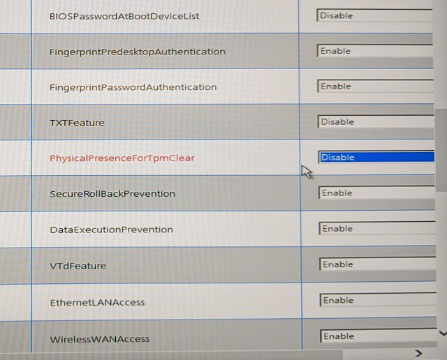
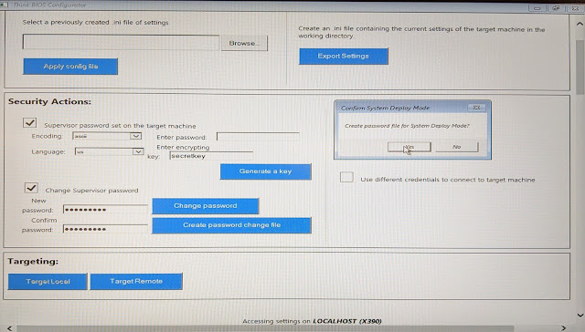
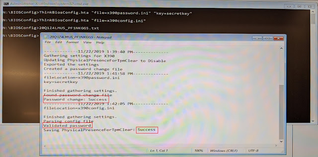
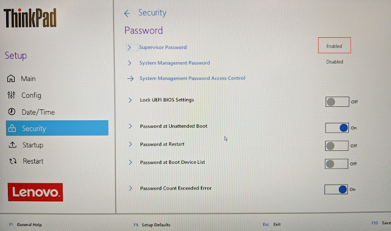
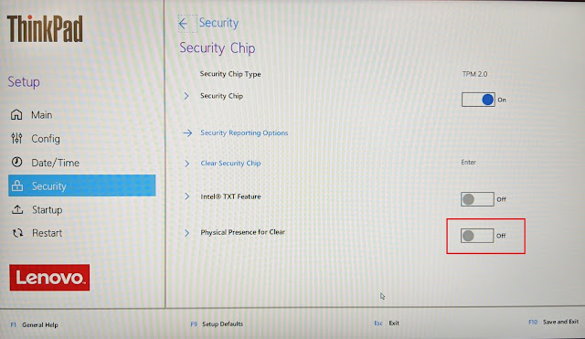

# System Deployment Boot Mode

## Overview

System Deployment Boot Mode (SDB) is a new feature added to the Whiskey Lake generation of ThinkPads.  This introduces the ability to programmatically configure key security BIOS settings during your operating system deployments.

Unlike previous generations, this boot mode will allow you to:

**Set an initial Supervisor Password**

In the past, a supervisor password had to be set manually or from the factory.  Once a supervisor password was set, it could be changed in an automated way leveraging the Lenovo_SetBiosPassword WMI class.

**Disable the TPM Physical Presence for Clear requirement**

No longer requires user interaction if a call to clear the TPM was performed.  In other words, no more pressing F9!

## Supported Systems

*(These systems were the supported systems at the original writing of this article. It is expected that this feature will continue to be inlcuded in follow-on models.)*

### L-Series

L14/15 (Intel)

### P-Series

P14s/15s

P15/17

P15v

P43s/53s

### T-Series

T14 (AMD)

T14/15 (Intel)

T14s/X13

T15p

T490 (CML)

T490/590

### X-Series

X1 Carbon 8/X1 Yoga 5

X13 NEC

X13/T14s (AMD)

X390 (CML)

X390 NEC

X390 (WHL)

## Activating System Deployment Boot Mode

* Boot the system and press F12 until the boot menu appears
* Press the Delete key.  **System Deployment Boot Mode** will appear in the upper right side of the screen.  The internal boot device(s) will be removed from the list.  This is a security precaution.



* Select a boot device.
* System Deployment Boot Mode is now active.
* System will exit System Deployment Boot Mode upon the next reboot.

## WMI in System Deployment Boot Mode

PXE boot a system to WinPE, F8 to a command prompt, and start PowerShell.  Verify there is no supervisor password set on the system by running the following command:

```
Get-CimInstance -Namespace root/WMI -ClassName Lenovo_BiosPasswordSettings
```

Confirm the **PasswordState** property value is 0


### Setting the Supervisor Password

Run the following commands to set an initial Supervisor Password.  Replace *secretpassword* with a password of your choice.

```
$setPw = Get-WmiObject -Namespace root/wmi -Class Lenovo_setBiosPassword
$setPw.SetBiosPassword("pap,secretpassword,secretpassword,ascii,us")
```


**CIM Example**
```
Get-CimInstance -Namespace root/WMI -ClassName Lenovo_SetBiosPassword | Invoke-CimMethod -MethodName SetBiosPassword -Arguments @{ parameter = "pap,secretpassword,secretpassword,ascii,us" }
Get-CimInstance -Namespace root/WMI -ClassName Lenovo_SaveBiosSettings | Invoke-CimMethod -MethodName SaveBiosSettings -Arguments @{ parameter = "secretpassword,ascii,us" }
```

### Check TPM Physical Presence for Clear Status

By default, the TPM Physical Presence for Clear setting is always going to be enabled from the factory.  You can verify by running these commands:

```
Get-CimInstance -Namespace root/WMI -ClassName Lenovo_BiosSetting | Where-Object {$_.CurrentSetting -match "PhysicalPresence"} | fl
```


### Disable TPM Physical Presence for Clear

To disable Physical Presence, run the following commands:

```
$tpmClear = Get-WmiObject -Namespace root\wmi -Class Lenovo_SetBiosSetting
$tpmClear.SetBiosSetting("PhysicalPresenceForTpmClear,Disable")
```

Save the settings using the new Supervisor Password

```
$saveBios = Get-WmiObject -Namespace root\wmi -Class Lenovo_SaveBiosSettings
$saveBios.SaveBiosSettings("secretpassword,ascii,us")
```



## Use With TBCT
### Preparing the Configuration File

You can also use the Think BIOS Config [Tool](https://thinkdeploy.blogspot.com/2016/08/the-think-bios-config-tool.html) or higher to apply these changes in your operating system deployment task sequence.  

?>Supported on version 1.28 or higher of the TBCT

On a test system, PXE boot (or USB boot) to WinPE and perform the following:

* Navigate to the directory containing the TBCT and launch it to present the GUI.
* Scroll through the list of available BIOS settings and make any changes to be applied.  In this example, we're going to set the PhysicalPresenceForTpmClear setting to Disable 



* Scroll back to the top and click the **Export Settings** button.
    * This will output a text file containing the BIOS setting(s) to be changed
* Tick the **Supervisor password set on the target machine** box
    * Leave the password field blank since there's currently no Supervisor Password set
    * Enter an encrypting key (or generate one)
* Tick the **Change Supervisor** password box
    * Enter a Supervisor Password.  (This will be the initial Supervisor Password)
    * Confirm the same password
* A prompt will appear to create a password file for System Deploy Mode.  This will only be presented if the Supervisor Password field (above the encrypting key field) is blank.  Click **Yes**.
* A new password file will be output



### Applying the Configuration File

To apply the new Supervisor Password and other BIOS settings, perform the following:

* Navigate to the directory containing the TBCT, password .INI, and config .INI.
* Run the first command to set the Supervisor Password
```
ThinkBiosConfig.hta "file=yourpassword.ini" "key=yourencryptingkey"
```

* The second command will apply the BIOS settings using the new Supervisor Password
```
ThinkBiosConfig.hta "file=config.ini"
```

If you open the log you'll see the password change was successful, the config file has been validated using the new Supervisor Password, and the BIOS setting to disable **PhysicalPresenceForTpmClear** was successfully set.



## Confirm the Updated BIOS Configuration

Reboot the system and **F1** to get to the BIOS.  You should be prompted to enter your new Supervisor Password.  Navigate to **Security > Password**

The Supervisor Password should now show as Enabled



Now navigate to **Security > Security Chip** and verify the Physical Presence for Clear setting has been toggled to Off.



?>If you're configuring other BIOS settings via WMI on top of what's described above, you should be able to do so in the same WinPE session.  There should be no need to set an initial Supervisor Password, reboot, activate SDB mode again, PXE boot back to WinPE and configure other settings.