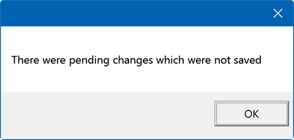

## Think BIOS Config Tool 2.0 (PowerShell)

### Introduction

The Think BIOS Config Tool was developed using the WMI BIOS Interface methods that are implemented in Lenovo commercial PCs to create a user friendly way of applying changes to the BIOS from within the Windows environment. This document will describe the ways the tool can be used and the various options it supports.

This redesigned version of the tool is built on PowerShell and consists of a PowerShell module and a PowerShell script for the GUI portion of the application. The GUI application will leverage cmdlets from the module to interface with WMI to provide the proper options for each of the available settings and to execute the necessary methods.

?>Not all BIOS settings are exposed through the WMI interface.  This tool will list only the settings that are configurable through WMI.

### Standard Execution of Application

With the Think BIOS Config Tool files copied to a folder on your system, open an Administrator Terminal session and change into that folder.  Execute the ".\ThinkBiosConfigUI.ps1" file.

The Think BIOS Config module will be imported and then the UI will appear with the **Work with Settings** tab displayed with each of the settings and their current value listed. The **Other Actions** tab displays actions that can be initiated from the tool.  The **Preferences** tab shows application specific options such as log file path.

<div style="text-align:center;margin-bottom:40px">


<span style='align:center;font-style:italic;'>Work with Settings</span>
</div>

<div style="text-align:center;margin-bottom:40px">


<span style='align:center;font-style:italic;'>Other Actions</span>
</div>

<div style="text-align:center;margin-bottom:40px">


<span style='align:center;font-style:italic;'>Preferences</span>
</div>

### Settings

#### Settings Table <!-- {docsify-ignore} -->

<div style="text-align:center;">


</div>

The Settings Table displays the current settings of the target machine. By default, the local system is targeted and the computer name and the installed BIOS version is displayed above the table. Each setting has an associated value column which can be changed easily. Most settings are in the form of dropdown boxes but options like ‘BootOrder’ have more complex options to select the new value of the setting.

#### Save Changed Settings <!-- {docsify-ignore} -->

If the user makes any changes, the text of the setting name will be changed to red (as seen below with the AlwaysOnUSB setting) to signify that it is a value different than what is currently set on the computer.

<div style="text-align:center;">


</div>

Once all the required changes have been set, click **Save Changed Settings** and the application attempts to commit the changes to the machine. Only the settings that are pending change are attempted to be saved to save time and eliminate any issues with trying to commit a setting with the same value. The result of the operation will be displayed in the Status bar at the bottom of the Think BIOS Config Tool window.

?>All settings will only take affect once the computer is restarted.

<!-- Is the bwlow paragraph and image still true? -->
<!--If a user closes the application with changes pending, a message will be displayed that there were pending changes. Unfortunately, there is a bug in Microsoft’s code that makes it so the closing of the application cannot be stopped once it is started.

<div style="text-align:center;padding-bottom:40px;padding-top:40px">


</div>
-->

#### Revert Changes <!-- {docsify-ignore} -->

<div style="text-align:center;">


</div>

If settings have been changed in the application but not applied to the machine and the user wants to revert back to the original settings, click **Revert Changes**. <!-- make sure this is correct--> The user will see the items that were previously marked in red text will be reverted back to black text and the values reset to their original settings. This is a quick way for the user to create multiple configuration files and revert back to the settings they had already saved.

#### Reset to Factory Defaults <!-- {docsify-ignore} -->

<div style="text-align:center;">


</div>

The **Reset to Factory Defaults** button applies factory default values to the settings.

?>Not all BIOS settings are affected by the BIOS defaults change and varies by product. If the button is clicked, a warning prompt will be shown to confirm the user wishes to do that.

#### Reset to Custom Defaults <!-- {docsify-ignore} -->

<div style="text-align:center;">


</div>

#### Generate INI <!-- {docsify-ignore} -->

<div style="text-align:center;">


</div>

The **Generate INI** option will create an .INI file of the current settings. The file will be generated in the working directory the application is launched from, inside the Output folder. The file will be named after the computer name the settings are being accessed on. The settings that are exported are the current settings of the machine AND the pending changes to the machine. This is done to allow the user to create these files without having to commit changes to the machine. The created file will have an optional first line if there is a supervisor password and the remaining lines are of the form key,value. If there is a supervisor password on the machine the application will include it based on the details provided in the Security section below. <!-- Make sure the file downloads in the same location or do we need to edit it? -->

<div style="text-align:center;">


</div>

#### Create Intune Package <!-- {docsify-ignore} -->

<div style="text-align:center;">


</div>

### Security

#### Authentication <!-- {docsify-ignore} -->

<div style="text-align:center;">


</div>

If settings are being changed on a system where a BIOS Supervisor Password has been set, the **Authentications** section provides the ability to provide the necessary password details. At the top left of the application you will see a section for authentication.

#### Target Remote <!-- {docsify-ignore} -->

By default the application will attempt to load the settings of the local machine when it launches. The address and model of the machine whose settings are being displayed will be displayed above the Settings table, such as:

<div style="text-align:center;">


</div>

If you would like to target another remote machine on the network, use the **Target Remote** section to the left. Enter the IP Address, Username, and Password for the targeted machine.

<div style="text-align:center;">


</div>

<!-- Add images/error messages that may pop up if host is unreachable or the WMI service is unavailable -->

Once connected to the remote computer, the screen will refresh with the data that is on that machine. To switch back to the local machine, just click the <!--‘Target Local’ --> button, which is only enabled if the application is accessing a remote machine.  <!-- Add how to revert back? -->

<!-- ### Output Location --><!-- {docsify-ignore} -->

<!-- <div style="text-align:center;"></div> -->

### Other Actions

Below is an example of what the application will display when the **Other Actions** tab is selected.

<div style="text-align:center;">


</div>

#### Supervisor Password <!-- {docsify-ignore} -->

If a Supervisor Password has been set then it will need to be specified before performing any of the actions. In the case of applying an INI file that contains an encrypted SVP, the Passphrase needed to decrypt the SVP can be specified instead. 

<div style="text-align:center;">


</div>

#### Apply Settings INI <!-- {docsify-ignore} -->

<div style="text-align:center;">


</div>

The **Apply Settings INI** tab provides the option to browse and select an .INI file that was previously generated by this program. Once selected, click **Apply Settings** to make any changes detected in the .INI file. All the settings are compared to the current settings of the machine to identify the changes to be applied. Only those that are different will be applied. Specify Supervisor password if applicable or specify an encryption passphrase if used in the INI file.

#### Clear Password or Fingerprint Data <!-- {docsify-ignore} -->

This tab provides the option to clear the Supervisor password or the Fingerprint Data by simply clicking one of the two buttons. These actions will require the Supervisor password to be set and specified above in order to perform the action.

<div style="text-align:center;">


</div>

#### Change Supervisor Password <!-- {docsify-ignore} -->

This tab provides the option of changing the Supervisor password. Obviously a Supervisor password must already be set on the local machine. Enter the Current password above the tab and then specify the New password and Confirm it in the tab. Click **Change Password** to change the password on the local machine or click **Create Password Change File** to create an INI file that can be used across many systems leveraging just the Think BIOS Config PowerShell module.

<div style="text-align:center;">


</div>

### Preferences

Below is an example of what the application will display when the **Preferences** tab is selected.

<div style="text-align:center;">


</div>

#### Output Location <!-- {docsify-ignore} -->

The default location for storing generated INI files will be ```C:\ProgramData\Lenovo\ThinkBiosConfig\Output```.  This location can be changed here.

<div style="text-align:center;">


</div>

#### Enable Logging <!-- {docsify-ignore} -->

By default, logging is not enabled.  It can be enabled here and the log file will be located at ```C:\ProgramData\Lenovo\ThinkBiosConfig\logs```.

<div style="text-align:center;">


</div>
